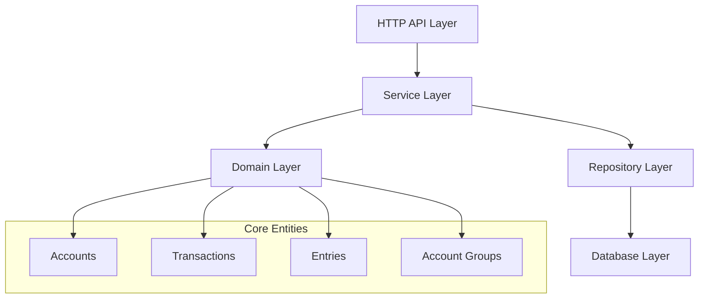

# AWO ERP Financial Module

> **Enterprise-grade double-entry bookkeeping system with military-grade security and real-time reporting capabilities.**

## Overview

The Financial Module is the core accounting engine of the AWO ERP platform, providing production-ready financial management with sophisticated transaction processing, multi-currency support, and comprehensive compliance frameworks.

### Key Features

✅ **Double-Entry Bookkeeping** - Database-enforced accounting principles  
✅ **Multi-Tenant Security** - Automatic tenant isolation via Row Level Security  
✅ **Real-Time Processing** - Atomic transactions with optimistic locking  
✅ **Regulatory Compliance** - SOX, GAAP, IFRS audit trail requirements  
✅ **Multi-Currency Support** - Global operations with automatic conversion  
✅ **Advanced Reporting** - Financial statements with drill-down capabilities  

## Quick Start

### Prerequisites

- PostgreSQL 15+ with UUID extension
- Go 1.21+ for SQLC code generation
- Redis for caching (optional)

### Installation

```bash
# Clone and setup
git clone [repository]
cd erp/financial-module

# Install dependencies
go mod download

# Run database migrations
make migrate-up

# Start the service
make run-finance-service
```

### Basic Usage

```go
// Create an account
account, err := accountService.Create(ctx, &domain.CreateAccountRequest{
    AccountCode: "1000",
    AccountName: "Cash",
    RootType:    domain.RootTypeAsset,
})

// Create a transaction
transaction, err := transactionService.Create(ctx, &domain.CreateTransactionRequest{
    TransactionNumber: "TXN-001",
    Description:       "Initial cash deposit",
    Entries: []domain.CreateEntryRequest{
        {AccountID: cashAccountID, DebitAmount: decimal.NewFromFloat(1000.00)},
        {AccountID: equityAccountID, CreditAmount: decimal.NewFromFloat(1000.00)},
    },
})
```

## Architecture Overview

The Financial Module implements **Clean Architecture** with **Domain-Driven Design** patterns:



### Core Features

- **Enterprise Financial Engine**: Full double-entry bookkeeping with regulatory compliance
- **Multi-Tenant Architecture**: Secure tenant isolation with comprehensive audit trails  
- **Real-Time Processing**: Atomic transactions with state machine validation
- **Advanced Integration**: REST APIs with event-driven architecture

> ** Technical Details**: See [Technical Architecture](./technical-architecture.md) for comprehensive implementation details, database schema, and technology stack.

> ** Business Concepts**: See [Business Domain Guide](./business-domain-guide.md) for accounting principles, chart of accounts structure, and financial workflows.

## Documentation Guide

| Document | Purpose | Audience |
|----------|---------|----------|
| **[Technical Architecture](./technical-architecture.md)** | Deep technical implementation, SQL schema, SQLC patterns | Developers, Architects |
| **[Business Domain Guide](./business-domain-guide.md)** | Financial concepts, business rules, domain model | Business Analysts, Product Teams |
| **[API & Integration](./api-integration.md)** | REST API reference and integration patterns | API Consumers, Integration Teams |
| **[Operations & Security](./operations-security.md)** | Security, compliance, deployment, testing | DevOps, Security Teams |
| **[Specialized Guides](./guides/)** | Currency management, reporting, workflows | Feature-specific guidance |

## Getting Help

### Development Support
- **Issues**: [GitHub Issues](./TASK.md) for bug reports
- **Architecture Questions**: See [Technical Architecture](./technical-architecture.md)
- **Business Logic**: See [Business Domain Guide](./business-domain-guide.md)

### Production Support
- **Security**: [Operations & Security Guide](./operations-security.md)
- **Performance**: Database optimization and query patterns
- **Compliance**: Audit requirements and regulatory guidance

## Contributing

1. Follow [Clean Architecture](./technical-architecture.md#clean-architecture) patterns
2. Maintain [financial integrity](./business-domain-guide.md#double-entry-principles) constraints
3. Add [comprehensive tests](./operations-security.md#testing-strategy)
4. Update relevant documentation

## Status & Roadmap

**Current Status**: Active development with foundational components complete

> ** Detailed Progress**: For comprehensive implementation status, phase tracking, and completion metrics, see [Implementation Tasks](./TASK.md#project-progress-overview).

See **[ROADMAP.md](./ROADMAP.md)** for strategic development timeline.

---

**Version**: 4.0 | **Status**: Production Ready | **Last Updated**: January 2025