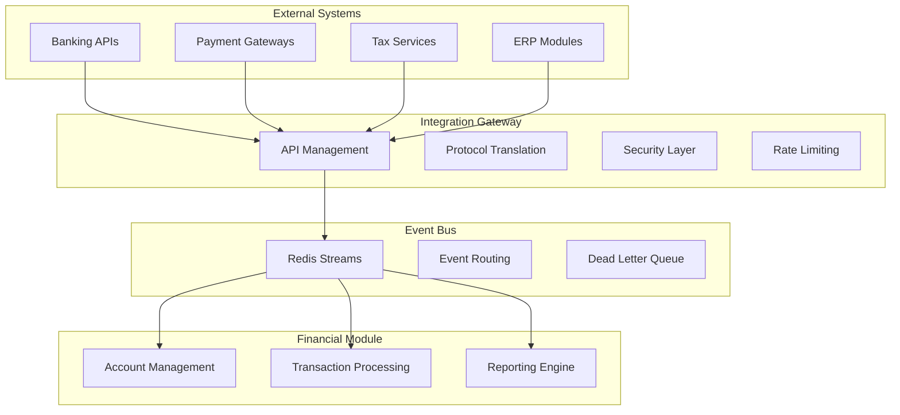

# Financial Module - API & Integration Guide

> **Complete API reference and integration patterns for the AWO ERP Financial Module, covering REST endpoints, authentication, integration strategies, and real-world implementation examples.**

## Table of Contents

1. [API Overview & Authentication](#api-overview--authentication)
2. [Core API Endpoints](#core-api-endpoints)
3. [Integration Patterns](#integration-patterns)
4. [Event-Driven Integration](#event-driven-integration)
5. [External System Integration](#external-system-integration)
6. [Real-Time Integration](#real-time-integration)
7. [Error Handling & Monitoring](#error-handling--monitoring)
8. [SDK & Code Examples](#sdk--code-examples)

---

## API Overview & Authentication

### Base Information

**API Details:**
- **Base URL**: `https://api.awo-erp.com/api/v1/finance`
- **Protocol**: HTTPS only with TLS 1.3
- **Content Type**: `application/json`
- **API Version**: `v1` (current production)

### Authentication & Access Control

**Bearer Token Authentication:**
```bash
# Include in all request headers
Authorization: Bearer <JWT_TOKEN>
X-Tenant-ID: <TENANT_UUID>
X-Entity-ID: <ENTITY_UUID>  # Optional for multi-entity
```

**ABAC (Attribute-Based Access Control):**
```json
{
  "user_id": "uuid",
  "tenant_id": "uuid", 
  "entity_id": "uuid",
  "roles": ["finance_manager", "accountant"],
  "permissions": ["transactions:create", "accounts:read"],
  "context": {
    "ip_address": "192.168.1.100",
    "time_of_day": "business_hours",
    "location": "headquarters"
  }
}
```

**Rate Limiting:**
- **Standard**: 1000 requests/hour per tenant
- **Burst**: 100 requests/minute  
- **Premium**: 5000 requests/hour per tenant

---

## Core API Endpoints

### Account Management

#### Create Account
```http
POST /api/v1/finance/accounts
Content-Type: application/json
Authorization: Bearer <token>
```

**Request Body:**
```json
{
  "account_code": "1001",
  "account_name": "Cash - Operating",
  "account_description": "Main operating cash account",
  "root_type": "ASSET",
  "account_type": "CASH",
  "normal_balance": "DEBIT",
  "is_active": true,
  "allow_manual_entries": true,
  "require_reference": false,
  "parent_account_id": "uuid",
  "currency_code": "USD"
}
```

**Response (201 Created):**
```json
{
  "id": "550e8400-e29b-41d4-a716-446655440000",
  "account_code": "1001",
  "account_name": "Cash - Operating",
  "account_path": "/1000/1001",
  "current_balance": "0.00",
  "created_at": "2025-01-15T10:30:00Z",
  "version": 1
}
```

#### List Accounts with Filtering
```http
GET /api/v1/finance/accounts?root_type=ASSET&is_active=true&limit=50&offset=0
```

**Query Parameters:**
- `root_type`: Filter by account type (ASSET, LIABILITY, EQUITY, REVENUE, EXPENSE)
- `is_active`: Filter by status (true/false)
- `parent_account_id`: Filter by parent account
- `search`: Text search in account name/code
- `limit`: Page size (max 100)
- `offset`: Page offset for pagination

#### Get Account with Balances
```http
GET /api/v1/finance/accounts/{account_id}/balances?as_of_date=2025-01-31
```

**Response:**
```json
{
  "account": {
    "id": "uuid",
    "account_code": "1001",
    "account_name": "Cash - Operating"
  },
  "balances": {
    "current_balance": "25000.00",
    "ytd_balance": "25000.00",
    "total_debits": "125000.00", 
    "total_credits": "100000.00",
    "transaction_count": 45,
    "last_transaction_date": "2025-01-30"
  }
}
```

### Transaction Processing

#### Create Transaction
```http
POST /api/v1/finance/transactions
Content-Type: application/json
```

**Request Body:**
```json
{
  "transaction_number": "JE-2025-001",
  "transaction_type": "MANUAL",
  "transaction_date": "2025-01-15",
  "description": "Initial cash investment",
  "reference_number": "INV-001",
  "currency_code": "USD",
  "entries": [
    {
      "account_id": "cash-account-uuid",
      "debit_amount": "50000.00",
      "description": "Cash investment",
      "reference": "Investment Agreement"
    },
    {
      "account_id": "equity-account-uuid", 
      "credit_amount": "50000.00",
      "description": "Owner's equity contribution"
    }
  ]
}
```

**Response (201 Created):**
```json
{
  "id": "transaction-uuid",
  "transaction_number": "JE-2025-001",
  "transaction_status": "DRAFT",
  "total_debit_amount": "50000.00",
  "total_credit_amount": "50000.00",
  "is_balanced": true,
  "created_at": "2025-01-15T10:30:00Z",
  "entries": [
    {
      "id": "entry-uuid-1",
      "entry_number": 1,
      "account_code": "1001",
      "debit_amount": "50000.00"
    },
    {
      "id": "entry-uuid-2", 
      "entry_number": 2,
      "account_code": "3001",
      "credit_amount": "50000.00"
    }
  ]
}
```

#### Transaction State Management
```http
# Submit for Approval
PUT /api/v1/finance/transactions/{id}/submit
{
  "approval_notes": "Monthly journal entry for review"
}

# Approve Transaction
PUT /api/v1/finance/transactions/{id}/approve
{
  "approval_notes": "Approved - proper documentation provided"
}

# Post Transaction
PUT /api/v1/finance/transactions/{id}/post
{
  "posting_date": "2025-01-15"
}

# Reverse Posted Transaction
PUT /api/v1/finance/transactions/{id}/reverse
{
  "reversal_reason": "Incorrect amount posted",
  "reversal_date": "2025-01-16"
}
```

### Financial Reporting

#### Trial Balance
```http
GET /api/v1/finance/reports/trial-balance?as_of_date=2025-01-31&include_zero_balances=false
```

**Response:**
```json
{
  "report_date": "2025-01-31T23:59:59Z",
  "entity_id": "uuid",
  "currency": "USD",
  "accounts": [
    {
      "account_code": "1001",
      "account_name": "Cash - Operating",
      "root_type": "ASSET",
      "normal_balance": "DEBIT",
      "debit_balance": "25000.00",
      "credit_balance": "0.00",
      "net_balance": "25000.00"
    }
  ],
  "totals": {
    "total_debits": "175000.00",
    "total_credits": "175000.00",
    "difference": "0.00"
  },
  "is_balanced": true
}
```

#### Balance Sheet
```http
GET /api/v1/finance/reports/balance-sheet?as_of_date=2025-01-31&format=summary
```

#### Income Statement  
```http
GET /api/v1/finance/reports/income-statement?period_start=2025-01-01&period_end=2025-01-31
```

#### Account Activity
```http
GET /api/v1/finance/accounts/{account_id}/activity?start_date=2025-01-01&end_date=2025-01-31&limit=100
```

---

## Integration Patterns

### Multi-Layer Integration Strategy



### Integration Patterns

**1. Synchronous API Integration:**
```javascript
// Real-time account balance check
const accountBalance = await financeAPI.getAccountBalance({
  accountId: 'uuid',
  asOfDate: '2025-01-31'
});

if (accountBalance.current_balance < requiredAmount) {
  throw new InsufficientFundsError();
}
```

**2. Asynchronous Event Integration:**
```javascript
// Event-driven transaction processing
eventBus.publish('finance.transaction.created', {
  transactionId: 'uuid',
  amount: 1000.00,
  currency: 'USD',
  sourceSystem: 'SALES'
});

// Event handler
eventBus.subscribe('finance.transaction.posted', (event) => {
  // Update downstream systems
  inventoryService.updateCostOfGoods(event.transactionId);
  reportingService.refreshDashboard();
});
```

**3. Batch Integration:**
```javascript
// Bulk transaction import
const batchResult = await financeAPI.importTransactions({
  batchId: 'batch-uuid',
  transactions: [
    { /* transaction 1 */ },
    { /* transaction 2 */ },
    // ... up to 1000 transactions
  ],
  validateOnly: false
});

// Monitor batch processing
const status = await financeAPI.getBatchStatus(batchResult.batchId);
```

### ERP Module Integration

**Sales Order Integration:**
```json
{
  "event_type": "sales_order.completed",
  "data": {
    "order_id": "SO-2025-001",
    "customer_id": "uuid",
    "total_amount": "5000.00",
    "tax_amount": "400.00",
    "line_items": [...]
  },
  "generate_transaction": {
    "transaction_type": "SALES_INVOICE",
    "entries": [
      {
        "account_code": "1200",  // Accounts Receivable
        "debit_amount": "5400.00"
      },
      {
        "account_code": "4000",  // Sales Revenue  
        "credit_amount": "5000.00"
      },
      {
        "account_code": "2300",  // Sales Tax Payable
        "credit_amount": "400.00"
      }
    ]
  }
}
```

**Inventory Integration:**
```json
{
  "event_type": "inventory.cost_update",
  "data": {
    "item_id": "uuid",
    "quantity_sold": 100,
    "unit_cost": "15.50",
    "total_cost": "1550.00"
  },
  "generate_transaction": {
    "transaction_type": "COST_OF_GOODS_SOLD",
    "entries": [
      {
        "account_code": "5000",  // Cost of Goods Sold
        "debit_amount": "1550.00"
      },
      {
        "account_code": "1300",  // Inventory
        "credit_amount": "1550.00"
      }
    ]
  }
}
```

### Workflow Integration

**Approval Workflow Integration:**
```javascript
// Custom approval workflow
const approvalConfig = {
  rules: [
    {
      condition: "amount > 10000",
      approvers: ["cfo@company.com"],
      required: true
    },
    {
      condition: "account_type == 'EXPENSE' && amount > 5000",
      approvers: ["department_head@company.com"],
      required: true
    }
  ],
  notifications: {
    email: true,
    slack: true,
    dashboard: true
  }
};

// Submit transaction for approval
await financeAPI.submitForApproval(transactionId, {
  workflow: approvalConfig,
  justification: "Monthly equipment lease payment"
});
```

---

## Event-Driven Integration

### Event Architecture

**Event Types:**
```typescript
// Account Events
interface AccountCreatedEvent {
  type: 'finance.account.created';
  accountId: string;
  accountCode: string;
  accountName: string;
  rootType: 'ASSET' | 'LIABILITY' | 'EQUITY' | 'REVENUE' | 'EXPENSE';
  timestamp: Date;
}

// Transaction Events  
interface TransactionPostedEvent {
  type: 'finance.transaction.posted';
  transactionId: string;
  transactionNumber: string;
  totalAmount: number;
  currency: string;
  entries: TransactionEntry[];
  timestamp: Date;
}
```

### Event Streaming with Redis

**Event Publisher:**
```javascript
// Publish transaction events
const eventPublisher = new RedisEventPublisher({
  stream: 'finance-events',
  redis: redisClient
});

await eventPublisher.publish('finance.transaction.posted', {
  transactionId: 'uuid',
  accountIds: ['uuid1', 'uuid2'],
  totalAmount: 1000.00,
  timestamp: new Date()
});
```

**Event Consumer:**
```javascript
// Subscribe to financial events
const eventConsumer = new RedisEventConsumer({
  stream: 'finance-events',
  consumerGroup: 'reporting-service',
  redis: redisClient
});

eventConsumer.subscribe('finance.transaction.posted', async (event) => {
  // Update real-time dashboard
  await dashboardService.updateAccountBalances(event.accountIds);
  
  // Refresh cached reports
  await reportCache.invalidate(['trial-balance', 'balance-sheet']);
  
  // Send notifications
  if (event.totalAmount > 10000) {
    await notificationService.sendAlert('large-transaction', event);
  }
});
```

### Integration with Message Queues

**RabbitMQ Integration:**
```javascript
// Dead letter queue for failed transactions
const dlqConfig = {
  exchange: 'finance.dlq',
  queue: 'failed-transactions',
  retryAttempts: 3,
  retryDelay: 60000 // 1 minute
};

// Saga pattern for complex workflows  
class TransactionSaga {
  async execute(transactionData) {
    try {
      // Step 1: Create transaction
      const transaction = await this.createTransaction(transactionData);
      
      // Step 2: Update account balances
      await this.updateAccountBalances(transaction);
      
      // Step 3: Generate reports
      await this.triggerReportGeneration(transaction);
      
      // Step 4: Send confirmations
      await this.sendConfirmations(transaction);
      
    } catch (error) {
      // Compensating actions for rollback
      await this.compensate(transactionData, error);
      throw error;
    }
  }
}
```

---

## External System Integration

### Banking Integration

**Bank Account Reconciliation:**
```javascript
// Import bank statements
const bankStatementAPI = {
  async importStatement(bankAccountId, statementData) {
    const response = await fetch(`/api/v1/finance/bank-accounts/${bankAccountId}/import`, {
      method: 'POST',
      headers: {
        'Authorization': `Bearer ${token}`,
        'Content-Type': 'application/json'
      },
      body: JSON.stringify({
        statement_date: '2025-01-31',
        beginning_balance: '10000.00',
        ending_balance: '15000.00',
        transactions: [
          {
            date: '2025-01-15',
            description: 'Customer Payment',
            amount: '5000.00',
            type: 'CREDIT',
            reference: 'ACH-12345'
          }
        ]
      })
    });
    
    return response.json();
  },
  
  async reconcile(bankAccountId, reconciliationData) {
    // Automatic matching with existing transactions
    const matches = await this.findMatches(reconciliationData.transactions);
    
    // Manual review for unmatched items
    const unmatchedItems = reconciliationData.transactions.filter(
      tx => !matches.find(m => m.bankTransactionId === tx.id)
    );
    
    return {
      matchedCount: matches.length,
      unmatchedItems: unmatchedItems,
      reconciliationStatus: unmatchedItems.length === 0 ? 'COMPLETE' : 'PENDING'
    };
  }
};
```

### Payment Gateway Integration

**Stripe Payment Processing:**
```javascript
// Payment webhook handling
app.post('/webhooks/stripe/payment-succeeded', async (req, res) => {
  const event = req.body;
  
  if (event.type === 'payment_intent.succeeded') {
    const paymentIntent = event.data.object;
    
    // Create financial transaction
    const transaction = await financeAPI.createTransaction({
      transaction_type: 'PAYMENT_RECEIVED',
      description: `Stripe payment ${paymentIntent.id}`,
      reference_number: paymentIntent.id,
      entries: [
        {
          account_code: '1010', // Cash account
          debit_amount: (paymentIntent.amount / 100).toString() // Convert from cents
        },
        {
          account_code: '1200', // Accounts Receivable
          credit_amount: (paymentIntent.amount / 100).toString()
        }
      ]
    });
    
    // Link payment to transaction
    await financeAPI.addTransactionAttribute(transaction.id, {
      stripe_payment_id: paymentIntent.id,
      payment_method: paymentIntent.payment_method_types[0]
    });
  }
  
  res.json({received: true});
});
```

### Tax Service Integration

**Avalara Tax Calculation:**
```javascript
class TaxIntegration {
  async calculateTax(transactionData) {
    const taxRequest = {
      companyCode: 'DEFAULT',
      type: 'SalesInvoice',
      customerCode: transactionData.customerId,
      date: transactionData.transactionDate,
      lines: transactionData.lineItems.map(item => ({
        number: item.lineNumber,
        amount: item.amount,
        taxCode: item.taxCode,
        description: item.description
      }))
    };
    
    const taxResponse = await avalaraClient.createTransaction(taxRequest);
    
    // Update financial transaction with tax details
    return {
      taxAmount: taxResponse.totalTax,
      taxLines: taxResponse.lines.map(line => ({
        accountCode: line.taxCode,
        taxAmount: line.tax
      }))
    };
  }
}
```

---

## Real-Time Integration

### WebSocket Integration

**Real-Time Account Balances:**
```javascript
// WebSocket connection for real-time updates
const financeWebSocket = new WebSocket('wss://api.awo-erp.com/finance/ws');

financeWebSocket.onopen = () => {
  // Subscribe to account balance updates
  financeWebSocket.send(JSON.stringify({
    action: 'subscribe',
    channels: ['account-balances', 'transaction-approvals'],
    accountIds: ['uuid1', 'uuid2']
  }));
};

financeWebSocket.onmessage = (event) => {
  const message = JSON.parse(event.data);
  
  switch (message.type) {
    case 'account-balance-updated':
      updateDashboardBalance(message.accountId, message.newBalance);
      break;
      
    case 'transaction-requires-approval':
      showApprovalNotification(message.transactionId, message.amount);
      break;
      
    case 'transaction-posted':
      refreshFinancialReports();
      break;
  }
};
```

### Server-Sent Events (SSE)

**Financial Report Streaming:**
```javascript
// Stream financial report generation status
const reportStream = new EventSource('/api/v1/finance/reports/generate/stream');

reportStream.onmessage = (event) => {
  const data = JSON.parse(event.data);
  
  switch (data.status) {
    case 'started':
      showProgressIndicator('Generating financial report...');
      break;
      
    case 'progress':
      updateProgressBar(data.percentage);
      break;
      
    case 'completed':
      downloadReport(data.reportUrl);
      hideProgressIndicator();
      break;
      
    case 'error':
      showError(data.error);
      hideProgressIndicator();
      break;
  }
};
```

### Caching Strategy

**Redis Caching for Performance:**
```javascript
class FinanceAPICache {
  constructor(redisClient) {
    this.redis = redisClient;
    this.defaultTTL = 300; // 5 minutes
  }
  
  async getCachedAccountBalance(accountId, asOfDate) {
    const cacheKey = `account-balance:${accountId}:${asOfDate}`;
    const cached = await this.redis.get(cacheKey);
    
    if (cached) {
      return JSON.parse(cached);
    }
    
    // Fetch from API if not cached
    const balance = await financeAPI.getAccountBalance(accountId, asOfDate);
    
    // Cache the result
    await this.redis.setex(cacheKey, this.defaultTTL, JSON.stringify(balance));
    
    return balance;
  }
  
  async invalidateAccountCache(accountId) {
    const pattern = `account-balance:${accountId}:*`;
    const keys = await this.redis.keys(pattern);
    
    if (keys.length > 0) {
      await this.redis.del(...keys);
    }
  }
}
```

---

## Error Handling & Monitoring

### Structured Error Response

**Standard Error Format:**
```json
{
  "error": {
    "type": "VALIDATION_ERROR",
    "code": "INVALID_ACCOUNT_CODE",
    "message": "Account code must be unique within the entity",
    "field": "account_code",
    "details": {
      "conflicting_account_id": "uuid",
      "suggestion": "Use account code 1002 instead"
    },
    "request_id": "req-uuid",
    "timestamp": "2025-01-15T10:30:00Z"
  }
}
```

**Error Categories:**
```typescript
enum ErrorType {
  VALIDATION_ERROR = 'VALIDATION_ERROR',        // 400
  BUSINESS_RULE_ERROR = 'BUSINESS_RULE_ERROR', // 422  
  AUTHENTICATION_ERROR = 'AUTHENTICATION_ERROR', // 401
  AUTHORIZATION_ERROR = 'AUTHORIZATION_ERROR',   // 403
  NOT_FOUND_ERROR = 'NOT_FOUND_ERROR',          // 404
  SYSTEM_ERROR = 'SYSTEM_ERROR'                 // 500
}
```

### API Monitoring & Observability

**Request Tracing:**
```javascript
// Distributed tracing with correlation IDs
const traceHeaders = {
  'X-Correlation-ID': 'uuid',
  'X-Trace-ID': 'trace-uuid',
  'X-Span-ID': 'span-uuid'
};

// APM Integration
const newrelic = require('newrelic');

app.use((req, res, next) => {
  newrelic.addCustomAttribute('tenant_id', req.headers['x-tenant-id']);
  newrelic.addCustomAttribute('user_id', req.user?.id);
  newrelic.addCustomAttribute('endpoint', req.path);
  next();
});
```

**Health Checks:**
```javascript
// Comprehensive health check endpoint
app.get('/api/v1/finance/health', async (req, res) => {
  const healthStatus = {
    status: 'healthy',
    timestamp: new Date().toISOString(),
    checks: {
      database: await checkDatabase(),
      cache: await checkRedis(),
      external_apis: await checkExternalAPIs(),
      message_queue: await checkMessageQueue()
    }
  };
  
  const isHealthy = Object.values(healthStatus.checks)
    .every(check => check.status === 'healthy');
  
  res.status(isHealthy ? 200 : 503).json(healthStatus);
});
```

### Performance Monitoring

**API Metrics:**
```javascript
// Prometheus metrics collection
const promClient = require('prom-client');

const apiRequestDuration = new promClient.Histogram({
  name: 'finance_api_request_duration_seconds',
  help: 'Duration of Finance API requests',
  labelNames: ['method', 'endpoint', 'status_code', 'tenant_id']
});

const transactionCreateCounter = new promClient.Counter({
  name: 'finance_transactions_created_total',
  help: 'Total number of transactions created',
  labelNames: ['transaction_type', 'tenant_id']
});

// Middleware for metrics collection
app.use((req, res, next) => {
  const startTime = Date.now();
  
  res.on('finish', () => {
    const duration = (Date.now() - startTime) / 1000;
    
    apiRequestDuration
      .labels(req.method, req.path, res.statusCode, req.headers['x-tenant-id'])
      .observe(duration);
  });
  
  next();
});
```

---

## SDK & Code Examples

### Node.js SDK

**Installation & Setup:**
```bash
npm install @awo-erp/finance-sdk
```

```javascript
const { FinanceAPI } = require('@awo-erp/finance-sdk');

const financeClient = new FinanceAPI({
  baseURL: 'https://api.awo-erp.com',
  apiKey: process.env.AWO_API_KEY,
  tenantId: process.env.AWO_TENANT_ID
});
```

**Common Operations:**
```javascript
// Account management
const account = await financeClient.accounts.create({
  accountCode: '1001',
  accountName: 'Cash - Operating',
  rootType: 'ASSET'
});

// Transaction creation
const transaction = await financeClient.transactions.create({
  transactionNumber: 'JE-2025-001',
  description: 'Initial investment',
  entries: [
    { accountId: cashAccount.id, debitAmount: '50000.00' },
    { accountId: equityAccount.id, creditAmount: '50000.00' }
  ]
});

// Transaction workflow
await financeClient.transactions.submit(transaction.id);
await financeClient.transactions.approve(transaction.id, {
  approvalNotes: 'Approved by CFO'
});
await financeClient.transactions.post(transaction.id);

// Financial reporting
const trialBalance = await financeClient.reports.trialBalance({
  asOfDate: '2025-01-31',
  includeZeroBalances: false
});
```

### Python SDK

**Installation & Usage:**
```bash
pip install awo-erp-finance-sdk
```

```python
from awo_erp.finance import FinanceAPI
from decimal import Decimal

# Initialize client
client = FinanceAPI(
    base_url='https://api.awo-erp.com',
    api_key=os.environ['AWO_API_KEY'],
    tenant_id=os.environ['AWO_TENANT_ID']
)

# Create account with proper decimal handling
account = client.accounts.create(
    account_code='1001',
    account_name='Cash - Operating',
    root_type='ASSET',
    normal_balance='DEBIT'
)

# Create transaction with Decimal precision
transaction = client.transactions.create(
    transaction_number='JE-2025-001',
    description='Monthly depreciation',
    entries=[
        {
            'account_id': expense_account.id,
            'debit_amount': Decimal('1200.00'),
            'description': 'Equipment depreciation'
        },
        {
            'account_id': accumulated_dep_account.id,
            'credit_amount': Decimal('1200.00'),
            'description': 'Accumulated depreciation'
        }
    ]
)

# Batch operations
batch_results = client.transactions.bulk_create([
    # Multiple transactions for bulk import
])
```

### C# SDK

**NuGet Installation:**
```xml
<PackageReference Include="AWO.ERP.Finance.SDK" Version="4.0.0" />
```

```csharp
using AWO.ERP.Finance;

// Client initialization
var financeClient = new FinanceApiClient(
    baseUrl: "https://api.awo-erp.com",
    apiKey: Environment.GetEnvironmentVariable("AWO_API_KEY"),
    tenantId: Guid.Parse(Environment.GetEnvironmentVariable("AWO_TENANT_ID"))
);

// Account creation with strong typing
var account = await financeClient.Accounts.CreateAsync(new CreateAccountRequest
{
    AccountCode = "1001",
    AccountName = "Cash - Operating",
    RootType = AccountRootType.Asset,
    NormalBalance = NormalBalance.Debit,
    IsActive = true
});

// Transaction with validation
var transaction = await financeClient.Transactions.CreateAsync(new CreateTransactionRequest
{
    TransactionNumber = "JE-2025-001",
    TransactionType = TransactionType.Manual,
    TransactionDate = DateTime.Today,
    Description = "Equipment purchase",
    Entries = new[]
    {
        new TransactionEntry
        {
            AccountId = equipmentAccount.Id,
            DebitAmount = 25000.00m,
            Description = "Office equipment"
        },
        new TransactionEntry
        {
            AccountId = cashAccount.Id,
            CreditAmount = 25000.00m,
            Description = "Payment for equipment"
        }
    }
});

// Async workflow operations
await financeClient.Transactions.SubmitAsync(transaction.Id);
var approvalResult = await financeClient.Transactions.ApproveAsync(transaction.Id, "CFO Approval");
await financeClient.Transactions.PostAsync(transaction.Id);
```

---

**This comprehensive API and integration guide provides everything needed to successfully integrate with the AWO ERP Financial Module, from basic API usage to complex enterprise integration patterns.**
