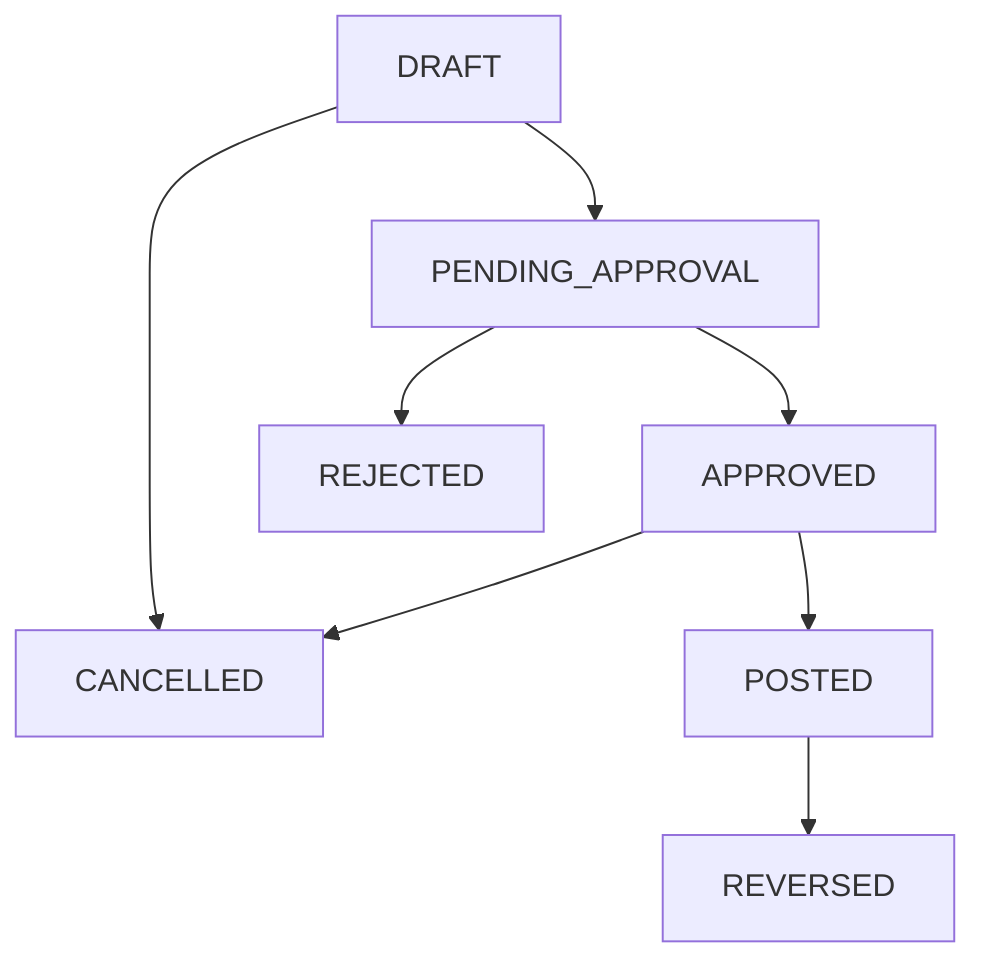

# Financial Module - Business Domain Guide

> **Complete guide to financial concepts, business rules, and domain model for the AWO ERP Financial Module.**

## Table of Contents

1. [Double-Entry Bookkeeping Principles](#double-entry-bookkeeping-principles)
2. [Chart of Accounts Structure](#chart-of-accounts-structure)
3. [Transaction Lifecycle Management](#transaction-lifecycle-management)  
4. [Financial Reporting Framework](#financial-reporting-framework)
5. [Multi-Currency Operations](#multi-currency-operations)
6. [Approval Workflows](#approval-workflows)
7. [Compliance & Regulatory Features](#compliance--regulatory-features)
8. [Business Rules & Validation](#business-rules--validation)

---

## Double-Entry Bookkeeping Principles

### Fundamental Accounting Equation

The Financial Module enforces the fundamental accounting equation at all times:

**Assets = Liabilities + Equity**

Every transaction maintains this balance through double-entry principles where:
- **Every transaction has at least two entries**
- **Total debits must equal total credits**  
- **No transaction can be posted unless balanced**

### Account Types & Normal Balances

| Account Type | Normal Balance | Increase | Decrease |
|--------------|---------------|----------|-----------|
| **Assets** | Debit | Debit | Credit |
| **Liabilities** | Credit | Credit | Debit |
| **Equity** | Credit | Credit | Debit |  
| **Revenue** | Credit | Credit | Debit |
| **Expenses** | Debit | Debit | Credit |

### Double-Entry Examples

**Example 1: Cash Purchase of Equipment**
```
Dr. Equipment (Asset)           $10,000
    Cr. Cash (Asset)                    $10,000
```

**Example 2: Sale on Credit**
```
Dr. Accounts Receivable (Asset) $5,000
    Cr. Sales Revenue (Revenue)         $5,000
```

**Example 3: Payment of Expenses**
```
Dr. Office Expense (Expense)    $1,200
    Cr. Cash (Asset)                    $1,200
```

---

## Chart of Accounts Structure

### Hierarchical Account Organization

The chart of accounts supports unlimited hierarchical depth with materialized path optimization:

```
1000 - ASSETS
├── 1100 - Current Assets
│   ├── 1110 - Cash and Cash Equivalents
│   │   ├── 1111 - Petty Cash
│   │   ├── 1112 - Checking Account - Main
│   │   └── 1113 - Savings Account
│   ├── 1120 - Accounts Receivable
│   │   ├── 1121 - Trade Receivables
│   │   └── 1122 - Other Receivables
│   └── 1130 - Inventory
│       ├── 1131 - Raw Materials
│       └── 1132 - Finished Goods
└── 1200 - Non-Current Assets
    ├── 1210 - Property, Plant & Equipment
    └── 1220 - Intangible Assets
```

### Account Properties & Business Rules

**Core Properties:**
- **Account Code**: Unique identifier (e.g., "1000", "4010")
- **Account Name**: Human-readable description
- **Root Type**: Primary classification (Asset, Liability, Equity, Revenue, Expense)
- **Account Type**: Secondary classification (Current Asset, Fixed Asset, etc.)
- **Normal Balance**: Debit or Credit based on account type

**Operational Controls:**
- **Is Active**: Controls whether account accepts new transactions
- **Allow Manual Entries**: Permits direct journal entries
- **Require Reference**: Mandates reference numbers for audit trail
- **Is System Account**: Protects critical accounts from modification

**Hierarchy Rules:**
1. **Parent-Child Relationships**: Accounts can have unlimited sub-accounts
2. **Leaf Account Posting**: Only accounts without children accept transactions
3. **Balance Roll-Up**: Parent account balances aggregate child balances
4. **Circular Reference Prevention**: Accounts cannot be their own parent

### Account Groups & Financial Statement Mapping

**Balance Sheet Groups:**
- **Current Assets**: Cash, receivables, inventory, prepaid expenses
- **Non-Current Assets**: Property, equipment, intangible assets
- **Current Liabilities**: Accounts payable, accrued expenses, short-term debt
- **Non-Current Liabilities**: Long-term debt, deferred tax liabilities
- **Equity**: Paid-in capital, retained earnings, accumulated other comprehensive income

**Income Statement Groups:**
- **Revenue**: Sales revenue, service revenue, other income
- **Cost of Goods Sold**: Direct materials, direct labor, manufacturing overhead
- **Operating Expenses**: Selling expenses, administrative expenses
- **Other Income/Expenses**: Interest income/expense, gain/loss on asset sales

**Cash Flow Statement Groups:**
- **Operating Activities**: Core business operations
- **Investing Activities**: Asset purchases/sales, investments
- **Financing Activities**: Debt/equity transactions, dividends

---

## Transaction Lifecycle Management

### Transaction States

Transactions follow a strict state machine with controlled transitions:



### State Definitions

| State | Description | Allowed Operations | Business Rules |
|-------|-------------|-------------------|----------------|
| **DRAFT** | Initial state for new transactions | Edit, Submit, Cancel | No posting date required |
| **PENDING_APPROVAL** | Awaiting approval | Approve, Reject, Cancel | Approval required = true |
| **APPROVED** | Approved but not posted | Post, Cancel | Ready for posting |
| **POSTED** | Posted to general ledger | Reverse only | Immutable, affects balances |
| **CANCELLED** | Cancelled before posting | View only | No impact on balances |
| **REJECTED** | Rejected during approval | Edit, Resubmit | Returns to draft state |
| **REVERSED** | Reversed after posting | View only | Reversal creates new transaction |

### Transaction Types

**MANUAL**: User-created journal entries
- General journal entries
- Adjusting entries  
- Correcting entries

**SYSTEM**: Automatically generated transactions
- Depreciation calculations
- Accrual reversals
- Period-end adjustments

**IMPORTED**: External data imports
- Bank statement imports
- Third-party system integrations
- Bulk data uploads

**RECURRING**: Template-based repeating transactions
- Monthly rent payments
- Periodic depreciation
- Scheduled loan payments

### Transaction Validation Rules

**Balance Validation:**
1. Total debits must equal total credits
2. Minimum of two transaction entries required
3. At least one debit and one credit entry

**Date Validation:**
1. Transaction date cannot be in the future
2. Posting date required when status = POSTED
3. Due date optional, must be >= transaction date

**Account Validation:**
1. All accounts must be active
2. Accounts must allow manual entries (if manual transaction)
3. Reference required for accounts marked as such

**Amount Validation:**
1. Entry amounts must be positive
2. Each entry must have either debit OR credit (not both)
3. Currency consistency across transaction

---

## Financial Reporting Framework

### Standard Financial Statements

**1. Balance Sheet (Statement of Financial Position)**
- **Assets**: Current and non-current asset balances
- **Liabilities**: Current and non-current liability balances  
- **Equity**: Owner's equity and retained earnings
- **Balance Verification**: Assets = Liabilities + Equity

**2. Income Statement (Profit & Loss)**
- **Revenue**: All income-generating activities
- **Expenses**: Cost of goods sold and operating expenses
- **Net Income**: Revenue minus expenses
- **Period Comparison**: Current vs. prior periods

**3. Cash Flow Statement**
- **Operating Activities**: Cash from core business operations
- **Investing Activities**: Cash from asset/investment transactions
- **Financing Activities**: Cash from debt/equity activities
- **Net Cash Flow**: Sum of all activity categories

**4. Trial Balance**
- **Account Listing**: All accounts with balances
- **Debit/Credit Totals**: Verification that debits = credits
- **Balance Details**: Beginning balance + activity = ending balance

### Reporting Periods

**Monthly Reporting:**
- Month-to-date activity
- Month-end balances
- Comparative prior month

**Quarterly Reporting:**
- Quarterly financial statements
- Year-over-year comparisons
- Trend analysis

**Annual Reporting:**
- Full-year financial statements
- Audited financials preparation
- Tax reporting compliance

### Management Reporting

**Departmental P&L:**
- Revenue and expenses by department
- Cost center analysis
- Performance metrics

**Project Accounting:**
- Project-specific revenue and costs
- Budget vs. actual comparisons
- Profitability analysis

**Budget Analysis:**
- Budget vs. actual variance reporting
- Forecast adjustments
- Performance indicators

---

## Multi-Currency Operations

### Currency Configuration

**Base Currency (Functional Currency):**
- Primary operating currency of the business entity
- All financial statements presented in base currency
- Default currency for new transactions

**Foreign Currencies:**
- Additional currencies for international operations
- Real-time exchange rate management
- Automatic currency conversion

### Exchange Rate Management

**Rate Types:**
1. **Spot Rates**: Current market exchange rates
2. **Average Rates**: Period average rates for income statement items
3. **Historical Rates**: Rates at specific transaction dates
4. **Budget Rates**: Planning rates for forecasting

**Rate Sources:**
- Manual entry by authorized users
- Automatic import from financial data providers
- Central bank official rates
- Custom rate calculation formulas

### Currency Translation Process

**Transaction Level:**
1. Record transaction in original currency
2. Convert to functional currency using transaction date rate
3. Store both original and functional currency amounts
4. Track exchange gains/losses

**Financial Statement Translation:**
- **Assets & Liabilities**: Current rate at balance sheet date
- **Income & Expenses**: Average rate for the period
- **Equity**: Historical rates at transaction dates
- **Translation Adjustments**: Other comprehensive income

### Multi-Currency Reporting

**Currency-Specific Reports:**
- Financial statements in any supported currency
- Multi-currency trial balance
- Exchange rate impact analysis

**Consolidation Features:**
- Multi-entity, multi-currency consolidation
- Elimination of intercompany transactions
- Currency translation adjustments

---

## Approval Workflows

### Approval Configuration

**Approval Requirements:**
- **Transaction Amount Thresholds**: Minimum amounts requiring approval
- **Account-Based Rules**: Sensitive accounts requiring approval
- **User Role Permissions**: Role-based approval authority
- **Entity-Specific Rules**: Different rules per business entity

**Approval Hierarchy:**
1. **Single Approver**: One authorized user approval
2. **Sequential Approval**: Multiple approvers in sequence
3. **Parallel Approval**: Multiple approvers simultaneously  
4. **Committee Approval**: Group decision requirement

### Approval Process Flow

**1. Submission:**
```
User creates transaction → System validates → Status: PENDING_APPROVAL
```

**2. Notification:**
```
Approval request sent → Approver receives notification → Review period begins
```

**3. Decision:**
```
Approver reviews → Approve/Reject decision → Reason documented
```

**4. Outcome:**
```
Approved → Ready for posting
Rejected → Returns to draft with comments
```

### Approval Controls

**Authority Limits:**
- Maximum transaction amounts per user role
- Account restrictions by user
- Time-based approval validity
- Override approval for emergencies

**Segregation of Duties:**
- Transaction creator cannot approve own transactions
- Multiple approvers for high-value transactions
- Independent review for sensitive accounts
- Audit trail of all approval activities

### Approval Reporting

**Pending Approvals Dashboard:**
- Transactions awaiting approval by user
- Aging analysis of pending items
- Priority escalation indicators
- Approval performance metrics

**Approval History:**
- Complete audit trail of approval decisions
- Approver identification and timestamps
- Rejection reasons and documentation
- Approval time analysis

---

## Compliance & Regulatory Features

### Audit Trail Requirements

**SOX Compliance (Sarbanes-Oxley):**
- Immutable transaction records after posting
- Complete change history with user identification
- Control environment documentation
- Management assertions support

**GAAP Compliance (Generally Accepted Accounting Principles):**
- Double-entry bookkeeping enforcement
- Revenue recognition principles
- Matching principle implementation
- Disclosure requirement support

**IFRS Compliance (International Financial Reporting Standards):**
- Fair value measurement capabilities
- Component accounting for complex assets
- Impairment testing support
- Comprehensive income reporting

### Data Retention Policies

**Legal Requirements:**
- Minimum retention periods by jurisdiction
- Immutable audit trails
- Secure archival processes
- Litigation hold capabilities

**Regulatory Reporting:**
- Tax authority reporting formats
- Regulatory filing automation
- Compliance monitoring dashboards
- Exception reporting

### Internal Controls

**Financial Controls:**
- Segregation of duties enforcement
- Authorization level controls
- Review and approval processes
- Reconciliation procedures

**System Controls:**
- User access controls
- Data validation rules
- Error detection mechanisms
- Exception handling procedures

**Monitoring & Testing:**
- Control effectiveness testing
- Management review processes
- Internal audit support
- Compliance monitoring

---

## Business Rules & Validation

### Account Validation Rules

**Account Code Rules:**
1. Must be unique within tenant/entity
2. Cannot be changed after transactions exist
3. Must follow configured numbering scheme
4. Required format validation (numeric, alphanumeric)

**Hierarchy Rules:**
1. Maximum hierarchy depth (configurable)
2. Circular reference prevention
3. Parent account type compatibility
4. Leaf account posting restrictions

**Status Rules:**
1. Active accounts required for new transactions
2. System accounts protected from deletion
3. Control accounts cannot have direct entries
4. Inactive accounts hide from user selection

### Transaction Validation Rules

**Financial Validation:**
1. **Balance Requirement**: Debits must equal credits
2. **Minimum Entries**: At least two transaction entries
3. **Amount Validation**: Positive amounts only
4. **Currency Consistency**: Single currency per transaction

**Date Validation:**
1. **Transaction Date**: Cannot be future-dated
2. **Posting Date**: Required when status = POSTED
3. **Period Validation**: Must be in open accounting period
4. **Sequence Validation**: Posting date >= transaction date

**Account Validation:**
1. **Account Status**: Must be active
2. **Posting Rights**: Account must allow entries
3. **Reference Requirements**: Reference mandatory if account requires
4. **Entity Matching**: Account entity must match transaction entity

### Business Logic Enforcement

**State Transition Rules:**
```
DRAFT → PENDING_APPROVAL: If approval required
DRAFT → POSTED: If no approval required  
PENDING_APPROVAL → APPROVED: By authorized approver
APPROVED → POSTED: With valid posting date
POSTED → REVERSED: Creates reversing entry
```

**Approval Logic:**
```
IF (Transaction Amount > Threshold) 
   OR (Account requires approval)
   OR (Transaction type = ADJUSTMENT)
THEN approval_required = TRUE
```

**Posting Logic:**
```
IF (Transaction status = APPROVED OR DRAFT)
   AND (Total debits = Total credits)
   AND (All accounts active)
   AND (Posting period open)
THEN allow posting
```

### Validation Error Handling

**Error Categories:**
- **BLOCKING**: Prevents transaction save
- **WARNING**: Allows save with user confirmation  
- **INFORMATION**: Notification only

**Error Messages:**
- Clear business language (not technical jargon)
- Specific field identification
- Suggested corrective actions
- Help documentation links

**Validation Timing:**
- **Real-time**: As user enters data
- **On Save**: Before transaction persistence
- **On Submit**: Before approval workflow
- **On Post**: Before general ledger update

---

**This business domain guide provides comprehensive coverage of financial concepts, business rules, and domain model without technical implementation details, making it accessible to business users, analysts, and product teams.**