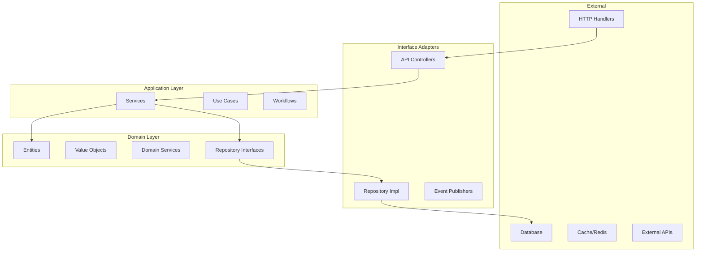
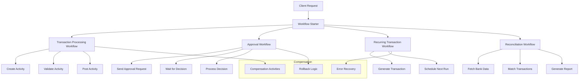

# Financial Module - Technical Architecture

> **Comprehensive guide to the technical implementation of the AWO ERP Financial Module covering Clean Architecture, SQL schema design, SQLC integration, and performance optimization strategies.**

## Table of Contents

1. [Clean Architecture Implementation](#clean-architecture-implementation)
2. [Database Schema Architecture](#database-schema-architecture)
3. [SQLC Integration Patterns](#sqlc-integration-patterns)
4. [Performance Optimization](#performance-optimization)
5. [Security Architecture](#security-architecture)
6. [Transaction Management](#transaction-management)
7. [Query Patterns & Optimization](#query-patterns--optimization)
8. [Code Organization](#code-organization)

---

## Clean Architecture Implementation

The Financial Module follows **Clean Architecture** principles with clear separation of concerns and dependency inversion.

### Layer Architecture



### 1. Handler Layer (Interface Adapters)

**Location**: `/internal/api/handlers/finance/`

**Purpose**: HTTP request/response handling with observability and validation

```go
type FinanceHandler struct {
    services  *financeService.Services
    logger    logger.Logger
    metrics   metrics.MetricsProvider
    tracer    tracing.Service
    validator *validator.Validate
}

func (h *FinanceHandler) CreateAccount(c *fiber.Ctx) error {
    // 1. Distributed tracing
    ctx, span := h.tracer.StartSpan(c.Context(), "finance.CreateAccount")
    defer span.End()
    
    // 2. Request validation with business rules
    var req financeDomain.CreateAccountRequest
    if err := h.ValidateRequest(c, &req); err != nil {
        return h.HandleError(c, err)
    }
    
    // 3. Service layer delegation
    account, err := h.services.Account.Create(ctx, &req)
    if err != nil {
        span.RecordError(err)
        return h.HandleError(c, err)
    }
    
    // 4. Structured response
    return h.Created(c, account)
}
```

### 2. Service Layer (Application/Use Cases)

**Location**: `/internal/core/finance/service/`

**Purpose**: Business logic orchestration and transaction coordination

```go
type AccountService interface {
    // Core CRUD operations
    Create(ctx context.Context, req *domain.CreateAccountRequest) (*domain.Accounts, error)
    GetByID(ctx context.Context, id uuid.UUID) (*domain.Accounts, error)
    Update(ctx context.Context, id uuid.UUID, req *domain.UpdateAccountRequest) (*domain.Accounts, error)
    
    // Business operations
    GetAccountHierarchy(ctx context.Context, rootAccountID uuid.UUID) ([]*domain.Accounts, error)
    ValidateAccountCode(ctx context.Context, code string, excludeID *uuid.UUID) error
    GetTrialBalance(ctx context.Context, entityID *uuid.UUID, asOfDate *time.Time) ([]*domain.TrialBalanceSummary, error)
}

// Implementation with dependency injection
type accountService struct {
    repo      domain.AccountRepository
    validator domain.ValidationService
    cache     cache.Service
    logger    logger.Logger
    tracer    tracing.Service
}
```

### 3. Domain Layer (Entities & Business Rules)

**Location**: `/internal/core/finance/domain/`

**Purpose**: Core business entities, value objects, and domain logic

```go
type Accounts struct {
    // Identity
    ID       uuid.UUID  `json:"id"`
    TenantID uuid.UUID  `json:"tenant_id"`
    
    // Core properties
    AccountCode string        `json:"account_code"`
    AccountName string        `json:"account_name"`
    RootType    RootType      `json:"root_type"`
    
    // Financial tracking
    CurrentBalance decimal.Decimal `json:"current_balance"`
    YTDBalance     decimal.Decimal `json:"ytd_balance"`
    
    // Business rules enforcement
    IsActive           bool `json:"is_active"`
    AllowManualEntries bool `json:"allow_manual_entries"`
}

// Domain methods with business logic
func (a *Accounts) CanReceiveEntries() bool {
    return a.IsActive && a.AllowManualEntries && a.IsLeafAccount
}

func (a *Accounts) UpdateBalance(amount decimal.Decimal, isDebit bool) error {
    if !a.CanReceiveEntries() {
        return domain.ErrAccountNotPostable
    }
    
    if (isDebit && a.NormalBalance == NormalBalanceDebit) ||
       (!isDebit && a.NormalBalance == NormalBalanceCredit) {
        a.CurrentBalance = a.CurrentBalance.Add(amount)
    } else {
        a.CurrentBalance = a.CurrentBalance.Sub(amount)
    }
    
    a.UpdatedAt = time.Now()
    return nil
}
```

### 4. Repository Layer (Data Access)

**Location**: `/internal/core/finance/repository/`

**Purpose**: Data persistence abstraction with SQLC integration

```go
type Repository struct {
    db      DBTX
    queries *db.Queries
    logger  logger.Logger
}

func (r *Repository) Create(ctx context.Context, account *domain.Accounts) (*domain.Accounts, error) {
    // Convert domain entity to SQLC parameters
    params := db.CreateAccountParams{
        AccountCode: account.AccountCode,
        AccountName: account.AccountName,
        RootType:    string(account.RootType),
        // ... other fields
    }
    
    // Execute type-safe query
    result, err := r.queries.CreateAccount(ctx, params)
    if err != nil {
        return nil, r.handleDBError(err)
    }
    
    // Convert back to domain entity
    return r.toDomainAccount(result), nil
}
```

---

## Database Schema Architecture

### Enterprise-Grade Design Principles

**1. Security-First Architecture**
- **Row Level Security (RLS)**: Automatic tenant isolation
- **Comprehensive Audit Trails**: Full change tracking
- **Soft Delete Patterns**: Compliance-friendly data retention

**2. Financial Integrity Enforcement**
- **Double-entry Constraints**: Database-level validation
- **State Machine Controls**: Transaction lifecycle management
- **Optimistic Locking**: Concurrent modification prevention

### Core Table Structures

#### 1. finance_accounts

```sql
CREATE TABLE finance_accounts (
    -- Identity & Tenant Isolation
    id UUID PRIMARY KEY DEFAULT gen_random_uuid(),
    tenant_id UUID NOT NULL REFERENCES tenants(id) ON DELETE CASCADE,
    entity_id UUID REFERENCES entities(uuid) ON DELETE CASCADE,
    
    -- Account Identification
    account_code VARCHAR(20) NOT NULL,
    account_name VARCHAR(255) NOT NULL,
    account_description TEXT,
    
    -- Hierarchy Management
    parent_account_id UUID REFERENCES finance_accounts(id) ON DELETE RESTRICT,
    account_level INTEGER NOT NULL DEFAULT 1,
    account_path VARCHAR(500), -- Materialized path: '/1000/1100/1110'
    has_children BOOLEAN DEFAULT false,
    is_leaf_account BOOLEAN DEFAULT true,
    
    -- Financial Classification
    root_type VARCHAR(20) NOT NULL CHECK (
        root_type IN ('ASSET', 'LIABILITY', 'EQUITY', 'REVENUE', 'EXPENSE')
    ),
    account_type VARCHAR(50) NOT NULL,
    account_subtype VARCHAR(50),
    normal_balance VARCHAR(10) NOT NULL CHECK (normal_balance IN ('DEBIT', 'CREDIT')),
    
    -- Group Relationships
    account_group_id UUID REFERENCES finance_account_groups(id) ON DELETE SET NULL,
    account_header_id UUID REFERENCES finance_account_groups(id) ON DELETE SET NULL,
    
    -- Financial Tracking
    current_balance DECIMAL(15, 2) DEFAULT 0.00,
    ytd_balance DECIMAL(15, 2) DEFAULT 0.00,
    last_transaction_date DATE,
    
    -- Multi-Currency Support
    currency_code CHAR(3) DEFAULT 'USD',
    is_multi_currency BOOLEAN DEFAULT false,
    currency_revaluation_required BOOLEAN DEFAULT false,
    
    -- Operational Controls
    is_active BOOLEAN NOT NULL DEFAULT true,
    is_system_account BOOLEAN NOT NULL DEFAULT false,
    allow_manual_entries BOOLEAN NOT NULL DEFAULT true,
    require_reference BOOLEAN NOT NULL DEFAULT false,
    
    -- Reporting Configuration
    financial_statement_line VARCHAR(100),
    report_order INTEGER DEFAULT 999,
    show_in_reports BOOLEAN DEFAULT true,
    cash_flow_type VARCHAR(20) CHECK (
        cash_flow_type IS NULL OR 
        cash_flow_type IN ('OPERATING', 'INVESTING', 'FINANCING')
    ),
    
    -- Audit & Versioning
    version INTEGER NOT NULL DEFAULT 1 CHECK (version > 0),
    validation_status VARCHAR(20) DEFAULT 'PENDING' CHECK (
        validation_status IN ('PENDING', 'VALID', 'WARNING', 'ERROR')
    ),
    validation_errors JSONB DEFAULT '[]'::jsonb,
    last_validation_run TIMESTAMPTZ,
    
    -- Flexible Attributes
    account_attributes JSONB DEFAULT '{}'::jsonb,
    
    -- Standard Audit Fields
    created_at TIMESTAMPTZ NOT NULL DEFAULT NOW(),
    updated_at TIMESTAMPTZ NOT NULL DEFAULT NOW(),
    deleted_at TIMESTAMPTZ,
    created_by UUID REFERENCES users(id),
    updated_by UUID REFERENCES users(id),
    
    -- Business Constraints
    UNIQUE (tenant_id, account_code),
    UNIQUE (tenant_id, account_name, parent_account_id)
);
```

#### 2. finance_transactions

```sql
CREATE TABLE finance_transactions (
    -- Identity & Tenant Isolation
    id UUID PRIMARY KEY DEFAULT gen_random_uuid(),
    tenant_id UUID NOT NULL REFERENCES tenants(id) ON DELETE CASCADE,
    entity_id UUID REFERENCES entities(uuid) ON DELETE CASCADE,
    
    -- Transaction Identification
    transaction_number VARCHAR(50) NOT NULL,
    transaction_type VARCHAR(30) NOT NULL CHECK (
        transaction_type IN ('MANUAL', 'SYSTEM', 'IMPORTED', 'RECURRING', 'ADJUSTMENT', 'CLOSING')
    ),
    
    -- State Management
    transaction_status VARCHAR(20) NOT NULL DEFAULT 'DRAFT' CHECK (
        transaction_status IN ('DRAFT', 'PENDING_APPROVAL', 'APPROVED', 'POSTED', 'CANCELLED', 'REVERSED')
    ),
    
    -- Financial Information
    currency_code CHAR(3) NOT NULL DEFAULT 'USD',
    exchange_rate DECIMAL(18, 8) DEFAULT 1.0 CHECK (exchange_rate > 0),
    total_debit_amount DECIMAL(15, 4) NOT NULL DEFAULT 0.00,
    total_credit_amount DECIMAL(15, 4) NOT NULL DEFAULT 0.00,
    
    -- Dates
    transaction_date DATE NOT NULL,
    posting_date DATE,
    due_date DATE,
    
    -- Description & References
    description TEXT NOT NULL,
    reference_number VARCHAR(100),
    external_reference VARCHAR(100),
    memo TEXT,
    
    -- Source Tracking
    source_module VARCHAR(50),
    source_document_type VARCHAR(50),
    source_document_id UUID,
    batch_id UUID,
    
    -- Approval Workflow
    approval_required BOOLEAN DEFAULT false,
    approval_status VARCHAR(20) DEFAULT 'NOT_REQUIRED' CHECK (
        approval_status IN ('NOT_REQUIRED', 'PENDING', 'APPROVED', 'REJECTED')
    ),
    approved_by UUID REFERENCES users(id),
    approved_at TIMESTAMPTZ,
    approval_notes TEXT,
    
    -- Recurring Transactions
    is_recurring BOOLEAN DEFAULT false,
    recurring_frequency VARCHAR(20) CHECK (
        recurring_frequency IS NULL OR 
        recurring_frequency IN ('DAILY', 'WEEKLY', 'MONTHLY', 'QUARTERLY', 'YEARLY')
    ),
    next_recurring_date DATE,
    
    -- Reversal Tracking
    is_reversed BOOLEAN DEFAULT false,
    reversed_by_transaction_id UUID REFERENCES finance_transactions(id),
    reversal_reason TEXT,
    
    -- Validation & Versioning
    version INTEGER NOT NULL DEFAULT 1 CHECK (version > 0),
    validation_status VARCHAR(20) DEFAULT 'PENDING' CHECK (
        validation_status IN ('PENDING', 'VALID', 'WARNING', 'ERROR')
    ),
    validation_errors JSONB DEFAULT '[]'::jsonb,
    
    -- Flexible Attributes
    transaction_attributes JSONB DEFAULT '{}'::jsonb,
    attachment_ids TEXT[],
    tags VARCHAR(25)[],
    
    -- Standard Audit Fields
    created_at TIMESTAMPTZ NOT NULL DEFAULT NOW(),
    updated_at TIMESTAMPTZ NOT NULL DEFAULT NOW(),
    deleted_at TIMESTAMPTZ,
    created_by UUID NOT NULL REFERENCES users(id),
    updated_by UUID REFERENCES users(id),
    posted_by UUID REFERENCES users(id),
    posted_at TIMESTAMPTZ,
    
    -- Business Rule Constraints
    CONSTRAINT balanced_transaction CHECK (
        CASE WHEN transaction_status IN ('POSTED', 'APPROVED') 
        THEN total_debit_amount = total_credit_amount
        ELSE TRUE END
    ),
    
    CONSTRAINT posting_date_logic CHECK (
        CASE WHEN transaction_status = 'POSTED' 
        THEN posting_date IS NOT NULL AND posted_by IS NOT NULL AND posted_at IS NOT NULL
        ELSE TRUE END
    ),
    
    CONSTRAINT approval_logic CHECK (
        CASE WHEN approval_required = true AND transaction_status IN ('APPROVED', 'POSTED')
        THEN approved_by IS NOT NULL AND approved_at IS NOT NULL
        ELSE TRUE END
    ),
    
    CONSTRAINT reversal_logic CHECK (
        CASE WHEN is_reversed = true 
        THEN reversed_by_transaction_id IS NOT NULL AND reversal_reason IS NOT NULL
        ELSE reversed_by_transaction_id IS NULL END
    ),
    
    -- Unique Constraints
    UNIQUE (tenant_id, transaction_number)
);
```

#### 3. finance_transaction_entries

```sql
CREATE TABLE finance_transaction_entries (
    -- Identity
    id UUID PRIMARY KEY DEFAULT gen_random_uuid(),
    tenant_id UUID NOT NULL REFERENCES tenants(id) ON DELETE CASCADE,
    entity_id UUID REFERENCES entities(uuid) ON DELETE CASCADE,
    
    -- Transaction Relationship
    transaction_id UUID NOT NULL REFERENCES finance_transactions(id) ON DELETE CASCADE,
    entry_number INTEGER NOT NULL,
    
    -- Account Relationship
    account_id UUID NOT NULL REFERENCES finance_accounts(id) ON DELETE RESTRICT,
    
    -- Entry Amounts (enforces single-sided entries)
    debit_amount DECIMAL(15, 2) NOT NULL DEFAULT 0.00,
    credit_amount DECIMAL(15, 2) NOT NULL DEFAULT 0.00,
    
    -- Entry Details
    description TEXT NOT NULL,
    reference VARCHAR(100),
    
    -- Dimensional Analysis
    cost_center VARCHAR(20),
    department VARCHAR(50),
    project_id UUID,
    
    -- Multi-Currency Support
    original_currency CHAR(3),
    original_amount DECIMAL(15, 2),
    exchange_rate DECIMAL(18, 8),
    
    -- Tax Information
    tax_code VARCHAR(20),
    tax_rate DECIMAL(5, 2),
    tax_amount DECIMAL(15, 2),
    
    -- Reconciliation
    reconciled BOOLEAN DEFAULT false,
    reconciled_date DATE,
    reconciliation_reference VARCHAR(100),
    
    -- Standard Audit Fields
    created_at TIMESTAMPTZ NOT NULL DEFAULT NOW(),
    updated_at TIMESTAMPTZ NOT NULL DEFAULT NOW(),
    deleted_at TIMESTAMPTZ,
    
    -- Double-Entry Validation Constraints
    CHECK (debit_amount >= 0 AND credit_amount >= 0),
    CHECK (NOT (debit_amount > 0 AND credit_amount > 0)), -- Single-sided
    CHECK (debit_amount > 0 OR credit_amount > 0),        -- Must have amount
    
    -- Entry Uniqueness
    UNIQUE (transaction_id, entry_number)
);
```

### Referential Integrity Strategy

**Cascade Deletion Patterns:**
```sql
-- Tenant deletion cascades to all financial data
tenant_id UUID NOT NULL REFERENCES tenants(id) ON DELETE CASCADE

-- Transaction deletion cascades to all entries
transaction_id UUID NOT NULL REFERENCES finance_transactions(id) ON DELETE CASCADE
```

**Restrict Deletion Patterns (Business Logic Protection):**
```sql
-- Cannot delete accounts with existing transactions
account_id UUID NOT NULL REFERENCES finance_accounts(id) ON DELETE RESTRICT

-- Cannot delete parent accounts with children
parent_account_id UUID REFERENCES finance_accounts(id) ON DELETE RESTRICT
```

**Hierarchical Integrity:**
```sql
-- Prevent self-references and deep nesting
CONSTRAINT chk_account_parent_not_self CHECK (id != parent_account_id),
CONSTRAINT chk_account_level_depth CHECK (account_level BETWEEN 1 AND 10)
```

### Row Level Security (RLS) Implementation

```sql
-- Enable RLS on all financial tables
ALTER TABLE finance_accounts ENABLE ROW LEVEL SECURITY;
ALTER TABLE finance_transactions ENABLE ROW LEVEL SECURITY;
ALTER TABLE finance_transaction_entries ENABLE ROW LEVEL SECURITY;

-- Tenant isolation policy
CREATE POLICY tenant_isolation_policy ON finance_accounts 
FOR ALL TO application_role USING (
    current_tenant_id() IS NOT NULL AND tenant_id = current_tenant_id()
) WITH CHECK (
    current_tenant_id() IS NOT NULL AND tenant_id = current_tenant_id()
);

-- Admin bypass policy
CREATE POLICY admin_full_access_policy ON finance_accounts 
FOR ALL TO admin_role USING (true);
```

---

## SQLC Integration Patterns

### Type-Safe Code Generation

**1. Financial Data Precision**

```go
// PostgreSQL DECIMAL maps to pgtype.Numeric for precision
type FinanceTransaction struct {
    ExchangeRate      pgtype.Numeric `json:"exchange_rate"`
    TotalDebitAmount  pgtype.Numeric `json:"total_debit_amount"`
    TotalCreditAmount pgtype.Numeric `json:"total_credit_amount"`
}

// Arrays mapped to Go slices
type FinanceTransaction struct {
    AttachmentIds []string `json:"attachment_ids"`
    Tags          []string `json:"tags"`
}

// JSONB fields mapped to []byte for flexibility
type FinanceAccount struct {
    ValidationErrors  []byte `json:"validation_errors"`
    AccountAttributes []byte `json:"account_attributes"`
}
```

**2. Parameter Mapping Strategy**

```go
// SQLC generates strongly-typed parameter structs
type CreateAccountParams struct {
    AccountCode string         `json:"account_code"`
    AccountName string         `json:"account_name"`
    RootType    string         `json:"root_type"`
    EntityID    *uuid.UUID     `json:"entity_id"`        // nullable
    IsActive    *bool          `json:"is_active"`        // nullable
}

// Query method generation patterns
// :one queries return single struct pointer
func (q *Queries) GetAccountByID(ctx context.Context, 
    accountID uuid.UUID) (*FinanceAccount, error)

// :many queries return slices
func (q *Queries) ListAccounts(ctx context.Context, 
    arg ListAccountsParams) ([]*FinanceAccount, error)

// :exec queries return error only
func (q *Queries) DeleteAccount(ctx context.Context, 
    accountID uuid.UUID) error
```

**3. Tenant Isolation at Code Level**

```sql
-- SQL automatically includes tenant context
-- name: GetAccountByID :one
SELECT * FROM finance_accounts 
WHERE id = $1 AND tenant_id = current_tenant_id() AND deleted_at IS NULL;

-- name: ListActiveAccounts :many  
SELECT * FROM finance_accounts
WHERE tenant_id = current_tenant_id() 
  AND deleted_at IS NULL 
  AND is_active = true
ORDER BY account_code;
```

```go
// Generated Go code doesn't need explicit tenant_id parameter
// SQLC handles tenant isolation transparently through database function
account, err := queries.GetAccountByID(ctx, accountID)
accounts, err := queries.ListActiveAccounts(ctx)
```

**4. Complex Query Handling**

```sql
-- name: GetTransactionWithEntries :many
SELECT 
    t.*,
    te.id as entry_id,
    te.entry_number,
    te.account_id,
    te.debit_amount,
    te.credit_amount,
    te.description as entry_description,
    a.account_code,
    a.account_name,
    a.normal_balance
FROM finance_transactions t
LEFT JOIN finance_transaction_entries te ON t.id = te.transaction_id
LEFT JOIN finance_accounts a ON te.account_id = a.id
WHERE t.id = $1 
  AND t.tenant_id = current_tenant_id() 
  AND t.deleted_at IS NULL
ORDER BY te.entry_number ASC;
```

```go
// Generated struct for complex query results
type GetTransactionWithEntriesRow struct {
    // Transaction fields
    ID                uuid.UUID      `json:"id"`
    TransactionNumber string         `json:"transaction_number"`
    // Entry fields
    EntryID           *uuid.UUID     `json:"entry_id"`
    EntryNumber       *int32         `json:"entry_number"`
    DebitAmount       pgtype.Numeric `json:"debit_amount"`
    // Account fields
    AccountCode       *string        `json:"account_code"`
    AccountName       *string        `json:"account_name"`
}
```

---

## Performance Optimization

### Strategic Indexing

**1. Multi-Column Indexes for Common Access Patterns**

```sql
-- Primary tenant-based queries
CREATE INDEX idx_finance_accounts_tenant_code 
    ON finance_accounts (tenant_id, account_code)
    WHERE deleted_at IS NULL;

CREATE INDEX idx_finance_transactions_tenant_date 
    ON finance_transactions (tenant_id, transaction_date)
    WHERE deleted_at IS NULL;

-- Join optimization
CREATE INDEX idx_finance_entries_transaction 
    ON finance_transaction_entries (transaction_id, entry_number);

CREATE INDEX idx_finance_entries_account 
    ON finance_transaction_entries (account_id, transaction_id);
```

**2. Partial Indexes for Conditional Queries**

```sql
-- Only index records that need approval
CREATE INDEX idx_finance_transactions_approval 
    ON finance_transactions (tenant_id, approval_status, created_at)
    WHERE approval_required = true AND deleted_at IS NULL;

-- Only index active recurring transactions
CREATE INDEX idx_finance_transactions_recurring 
    ON finance_transactions (tenant_id, next_recurring_date)
    WHERE is_recurring = true AND deleted_at IS NULL;

-- Only index unreconciled entries
CREATE INDEX idx_finance_entries_unreconciled 
    ON finance_transaction_entries (account_id, created_at)
    WHERE reconciled = false AND deleted_at IS NULL;
```

**3. Specialized Indexes**

```sql
-- GIN index for array operations (tags, attachment_ids)
CREATE INDEX idx_finance_transactions_tags 
    ON finance_transactions USING GIN (tags)
    WHERE tags IS NOT NULL;

-- GIN index for JSONB attribute searches
CREATE INDEX idx_finance_accounts_attributes 
    ON finance_accounts USING GIN (account_attributes);

-- Text search for descriptions
CREATE INDEX idx_finance_transactions_description 
    ON finance_transactions USING GIN (to_tsvector('english', description));
```

### Query Optimization Patterns

**1. N+1 Query Prevention**

```sql
-- Single query to fetch transaction with all entries and account details
-- name: GetTransactionComplete :many
SELECT 
    t.id, t.transaction_number, t.description, t.transaction_date,
    te.id as entry_id, te.entry_number, te.debit_amount, te.credit_amount,
    a.account_code, a.account_name, a.root_type, a.normal_balance
FROM finance_transactions t
LEFT JOIN finance_transaction_entries te ON t.id = te.transaction_id
LEFT JOIN finance_accounts a ON te.account_id = a.id  
WHERE t.id = $1 AND t.tenant_id = current_tenant_id()
ORDER BY te.entry_number;
```

**2. View-Based Optimization**

```sql
-- Pre-computed view for complex account hierarchies
CREATE VIEW v_accounts_with_balances AS
SELECT 
    a.*,
    COALESCE(SUM(CASE WHEN te.debit_amount > 0 THEN te.debit_amount ELSE 0 END), 0) as total_debits,
    COALESCE(SUM(CASE WHEN te.credit_amount > 0 THEN te.credit_amount ELSE 0 END), 0) as total_credits,
    COUNT(te.id) as transaction_count,
    MAX(t.transaction_date) as last_transaction_date
FROM finance_accounts a
LEFT JOIN finance_transaction_entries te ON a.id = te.account_id
LEFT JOIN finance_transactions t ON te.transaction_id = t.id 
    AND t.transaction_status = 'POSTED'
GROUP BY a.id;

-- Query leverages pre-computed view
-- name: GetAccountsWithBalances :many
SELECT * FROM v_accounts_with_balances
WHERE tenant_id = current_tenant_id() 
  AND is_active = true
ORDER BY account_code;
```

**3. Efficient Pagination**

```sql
-- Cursor-based pagination for large datasets
-- name: ListTransactionsPaginated :many
SELECT * FROM finance_transactions
WHERE tenant_id = current_tenant_id()
  AND deleted_at IS NULL
  AND ($1::timestamptz IS NULL OR created_at < $1)  -- cursor
ORDER BY created_at DESC
LIMIT $2;  -- page_size
```

### Bulk Operations Support

**1. Array-Based Bulk Updates**

```sql
-- name: BulkUpdateTransactionTags :exec
UPDATE finance_transactions 
SET tags = $1::VARCHAR[], 
    updated_at = NOW(),
    updated_by = $2
WHERE id = ANY($3::UUID[]) 
  AND tenant_id = current_tenant_id() 
  AND deleted_at IS NULL;

-- name: BulkReconcileEntries :exec
UPDATE finance_transaction_entries
SET reconciled = true,
    reconciled_date = $1,
    reconciliation_reference = $2,
    updated_at = NOW()
WHERE id = ANY($3::UUID[]) 
  AND tenant_id = current_tenant_id() 
  AND deleted_at IS NULL;
```

**2. Batch Processing Patterns**

```sql
-- name: GetTransactionsByBatch :many
SELECT * FROM finance_transactions 
WHERE batch_id = $1 
  AND tenant_id = current_tenant_id() 
  AND deleted_at IS NULL
ORDER BY created_at;

-- Efficient batch status updates
-- name: UpdateBatchTransactionStatus :exec
UPDATE finance_transactions 
SET transaction_status = $1,
    updated_at = NOW(),
    updated_by = $2
WHERE batch_id = $3 
  AND tenant_id = current_tenant_id() 
  AND transaction_status = $4  -- previous status
  AND deleted_at IS NULL;
```

---

## Security Architecture

### Multi-Tenant Security Model

> ** Security Implementation**: For comprehensive security architecture, RLS implementation details, authentication patterns, and compliance frameworks, see [Operations & Security Guide](./operations-security.md#security-architecture).

**Database-Level Security Integration:**

All SQLC queries automatically include tenant isolation through the `current_tenant_id()` function:

### Audit Trail Implementation

**1. Comprehensive Change Tracking**

```sql
-- Audit trigger function
CREATE OR REPLACE FUNCTION audit_transaction_changes()
RETURNS TRIGGER AS $$
BEGIN
    -- Log all changes to audit table
    INSERT INTO finance_audit_log (
        table_name, record_id, action, 
        old_values, new_values, changed_by, changed_at
    ) VALUES (
        TG_TABLE_NAME, 
        COALESCE(NEW.id, OLD.id),
        TG_OP,
        CASE WHEN TG_OP = 'DELETE' THEN row_to_json(OLD) ELSE NULL END,
        CASE WHEN TG_OP IN ('INSERT', 'UPDATE') THEN row_to_json(NEW) ELSE NULL END,
        current_setting('app.current_user_id', true)::UUID,
        NOW()
    );
    
    RETURN COALESCE(NEW, OLD);
END;
$$ LANGUAGE plpgsql SECURITY DEFINER;

-- Apply audit triggers to all financial tables
CREATE TRIGGER finance_accounts_audit 
    AFTER INSERT OR UPDATE OR DELETE ON finance_accounts
    FOR EACH ROW EXECUTE FUNCTION audit_transaction_changes();
```

**2. Version Control & Optimistic Locking**

```sql
-- Version increment trigger
CREATE OR REPLACE FUNCTION increment_version()
RETURNS TRIGGER AS $$
BEGIN
    NEW.version = OLD.version + 1;
    NEW.updated_at = NOW();
    RETURN NEW;
END;
$$ LANGUAGE plpgsql;

-- Apply to versioned tables
CREATE TRIGGER finance_transaction_version 
    BEFORE UPDATE ON finance_transactions
    FOR EACH ROW EXECUTE FUNCTION increment_version();
```

### Data Protection Patterns

**1. Sensitive Data Handling**

```go
// Encrypted sensitive fields in domain entities
type BankAccount struct {
    ID           uuid.UUID `json:"id"`
    AccountName  string    `json:"account_name"`
    
    // Sensitive fields with encryption
    AccountNumber string `json:"-" encrypt:"true"`          // Hidden from JSON
    RoutingNumber string `json:"-" encrypt:"true"`
    
    // Audit trail
    CreatedAt time.Time `json:"created_at"`
    UpdatedAt time.Time `json:"updated_at"`
}
```

**2. SQL Injection Prevention**

```sql
-- SQLC ensures parameterized queries
-- name: SearchTransactions :many
SELECT * FROM finance_transactions 
WHERE tenant_id = current_tenant_id()
  AND deleted_at IS NULL
  AND (
    -- Safe parameter binding prevents injection
    $1::text IS NULL OR 
    description ILIKE '%' || $1 || '%' OR
    reference_number ILIKE '%' || $1 || '%'
  )
ORDER BY transaction_date DESC
LIMIT $2 OFFSET $3;
```

---

## Transaction Management

### Database Transaction Patterns

**1. Service-Level Transaction Management**

```go
type TransactionService struct {
    db     *sql.DB
    repo   domain.TransactionRepository
    logger logger.Logger
}

func (s *TransactionService) CreateWithEntries(
    ctx context.Context, 
    req *domain.CreateTransactionRequest,
) (*domain.Transaction, error) {
    // Start database transaction
    tx, err := s.db.BeginTx(ctx, &sql.TxOptions{
        Isolation: sql.LevelReadCommitted,
    })
    if err != nil {
        return nil, err
    }
    defer tx.Rollback() // Safe rollback if not committed
    
    // Create transaction header
    transaction, err := s.repo.WithTx(tx).Create(ctx, req)
    if err != nil {
        return nil, err
    }
    
    // Create all entries atomically
    for i, entryReq := range req.Entries {
        entryReq.TransactionID = transaction.ID
        entryReq.EntryNumber = i + 1
        
        _, err := s.repo.WithTx(tx).CreateEntry(ctx, &entryReq)
        if err != nil {
            return nil, fmt.Errorf("failed to create entry %d: %w", i+1, err)
        }
    }
    
    // Validate transaction balance
    if err := s.validateBalance(ctx, tx, transaction.ID); err != nil {
        return nil, err
    }
    
    // Commit transaction
    if err := tx.Commit(); err != nil {
        return nil, err
    }
    
    return transaction, nil
}
```

**2. State Machine Implementation**

```go
type TransactionStateMachine struct {
    allowedTransitions map[TransactionStatus][]TransactionStatus
}

func NewTransactionStateMachine() *TransactionStateMachine {
    return &TransactionStateMachine{
        allowedTransitions: map[TransactionStatus][]TransactionStatus{
            StatusDraft: {StatusPendingApproval, StatusCancelled},
            StatusPendingApproval: {StatusApproved, StatusRejected},
            StatusApproved: {StatusPosted, StatusCancelled},
            StatusPosted: {StatusReversed},
        },
    }
}

func (sm *TransactionStateMachine) CanTransition(
    from, to TransactionStatus,
) bool {
    allowed, exists := sm.allowedTransitions[from]
    if !exists {
        return false
    }
    
    for _, status := range allowed {
        if status == to {
            return true
        }
    }
    return false
}
```

### Concurrency Control

**1. Optimistic Locking with Versions**

```sql
-- name: UpdateTransactionWithVersion :one
UPDATE finance_transactions 
SET description = $2,
    total_debit_amount = $3,
    total_credit_amount = $4,
    updated_at = NOW(),
    updated_by = $5,
    version = version + 1
WHERE id = $1 
  AND version = $6  -- Optimistic lock check
  AND tenant_id = current_tenant_id()
  AND deleted_at IS NULL
RETURNING *;
```

```go
func (s *TransactionService) Update(
    ctx context.Context, 
    id uuid.UUID, 
    req *domain.UpdateTransactionRequest,
) (*domain.Transaction, error) {
    // Attempt update with version check
    result, err := s.repo.UpdateWithVersion(ctx, db.UpdateTransactionWithVersionParams{
        ID:                 id,
        Description:        req.Description,
        TotalDebitAmount:   req.TotalDebitAmount,
        TotalCreditAmount:  req.TotalCreditAmount,
        UpdatedBy:          req.UpdatedBy,
        Version:            req.Version, // Must match current version
    })
    
    if errors.Is(err, db.ErrNoRows) {
        return nil, domain.ErrOptimisticLockFailure
    }
    
    return s.toDomainTransaction(result), err
}
```

**2. Distributed Transaction Coordination**

```go
// Example with outbox pattern for event publishing
func (s *TransactionService) PostTransaction(
    ctx context.Context, 
    id uuid.UUID,
) error {
    return s.db.WithTransaction(ctx, func(tx *sql.Tx) error {
        // 1. Update transaction status
        if err := s.repo.WithTx(tx).UpdateStatus(ctx, id, StatusPosted); err != nil {
            return err
        }
        
        // 2. Update account balances
        if err := s.updateAccountBalances(ctx, tx, id); err != nil {
            return err
        }
        
        // 3. Create outbox event for downstream systems
        event := domain.TransactionPostedEvent{
            TransactionID: id,
            PostedAt:      time.Now(),
        }
        
        if err := s.eventOutbox.WithTx(tx).Create(ctx, &event); err != nil {
            return err
        }
        
        return nil
    })
}
```

---

## Query Patterns & Optimization

### Complex Query Decomposition

**1. Hierarchical Queries with Recursive CTEs**

```sql
-- name: GetAccountHierarchy :many
WITH RECURSIVE account_hierarchy AS (
    -- Base case: root accounts
    SELECT 
        id, account_code, account_name, parent_account_id,
        1 as level,
        account_code::text as path,
        account_code as sort_path
    FROM finance_accounts
    WHERE parent_account_id IS NULL 
      AND tenant_id = current_tenant_id()
      AND deleted_at IS NULL
    
    UNION ALL
    
    -- Recursive case: child accounts  
    SELECT 
        a.id, a.account_code, a.account_name, a.parent_account_id,
        h.level + 1,
        h.path || '/' || a.account_code,
        h.sort_path || '.' || LPAD(a.account_code, 10, '0')
    FROM finance_accounts a
    JOIN account_hierarchy h ON a.parent_account_id = h.id
    WHERE a.tenant_id = current_tenant_id()
      AND a.deleted_at IS NULL
      AND h.level < 10  -- Prevent infinite recursion
)
SELECT * FROM account_hierarchy
ORDER BY sort_path;
```

**2. Efficient Trial Balance Calculation**

```sql
-- name: GetTrialBalance :many
SELECT 
    a.id,
    a.account_code,
    a.account_name,
    a.root_type,
    a.normal_balance,
    COALESCE(SUM(
        CASE WHEN te.debit_amount > 0 THEN te.debit_amount ELSE 0 END
    ), 0) as total_debits,
    COALESCE(SUM(
        CASE WHEN te.credit_amount > 0 THEN te.credit_amount ELSE 0 END  
    ), 0) as total_credits,
    COALESCE(SUM(
        CASE 
            WHEN te.debit_amount > 0 THEN te.debit_amount
            WHEN te.credit_amount > 0 THEN -te.credit_amount
            ELSE 0
        END
    ), 0) as net_balance
FROM finance_accounts a
LEFT JOIN finance_transaction_entries te ON a.id = te.account_id
LEFT JOIN finance_transactions t ON te.transaction_id = t.id 
    AND t.transaction_status = 'POSTED'
    AND t.tenant_id = current_tenant_id()
    AND t.deleted_at IS NULL
    AND ($1::date IS NULL OR t.posting_date <= $1)  -- as_of_date
WHERE a.tenant_id = current_tenant_id()
  AND a.deleted_at IS NULL
  AND a.is_active = true
GROUP BY a.id, a.account_code, a.account_name, a.root_type, a.normal_balance
HAVING (
    $2::boolean IS NULL OR $2 = false OR  -- include_zero_balances
    COALESCE(SUM(
        CASE 
            WHEN te.debit_amount > 0 THEN te.debit_amount
            WHEN te.credit_amount > 0 THEN -te.credit_amount
            ELSE 0
        END
    ), 0) != 0
)
ORDER BY a.account_code;
```

### Advanced Query Patterns

**1. Conditional Filtering with Optional Parameters**

```sql
-- name: SearchTransactions :many
SELECT * FROM finance_transactions
WHERE tenant_id = current_tenant_id()
  AND deleted_at IS NULL
  
  -- Optional filters using COALESCE pattern
  AND ($1::VARCHAR IS NULL OR transaction_type = $1)
  AND ($2::VARCHAR IS NULL OR transaction_status = $2)
  AND ($3::DATE IS NULL OR transaction_date >= $3)
  AND ($4::DATE IS NULL OR transaction_date <= $4)
  AND ($5::TEXT IS NULL OR (
    description ILIKE '%' || $5 || '%' OR
    reference_number ILIKE '%' || $5 || '%' OR
    external_reference ILIKE '%' || $5 || '%'
  ))
  
  -- Array operations for tags
  AND ($6::VARCHAR[] IS NULL OR tags && $6)
  
ORDER BY 
    CASE WHEN $7::TEXT = 'date' THEN transaction_date END DESC,
    CASE WHEN $7::TEXT = 'number' THEN transaction_number END,
    created_at DESC
LIMIT $8 OFFSET $9;
```

**2. Analytical Queries with Window Functions**

```sql
-- name: GetAccountActivityAnalysis :many
SELECT 
    a.account_code,
    a.account_name,
    a.current_balance,
    
    -- Activity metrics
    COUNT(te.id) as total_entries,
    COUNT(CASE WHEN t.transaction_date >= CURRENT_DATE - INTERVAL '30 days' 
          THEN te.id END) as entries_last_30_days,
    
    -- Balance trends
    SUM(CASE WHEN te.debit_amount > 0 THEN te.debit_amount ELSE 0 END) as total_debits,
    SUM(CASE WHEN te.credit_amount > 0 THEN te.credit_amount ELSE 0 END) as total_credits,
    
    -- Running balance calculation
    SUM(CASE WHEN te.debit_amount > 0 THEN te.debit_amount 
             ELSE -te.credit_amount END) 
    OVER (PARTITION BY a.id ORDER BY t.transaction_date, te.created_at 
          ROWS UNBOUNDED PRECEDING) as running_balance,
          
    -- Ranking by activity
    RANK() OVER (ORDER BY COUNT(te.id) DESC) as activity_rank,
    
    -- Last transaction info
    MAX(t.transaction_date) as last_transaction_date,
    FIRST_VALUE(t.description) 
    OVER (PARTITION BY a.id ORDER BY t.transaction_date DESC, te.created_at DESC) as last_transaction_desc
    
FROM finance_accounts a
LEFT JOIN finance_transaction_entries te ON a.id = te.account_id
LEFT JOIN finance_transactions t ON te.transaction_id = t.id
    AND t.transaction_status = 'POSTED'
    AND t.tenant_id = current_tenant_id()
    AND t.deleted_at IS NULL
WHERE a.tenant_id = current_tenant_id()
  AND a.deleted_at IS NULL
  AND a.is_active = true
GROUP BY a.id, a.account_code, a.account_name, a.current_balance
ORDER BY activity_rank;
```

---

## Code Organization

### Directory Structure

```
internal/
├── api/
│   └── handlers/
│       └── finance/
│           ├── handler.go           # Main handler struct
│           ├── account_handlers.go  # Account endpoints  
│           ├── transaction_handlers.go # Transaction endpoints
│           ├── reporting_handlers.go   # Reporting endpoints
│           └── validation.go        # Request validation
│
├── core/
│   └── finance/
│       ├── domain/                  # Domain layer
│       │   ├── entities.go         # Core entities
│       │   ├── value_objects.go    # Value objects
│       │   ├── repositories.go     # Repository interfaces
│       │   ├── services.go         # Domain services
│       │   └── errors.go           # Domain errors
│       │
│       ├── service/                 # Application layer
│       │   ├── account_service.go   # Account use cases
│       │   ├── transaction_service.go # Transaction use cases
│       │   ├── reporting_service.go   # Reporting use cases
│       │   └── validation_service.go  # Business validation
│       │
│       └── repository/              # Data access layer
│           ├── postgres/
│           │   ├── account_repo.go  # Account data access
│           │   ├── transaction_repo.go # Transaction data access
│           │   ├── queries.go       # SQLC generated queries
│           │   └── migrations/      # Database migrations
│           │
│           └── cache/
│               └── redis_cache.go   # Caching implementation
│
└── infrastructure/
    ├── database/
    │   ├── postgres.go              # Database connection
    │   └── migrations.go            # Migration runner
    │
    ├── cache/
    │   └── redis.go                 # Cache connection
    │
    └── observability/
        ├── tracing.go               # Distributed tracing
        ├── metrics.go               # Application metrics
        └── logging.go               # Structured logging
```

### Dependency Injection Pattern

```go
// Service container for dependency injection
type FinanceServices struct {
    Account     domain.AccountService
    Transaction domain.TransactionService
    Reporting   domain.ReportingService
}

func NewFinanceServices(
    accountRepo domain.AccountRepository,
    transactionRepo domain.TransactionRepository,
    cache cache.Service,
    logger logger.Logger,
) *FinanceServices {
    return &FinanceServices{
        Account: service.NewAccountService(accountRepo, cache, logger),
        Transaction: service.NewTransactionService(transactionRepo, logger),
        Reporting: service.NewReportingService(accountRepo, transactionRepo, cache, logger),
    }
}

// Handler dependency injection
type FinanceHandler struct {
    services *FinanceServices
    logger   logger.Logger
    tracer   tracing.Service
}

func NewFinanceHandler(services *FinanceServices, logger logger.Logger, tracer tracing.Service) *FinanceHandler {
    return &FinanceHandler{
        services: services,
        logger:   logger,
        tracer:   tracer,
    }
}
```

### Error Handling Strategy

```go
// Domain errors
var (
    ErrAccountNotFound     = errors.New("account not found")
    ErrAccountNotPostable  = errors.New("account does not allow entries")
    ErrTransactionNotBalanced = errors.New("transaction debits must equal credits")
    ErrInvalidStateTransition = errors.New("invalid transaction state transition")
    ErrOptimisticLockFailure = errors.New("record was modified by another user")
)

// Error categorization
type ErrorType string

const (
    ErrorTypeValidation ErrorType = "VALIDATION"
    ErrorTypeBusiness   ErrorType = "BUSINESS"
    ErrorTypeSystem     ErrorType = "SYSTEM"
    ErrorTypeNotFound   ErrorType = "NOT_FOUND"
)

// Structured error with context
type FinanceError struct {
    Type      ErrorType `json:"type"`
    Message   string    `json:"message"`
    Field     string    `json:"field,omitempty"`
    Code      string    `json:"code"`
    Details   map[string]interface{} `json:"details,omitempty"`
}

func (e *FinanceError) Error() string {
    return e.Message
}
```

---

## Temporal Financial Workflows

The Financial Module implements comprehensive business process automation using Temporal workflows for reliability, observability, and compensation handling.

### Workflow Architecture Overview



### Core Financial Workflows

#### 1. Transaction Processing Workflow

**Primary workflow for all financial transaction processing with full compensation support.**

```go
// TransactionProcessingInput defines the workflow input
type TransactionProcessingInput struct {
    TenantID        uuid.UUID                    `json:"tenant_id"`
    UserID          uuid.UUID                    `json:"user_id"`
    TransactionData CreateTransactionCommand     `json:"transaction_data"`
    ProcessingMode  TransactionProcessingMode    `json:"processing_mode"`
    ApprovalConfig  *ApprovalConfiguration       `json:"approval_config,omitempty"`
}

type TransactionProcessingMode string
const (
    ProcessingModeImmediate TransactionProcessingMode = "IMMEDIATE"
    ProcessingModeQueued    TransactionProcessingMode = "QUEUED"
    ProcessingModeBatch     TransactionProcessingMode = "BATCH"
)

// TransactionProcessingWorkflow orchestrates complete transaction lifecycle
func TransactionProcessingWorkflow(ctx workflow.Context, input TransactionProcessingInput) (*TransactionProcessingResult, error) {
    logger := workflow.GetLogger(ctx)
    
    // Workflow configuration
    activityOptions := workflow.ActivityOptions{
        StartToCloseTimeout:    5 * time.Minute,
        HeartbeatTimeout:       30 * time.Second,
        RetryPolicy: &temporal.RetryPolicy{
            InitialInterval:        time.Second,
            BackoffCoefficient:     2.0,
            MaximumInterval:        time.Minute,
            MaximumAttempts:        3,
            NonRetryableErrorTypes: []string{"ValidationError", "BusinessRuleError"},
        },
    }
    ctx = workflow.WithActivityOptions(ctx, activityOptions)
    
    var transactionID uuid.UUID
    var compensationData CompensationData
    
    // Compensation handling - executed on workflow failure
    defer func() {
        if !workflow.IsReplaying(ctx) {
            disconnectedCtx, _ := workflow.NewDisconnectedContext(ctx)
            workflow.ExecuteActivity(disconnectedCtx, "CompensateTransactionProcessing", 
                CompensateTransactionInput{
                    TransactionID: transactionID,
                    CompensationData: compensationData,
                    Reason: "WorkflowFailure",
                })
        }
    }()
    
    // Step 1: Business Validation
    logger.Info("Starting transaction validation", "transaction_type", input.TransactionData.TransactionType)
    
    var validationResult ValidationResult
    err := workflow.ExecuteActivity(ctx, "ValidateTransactionActivity", input.TransactionData).Get(ctx, &validationResult)
    if err != nil {
        return nil, fmt.Errorf("transaction validation failed: %w", err)
    }
    
    if !validationResult.IsValid {
        return nil, fmt.Errorf("transaction validation failed: %s", validationResult.ErrorMessage)
    }
    
    // Step 2: Create Transaction
    logger.Info("Creating transaction")
    
    var createResult CreateTransactionResult
    err = workflow.ExecuteActivity(ctx, "CreateTransactionActivity", input.TransactionData).Get(ctx, &createResult)
    if err != nil {
        return nil, fmt.Errorf("transaction creation failed: %w", err)
    }
    
    transactionID = createResult.TransactionID
    compensationData.TransactionID = transactionID
    compensationData.CreatedEntities = createResult.CreatedEntities
    
    // Step 3: Approval Processing (if required)
    if validationResult.RequiresApproval || input.ApprovalConfig != nil {
        logger.Info("Processing approval workflow", "transaction_id", transactionID)
        
        approvalInput := ApprovalWorkflowInput{
            TenantID:      input.TenantID,
            TransactionID: transactionID,
            UserID:        input.UserID,
            Configuration: input.ApprovalConfig,
        }
        
        var approvalResult ApprovalResult
        childWorkflowOptions := workflow.ChildWorkflowOptions{
            WorkflowID: fmt.Sprintf("approval-%s", transactionID.String()),
        }
        
        childCtx := workflow.WithChildOptions(ctx, childWorkflowOptions)
        err = workflow.ExecuteChildWorkflow(childCtx, "ApprovalWorkflow", approvalInput).Get(ctx, &approvalResult)
        if err != nil {
            return nil, fmt.Errorf("approval workflow failed: %w", err)
        }
        
        if !approvalResult.Approved {
            return &TransactionProcessingResult{
                TransactionID: transactionID,
                Status:        "REJECTED",
                Message:       approvalResult.RejectionReason,
            }, nil
        }
        
        compensationData.ApprovalID = &approvalResult.ApprovalID
    }
    
    // Step 4: Transaction Posting
    logger.Info("Posting transaction", "transaction_id", transactionID)
    
    var postingResult PostingResult
    err = workflow.ExecuteActivity(ctx, "PostTransactionActivity", PostTransactionInput{
        TransactionID: transactionID,
        PostingDate:   time.Now(),
        UserID:        input.UserID,
    }).Get(ctx, &postingResult)
    if err != nil {
        return nil, fmt.Errorf("transaction posting failed: %w", err)
    }
    
    compensationData.PostedEntries = postingResult.PostedEntries
    
    // Step 5: Balance Updates
    logger.Info("Updating account balances", "affected_accounts", len(postingResult.PostedEntries))
    
    err = workflow.ExecuteActivity(ctx, "UpdateAccountBalancesActivity", UpdateBalancesInput{
        Entries:       postingResult.PostedEntries,
        TransactionID: transactionID,
        PostingDate:   postingResult.PostingDate,
    }).Get(ctx, nil)
    if err != nil {
        return nil, fmt.Errorf("balance update failed: %w", err)
    }
    
    // Step 6: External Integrations (non-critical)
    logger.Info("Processing external integrations")
    
    // Use local activity for fast, non-persistent operations
    localActivityOptions := workflow.LocalActivityOptions{
        ScheduleToCloseTimeout: 30 * time.Second,
    }
    
    localCtx := workflow.WithLocalActivityOptions(ctx, localActivityOptions)
    err = workflow.ExecuteLocalActivity(localCtx, "TriggerExternalIntegrationsActivity", 
        ExternalIntegrationInput{
            TransactionID: transactionID,
            EventType:     "TRANSACTION_POSTED",
        }).Get(ctx, nil)
    if err != nil {
        logger.Warn("External integration failed (non-critical)", "error", err)
        // Continue execution - external integrations are non-critical
    }
    
    // Step 7: Audit and Notifications
    logger.Info("Finalizing transaction processing")
    
    err = workflow.ExecuteActivity(ctx, "FinalizeTransactionActivity", FinalizeTransactionInput{
        TransactionID: transactionID,
        UserID:        input.UserID,
        Success:       true,
    }).Get(ctx, nil)
    if err != nil {
        logger.Warn("Transaction finalization failed (non-critical)", "error", err)
        // Continue - finalization is non-critical for business success
    }
    
    return &TransactionProcessingResult{
        TransactionID: transactionID,
        Status:        "POSTED",
        Message:       "Transaction successfully processed and posted",
        PostingDate:   postingResult.PostingDate,
        AffectedAccounts: len(postingResult.PostedEntries),
    }, nil
}
```

#### 2. Multi-Level Approval Workflow

**Sophisticated approval workflow with escalation, timeouts, and signal handling.**

```go
type ApprovalWorkflowInput struct {
    TenantID      uuid.UUID             `json:"tenant_id"`
    TransactionID uuid.UUID             `json:"transaction_id"`
    UserID        uuid.UUID             `json:"user_id"`
    Configuration *ApprovalConfiguration `json:"configuration"`
}

type ApprovalConfiguration struct {
    RequiredApprovers []ApprovalLevel   `json:"required_approvers"`
    EscalationRules   []EscalationRule  `json:"escalation_rules"`
    TimeoutPolicy     TimeoutPolicy     `json:"timeout_policy"`
    ParallelApproval  bool             `json:"parallel_approval"`
}

type ApprovalLevel struct {
    Level     int         `json:"level"`
    Approvers []uuid.UUID `json:"approvers"`
    Required  int         `json:"required"`  // Number of approvers needed from this level
    Policy    string      `json:"policy"`   // "ANY", "ALL", "MAJORITY"
}

// ApprovalWorkflow handles complex approval scenarios
func ApprovalWorkflow(ctx workflow.Context, input ApprovalWorkflowInput) (*ApprovalResult, error) {
    logger := workflow.GetLogger(ctx)
    
    // Signal handling for real-time approval responses
    var approvalSignal workflow.ReceiveChannel
    var rejectionSignal workflow.ReceiveChannel
    var escalationSignal workflow.ReceiveChannel
    
    approvalSelector := workflow.NewSelector(ctx)
    
    // Set up signal channels
    approvalSignal = workflow.GetSignalChannel(ctx, "approval_response")
    rejectionSignal = workflow.GetSignalChannel(ctx, "rejection_response")
    escalationSignal = workflow.GetSignalChannel(ctx, "escalation_request")
    
    currentLevel := 0
    approvalResults := make(map[int][]ApprovalResponse)
    
    // Process each approval level
    for currentLevel < len(input.Configuration.RequiredApprovers) {
        level := input.Configuration.RequiredApprovers[currentLevel]
        logger.Info("Processing approval level", "level", level.Level, "required", level.Required)
        
        // Send approval requests to all approvers at this level
        var requestResults []ApprovalRequestResult
        for _, approverID := range level.Approvers {
            var result ApprovalRequestResult
            err := workflow.ExecuteActivity(ctx, "SendApprovalRequestActivity", 
                SendApprovalRequestInput{
                    TransactionID: input.TransactionID,
                    ApproverID:    approverID,
                    Level:         level.Level,
                    DueDate:       time.Now().Add(input.Configuration.TimeoutPolicy.ApprovalTimeout),
                }).Get(ctx, &result)
            if err != nil {
                logger.Error("Failed to send approval request", "approver_id", approverID, "error", err)
                continue
            }
            requestResults = append(requestResults, result)
        }
        
        if len(requestResults) == 0 {
            return &ApprovalResult{
                Approved:        false,
                RejectionReason: "No valid approvers found at level " + fmt.Sprintf("%d", level.Level),
            }, nil
        }
        
        // Wait for approvals with timeout handling
        approvedCount := 0
        rejectedCount := 0
        totalRequired := level.Required
        
        if level.Policy == "ALL" {
            totalRequired = len(level.Approvers)
        }
        
        // Timeout timer for this approval level
        timeoutTimer := workflow.NewTimer(ctx, input.Configuration.TimeoutPolicy.ApprovalTimeout)
        
        for {
            approvalSelector.AddReceive(approvalSignal, func(c workflow.ReceiveChannel, more bool) {
                var response ApprovalResponse
                c.Receive(ctx, &response)
                
                if response.TransactionID == input.TransactionID && response.Level == level.Level {
                    if response.Approved {
                        approvedCount++
                        logger.Info("Received approval", "approver", response.ApproverID, "level", level.Level)
                    } else {
                        rejectedCount++
                        logger.Info("Received rejection", "approver", response.ApproverID, "level", level.Level)
                    }
                    
                    approvalResults[level.Level] = append(approvalResults[level.Level], response)
                }
            })
            
            approvalSelector.AddReceive(rejectionSignal, func(c workflow.ReceiveChannel, more bool) {
                var response ApprovalResponse
                c.Receive(ctx, &response)
                
                if response.TransactionID == input.TransactionID && response.Level == level.Level {
                    rejectedCount++
                    logger.Info("Received rejection", "approver", response.ApproverID, "level", level.Level)
                    approvalResults[level.Level] = append(approvalResults[level.Level], response)
                }
            })
            
            approvalSelector.AddFuture(timeoutTimer, func(f workflow.Future) {
                logger.Warn("Approval timeout reached", "level", level.Level)
                
                // Handle timeout based on escalation rules
                escalated := false
                for _, rule := range input.Configuration.EscalationRules {
                    if rule.TriggerLevel == level.Level && rule.TriggerCondition == "TIMEOUT" {
                        // Execute escalation
                        var escalationResult EscalationResult
                        err := workflow.ExecuteActivity(ctx, "EscalateApprovalActivity", 
                            EscalateApprovalInput{
                                TransactionID:     input.TransactionID,
                                OriginalLevel:     level.Level,
                                EscalationLevel:   rule.EscalationLevel,
                                EscalationReason:  "APPROVAL_TIMEOUT",
                            }).Get(ctx, &escalationResult)
                        if err == nil && escalationResult.Success {
                            escalated = true
                            logger.Info("Successfully escalated approval", "to_level", rule.EscalationLevel)
                            break
                        }
                    }
                }
                
                if !escalated {
                    // Default timeout behavior - treat as rejection
                    rejectedCount = len(level.Approvers)
                }
            })
            
            approvalSelector.Select(ctx)
            
            // Check if we have enough approvals or rejections to proceed
            if approvedCount >= totalRequired {
                logger.Info("Level approved", "level", level.Level, "approved", approvedCount, "required", totalRequired)
                break
            }
            
            if rejectedCount > 0 && level.Policy != "MAJORITY" {
                logger.Info("Level rejected", "level", level.Level, "rejected", rejectedCount)
                return &ApprovalResult{
                    Approved:         false,
                    RejectionReason:  fmt.Sprintf("Rejected at approval level %d", level.Level),
                    ApprovalHistory:  approvalResults,
                }, nil
            }
            
            // For MAJORITY policy, check if rejection is still possible
            if level.Policy == "MAJORITY" {
                remaining := len(level.Approvers) - (approvedCount + rejectedCount)
                if approvedCount + remaining < totalRequired {
                    return &ApprovalResult{
                        Approved:         false,
                        RejectionReason:  fmt.Sprintf("Insufficient approvals possible at level %d", level.Level),
                        ApprovalHistory:  approvalResults,
                    }, nil
                }
            }
        }
        
        currentLevel++
    }
    
    return &ApprovalResult{
        Approved:        true,
        ApprovalID:      uuid.New(),
        ApprovalHistory: approvalResults,
        CompletedAt:     time.Now(),
    }, nil
}
```

#### 3. Recurring Transaction Workflow

**Automated recurring transaction processing with schedule management.**

```go
type RecurringTransactionInput struct {
    RecurrenceID   uuid.UUID              `json:"recurrence_id"`
    TenantID       uuid.UUID              `json:"tenant_id"`
    Template       TransactionTemplate    `json:"template"`
    Schedule       RecurrenceSchedule     `json:"schedule"`
    EndCondition   EndCondition          `json:"end_condition"`
}

type RecurrenceSchedule struct {
    Frequency    string     `json:"frequency"`     // "DAILY", "WEEKLY", "MONTHLY", "QUARTERLY", "ANNUALLY"
    Interval     int        `json:"interval"`      // Every N periods
    DayOfMonth   *int       `json:"day_of_month,omitempty"`   // For monthly/quarterly
    DayOfWeek    *int       `json:"day_of_week,omitempty"`    // For weekly
    NextRunDate  time.Time  `json:"next_run_date"`
}

type EndCondition struct {
    Type         string     `json:"type"`          // "NEVER", "DATE", "COUNT"
    EndDate      *time.Time `json:"end_date,omitempty"`
    MaxOccurrences *int     `json:"max_occurrences,omitempty"`
}

// RecurringTransactionWorkflow manages automated recurring transactions
func RecurringTransactionWorkflow(ctx workflow.Context, input RecurringTransactionInput) error {
    logger := workflow.GetLogger(ctx)
    
    occurrenceCount := 0
    nextRunDate := input.Schedule.NextRunDate
    
    for {
        // Check end conditions
        if input.EndCondition.Type == "DATE" && input.EndCondition.EndDate != nil && 
           time.Now().After(*input.EndCondition.EndDate) {
            logger.Info("Recurring transaction ended by date", "end_date", input.EndCondition.EndDate)
            break
        }
        
        if input.EndCondition.Type == "COUNT" && input.EndCondition.MaxOccurrences != nil && 
           occurrenceCount >= *input.EndCondition.MaxOccurrences {
            logger.Info("Recurring transaction ended by count", "max_occurrences", input.EndCondition.MaxOccurrences)
            break
        }
        
        // Wait until the next run date
        sleepDuration := time.Until(nextRunDate)
        if sleepDuration > 0 {
            logger.Info("Waiting for next run", "next_run", nextRunDate, "duration", sleepDuration)
            err := workflow.Sleep(ctx, sleepDuration)
            if err != nil {
                logger.Error("Sleep interrupted", "error", err)
                return err
            }
        }
        
        // Generate transaction for this occurrence
        logger.Info("Generating recurring transaction", "occurrence", occurrenceCount+1)
        
        transactionData := input.Template.GenerateForDate(nextRunDate)
        
        // Execute transaction processing as child workflow
        childWorkflowOptions := workflow.ChildWorkflowOptions{
            WorkflowID: fmt.Sprintf("recurring-%s-%d", input.RecurrenceID.String(), occurrenceCount+1),
        }
        
        childCtx := workflow.WithChildOptions(ctx, childWorkflowOptions)
        var transactionResult TransactionProcessingResult
        err := workflow.ExecuteChildWorkflow(childCtx, "TransactionProcessingWorkflow", 
            TransactionProcessingInput{
                TenantID:        input.TenantID,
                TransactionData: transactionData,
                ProcessingMode:  ProcessingModeImmediate,
            }).Get(ctx, &transactionResult)
        
        if err != nil {
            logger.Error("Recurring transaction failed", "occurrence", occurrenceCount+1, "error", err)
            
            // Record failure but continue with next occurrence
            _ = workflow.ExecuteActivity(ctx, "RecordRecurringTransactionFailureActivity", 
                RecurringFailureInput{
                    RecurrenceID: input.RecurrenceID,
                    Occurrence:   occurrenceCount + 1,
                    ScheduledDate: nextRunDate,
                    Error:        err.Error(),
                }).Get(ctx, nil)
        } else {
            logger.Info("Recurring transaction completed successfully", 
                "occurrence", occurrenceCount+1, "transaction_id", transactionResult.TransactionID)
            
            // Update recurrence tracking
            _ = workflow.ExecuteActivity(ctx, "UpdateRecurrenceTrackingActivity", 
                UpdateRecurrenceInput{
                    RecurrenceID:  input.RecurrenceID,
                    Occurrence:    occurrenceCount + 1,
                    TransactionID: &transactionResult.TransactionID,
                    CompletedAt:   time.Now(),
                }).Get(ctx, nil)
        }
        
        // Calculate next run date
        nextRunDate = calculateNextRunDate(input.Schedule, nextRunDate)
        occurrenceCount++
        
        // Update the recurring transaction schedule
        _ = workflow.ExecuteActivity(ctx, "UpdateRecurringScheduleActivity", 
            UpdateScheduleInput{
                RecurrenceID: input.RecurrenceID,
                NextRunDate:  nextRunDate,
                Occurrence:   occurrenceCount,
            }).Get(ctx, nil)
    }
    
    logger.Info("Recurring transaction workflow completed", "total_occurrences", occurrenceCount)
    return nil
}

// Helper function to calculate next run date based on schedule
func calculateNextRunDate(schedule RecurrenceSchedule, currentDate time.Time) time.Time {
    switch schedule.Frequency {
    case "DAILY":
        return currentDate.AddDate(0, 0, schedule.Interval)
    case "WEEKLY":
        return currentDate.AddDate(0, 0, 7*schedule.Interval)
    case "MONTHLY":
        nextMonth := currentDate.AddDate(0, schedule.Interval, 0)
        if schedule.DayOfMonth != nil {
            return time.Date(nextMonth.Year(), nextMonth.Month(), *schedule.DayOfMonth, 
                           currentDate.Hour(), currentDate.Minute(), currentDate.Second(), 
                           currentDate.Nanosecond(), currentDate.Location())
        }
        return nextMonth
    case "QUARTERLY":
        return currentDate.AddDate(0, 3*schedule.Interval, 0)
    case "ANNUALLY":
        return currentDate.AddDate(schedule.Interval, 0, 0)
    default:
        return currentDate.AddDate(0, 0, 1) // Default to daily
    }
}
```

#### 4. Bank Reconciliation Workflow

**Automated bank statement processing and reconciliation.**

```go
type BankReconciliationInput struct {
    TenantID         uuid.UUID    `json:"tenant_id"`
    BankAccountID    uuid.UUID    `json:"bank_account_id"`
    StatementDate    time.Time    `json:"statement_date"`
    StatementData    []BankTransaction `json:"statement_data"`
    AutoMatch        bool         `json:"auto_match"`
    MatchingRules    []MatchingRule   `json:"matching_rules"`
}

type BankTransaction struct {
    ID              string          `json:"id"`
    Date            time.Time       `json:"date"`
    Description     string          `json:"description"`
    Amount          decimal.Decimal `json:"amount"`
    Type            string          `json:"type"`  // "DEBIT", "CREDIT"
    Reference       string          `json:"reference"`
    Balance         decimal.Decimal `json:"balance"`
}

type MatchingRule struct {
    Priority        int            `json:"priority"`
    AmountTolerance decimal.Decimal `json:"amount_tolerance"`
    DateRange       int            `json:"date_range_days"`
    DescriptionMatch string        `json:"description_match"`  // Regex pattern
    ReferenceMatch   string        `json:"reference_match"`    // Exact or pattern
}

// BankReconciliationWorkflow automates bank statement reconciliation
func BankReconciliationWorkflow(ctx workflow.Context, input BankReconciliationInput) (*ReconciliationResult, error) {
    logger := workflow.GetLogger(ctx)
    
    activityOptions := workflow.ActivityOptions{
        StartToCloseTimeout: 10 * time.Minute,
        HeartbeatTimeout:    time.Minute,
        RetryPolicy: &temporal.RetryPolicy{
            InitialInterval:     time.Second,
            BackoffCoefficient:  2.0,
            MaximumInterval:     time.Minute,
            MaximumAttempts:     3,
        },
    }
    ctx = workflow.WithActivityOptions(ctx, activityOptions)
    
    reconciliationID := uuid.New()
    
    logger.Info("Starting bank reconciliation", "bank_account", input.BankAccountID, 
               "statement_date", input.StatementDate, "transactions", len(input.StatementData))
    
    // Step 1: Fetch unreconciled transactions from our system
    var systemTransactions []SystemTransaction
    err := workflow.ExecuteActivity(ctx, "FetchUnreconciledTransactionsActivity", 
        FetchUnreconciledInput{
            BankAccountID: input.BankAccountID,
            StartDate:     input.StatementDate.AddDate(0, -1, 0), // 1 month back
            EndDate:       input.StatementDate,
        }).Get(ctx, &systemTransactions)
    if err != nil {
        return nil, fmt.Errorf("failed to fetch unreconciled transactions: %w", err)
    }
    
    logger.Info("Fetched unreconciled transactions", "count", len(systemTransactions))
    
    // Step 2: Perform automatic matching
    var matchingResults MatchingResults
    if input.AutoMatch {
        err = workflow.ExecuteActivity(ctx, "AutoMatchTransactionsActivity", 
            AutoMatchInput{
                ReconciliationID:   reconciliationID,
                BankTransactions:   input.StatementData,
                SystemTransactions: systemTransactions,
                MatchingRules:      input.MatchingRules,
            }).Get(ctx, &matchingResults)
        if err != nil {
            logger.Warn("Auto matching failed, will proceed with manual reconciliation", "error", err)
        } else {
            logger.Info("Auto matching completed", 
                       "matched", len(matchingResults.Matches),
                       "unmatched_bank", len(matchingResults.UnmatchedBank),
                       "unmatched_system", len(matchingResults.UnmatchedSystem))
        }
    }
    
    // Step 3: Handle unmatched items
    var pendingItems []PendingReconciliationItem
    
    // Process unmatched bank transactions
    for _, bankTxn := range matchingResults.UnmatchedBank {
        var pendingResult PendingItemResult
        err = workflow.ExecuteActivity(ctx, "CreatePendingReconciliationItemActivity", 
            CreatePendingItemInput{
                ReconciliationID: reconciliationID,
                Type:             "BANK_UNMATCHED",
                BankTransaction:  &bankTxn,
                SuggestedAction:  determineSuggestedAction(bankTxn),
            }).Get(ctx, &pendingResult)
        if err != nil {
            logger.Error("Failed to create pending item for bank transaction", 
                        "bank_txn_id", bankTxn.ID, "error", err)
            continue
        }
        pendingItems = append(pendingItems, pendingResult.PendingItem)
    }
    
    // Process unmatched system transactions
    for _, sysTxn := range matchingResults.UnmatchedSystem {
        var pendingResult PendingItemResult
        err = workflow.ExecuteActivity(ctx, "CreatePendingReconciliationItemActivity", 
            CreatePendingItemInput{
                ReconciliationID:  reconciliationID,
                Type:              "SYSTEM_UNMATCHED",
                SystemTransaction: &sysTxn,
                SuggestedAction:   determineSuggestedAction(sysTxn),
            }).Get(ctx, &pendingResult)
        if err != nil {
            logger.Error("Failed to create pending item for system transaction", 
                        "sys_txn_id", sysTxn.ID, "error", err)
            continue
        }
        pendingItems = append(pendingItems, pendingResult.PendingItem)
    }
    
    // Step 4: Wait for manual review if there are pending items
    var manualReviewResult ManualReviewResult
    if len(pendingItems) > 0 {
        logger.Info("Waiting for manual review of pending items", "count", len(pendingItems))
        
        // Send notification for manual review
        _ = workflow.ExecuteActivity(ctx, "SendReconciliationNotificationActivity", 
            SendNotificationInput{
                ReconciliationID: reconciliationID,
                Type:            "MANUAL_REVIEW_REQUIRED",
                Recipients:      []string{"finance-team@company.com"},
                PendingItems:    pendingItems,
            }).Get(ctx, nil)
        
        // Wait for manual review signal with timeout
        manualReviewSignal := workflow.GetSignalChannel(ctx, "manual_review_completed")
        selector := workflow.NewSelector(ctx)
        
        // 48 hour timeout for manual review
        reviewTimeout := workflow.NewTimer(ctx, 48*time.Hour)
        
        selector.AddReceive(manualReviewSignal, func(c workflow.ReceiveChannel, more bool) {
            c.Receive(ctx, &manualReviewResult)
            logger.Info("Manual review completed", "resolved_items", len(manualReviewResult.ResolvedItems))
        })
        
        selector.AddFuture(reviewTimeout, func(f workflow.Future) {
            logger.Warn("Manual review timeout reached")
            manualReviewResult.TimedOut = true
        })
        
        selector.Select(ctx)
    }
    
    // Step 5: Apply reconciliation results
    var finalResult ReconciliationFinalResult
    err = workflow.ExecuteActivity(ctx, "ApplyReconciliationResultsActivity", 
        ApplyReconciliationInput{
            ReconciliationID:      reconciliationID,
            MatchedTransactions:   matchingResults.Matches,
            ManualReviewResults:   manualReviewResult.ResolvedItems,
            BankAccountID:         input.BankAccountID,
            StatementDate:         input.StatementDate,
        }).Get(ctx, &finalResult)
    if err != nil {
        return nil, fmt.Errorf("failed to apply reconciliation results: %w", err)
    }
    
    // Step 6: Generate reconciliation report
    var reportResult ReportGenerationResult
    err = workflow.ExecuteActivity(ctx, "GenerateReconciliationReportActivity", 
        GenerateReportInput{
            ReconciliationID:      reconciliationID,
            BankAccountID:         input.BankAccountID,
            StatementDate:         input.StatementDate,
            ReconciledCount:       finalResult.ReconciledCount,
            UnreconciledCount:     finalResult.UnreconciledCount,
            AdjustmentsCreated:    finalResult.AdjustmentsCreated,
        }).Get(ctx, &reportResult)
    if err != nil {
        logger.Error("Failed to generate reconciliation report", "error", err)
        // Non-critical - continue
    }
    
    logger.Info("Bank reconciliation completed", 
               "reconciled", finalResult.ReconciledCount,
               "unreconciled", finalResult.UnreconciledCount,
               "adjustments", finalResult.AdjustmentsCreated)
    
    return &ReconciliationResult{
        ReconciliationID:      reconciliationID,
        Status:                "COMPLETED",
        ReconciledCount:       finalResult.ReconciledCount,
        UnreconciledCount:     finalResult.UnreconciledCount,
        AdjustmentsCreated:    finalResult.AdjustmentsCreated,
        ReportURL:            reportResult.ReportURL,
        CompletedAt:          time.Now(),
    }, nil
}

func determineSuggestedAction(item interface{}) string {
    switch v := item.(type) {
    case BankTransaction:
        if v.Type == "DEBIT" && v.Amount.LessThan(decimal.NewFromFloat(50)) {
            return "CREATE_EXPENSE_ENTRY"
        }
        if v.Type == "CREDIT" {
            return "CREATE_REVENUE_ENTRY"  
        }
        return "MANUAL_REVIEW"
    case SystemTransaction:
        if time.Since(v.TransactionDate) > 30*24*time.Hour {
            return "MARK_AS_CANCELLED"
        }
        return "CHECK_BANK_RECORDS"
    default:
        return "MANUAL_REVIEW"
    }
}
```

#### 5. Month-End Closing Workflow

**Automated period closing with comprehensive validation.**

```go
type MonthEndClosingInput struct {
    TenantID        uuid.UUID `json:"tenant_id"`
    ClosingPeriod   Period    `json:"closing_period"`
    UserID          uuid.UUID `json:"user_id"`
    ForceClose      bool      `json:"force_close"`
    ValidationRules []ValidationRule `json:"validation_rules"`
}

type Period struct {
    Year  int `json:"year"`
    Month int `json:"month"`
}

type ValidationRule struct {
    Type        string                 `json:"type"`
    Description string                 `json:"description"`
    Parameters  map[string]interface{} `json:"parameters"`
    Critical    bool                   `json:"critical"`
}

// MonthEndClosingWorkflow manages comprehensive period closing procedures
func MonthEndClosingWorkflow(ctx workflow.Context, input MonthEndClosingInput) (*MonthEndClosingResult, error) {
    logger := workflow.GetLogger(ctx)
    
    activityOptions := workflow.ActivityOptions{
        StartToCloseTimeout: 30 * time.Minute,
        HeartbeatTimeout:    2 * time.Minute,
        RetryPolicy: &temporal.RetryPolicy{
            InitialInterval:     time.Second,
            BackoffCoefficient:  1.5,
            MaximumInterval:     30 * time.Second,
            MaximumAttempts:     3,
        },
    }
    ctx = workflow.WithActivityOptions(ctx, activityOptions)
    
    closingID := uuid.New()
    startTime := time.Now()
    
    logger.Info("Starting month-end closing", 
               "period", fmt.Sprintf("%d-%02d", input.ClosingPeriod.Year, input.ClosingPeriod.Month),
               "user", input.UserID)
    
    // Step 1: Pre-closing validation
    logger.Info("Performing pre-closing validation")
    
    var validationResults []ValidationResult
    for _, rule := range input.ValidationRules {
        var result ValidationResult
        err := workflow.ExecuteActivity(ctx, "ValidateClosingRuleActivity", 
            ValidateClosingRuleInput{
                ClosingID: closingID,
                Period:    input.ClosingPeriod,
                Rule:      rule,
            }).Get(ctx, &result)
        
        if err != nil {
            if rule.Critical && !input.ForceClose {
                return nil, fmt.Errorf("critical validation failed: %s - %w", rule.Description, err)
            }
            logger.Warn("Validation rule failed", "rule", rule.Type, "error", err)
            result = ValidationResult{
                RuleType: rule.Type,
                Passed:   false,
                Error:    err.Error(),
                Critical: rule.Critical,
            }
        }
        
        validationResults = append(validationResults, result)
        
        if !result.Passed && rule.Critical && !input.ForceClose {
            return &MonthEndClosingResult{
                Status:            "VALIDATION_FAILED",
                ValidationResults: validationResults,
                Error:             result.Error,
            }, nil
        }
    }
    
    logger.Info("Pre-closing validation completed", 
               "total_rules", len(input.ValidationRules),
               "passed", len(validationResults))
    
    // Step 2: Generate automatic adjusting entries
    logger.Info("Generating automatic adjusting entries")
    
    var adjustingEntries []AdjustingEntry
    
    // Accrual entries
    var accrualResult AccrualResult
    err := workflow.ExecuteActivity(ctx, "GenerateAccrualEntriesActivity", 
        GenerateAccrualInput{
            ClosingID: closingID,
            Period:    input.ClosingPeriod,
            UserID:    input.UserID,
        }).Get(ctx, &accrualResult)
    if err != nil {
        logger.Error("Failed to generate accrual entries", "error", err)
        if !input.ForceClose {
            return nil, fmt.Errorf("accrual generation failed: %w", err)
        }
    } else {
        adjustingEntries = append(adjustingEntries, accrualResult.Entries...)
    }
    
    // Depreciation entries
    var depreciationResult DepreciationResult
    err = workflow.ExecuteActivity(ctx, "GenerateDepreciationEntriesActivity", 
        GenerateDepreciationInput{
            ClosingID: closingID,
            Period:    input.ClosingPeriod,
            UserID:    input.UserID,
        }).Get(ctx, &depreciationResult)
    if err != nil {
        logger.Error("Failed to generate depreciation entries", "error", err)
        if !input.ForceClose {
            return nil, fmt.Errorf("depreciation generation failed: %w", err)
        }
    } else {
        adjustingEntries = append(adjustingEntries, depreciationResult.Entries...)
    }
    
    // Currency revaluation entries
    var revaluationResult RevaluationResult
    err = workflow.ExecuteActivity(ctx, "GenerateCurrencyRevaluationEntriesActivity", 
        GenerateRevaluationInput{
            ClosingID: closingID,
            Period:    input.ClosingPeriod,
            UserID:    input.UserID,
        }).Get(ctx, &revaluationResult)
    if err != nil {
        logger.Error("Failed to generate revaluation entries", "error", err)
        if !input.ForceClose {
            return nil, fmt.Errorf("currency revaluation failed: %w", err)
        }
    } else {
        adjustingEntries = append(adjustingEntries, revaluationResult.Entries...)
    }
    
    logger.Info("Generated adjusting entries", "total", len(adjustingEntries))
    
    // Step 3: Post adjusting entries
    if len(adjustingEntries) > 0 {
        logger.Info("Posting adjusting entries")
        
        for i, entry := range adjustingEntries {
            // Post each adjusting entry as a separate transaction
            childWorkflowOptions := workflow.ChildWorkflowOptions{
                WorkflowID: fmt.Sprintf("adjusting-entry-%s-%d", closingID.String(), i),
            }
            
            childCtx := workflow.WithChildOptions(ctx, childWorkflowOptions)
            var transactionResult TransactionProcessingResult
            err = workflow.ExecuteChildWorkflow(childCtx, "TransactionProcessingWorkflow", 
                TransactionProcessingInput{
                    TenantID:        input.TenantID,
                    UserID:          input.UserID,
                    TransactionData: entry.ToTransactionCommand(),
                    ProcessingMode:  ProcessingModeImmediate,
                }).Get(ctx, &transactionResult)
            
            if err != nil {
                logger.Error("Failed to post adjusting entry", "entry_type", entry.Type, "error", err)
                if !input.ForceClose {
                    return nil, fmt.Errorf("failed to post adjusting entry %s: %w", entry.Type, err)
                }
            } else {
                logger.Info("Posted adjusting entry", "type", entry.Type, "transaction_id", transactionResult.TransactionID)
            }
        }
    }
    
    // Step 4: Generate financial statements
    logger.Info("Generating month-end financial statements")
    
    var statementsResult StatementsResult
    err = workflow.ExecuteActivity(ctx, "GenerateMonthEndStatementsActivity", 
        GenerateStatementsInput{
            ClosingID: closingID,
            Period:    input.ClosingPeriod,
            UserID:    input.UserID,
        }).Get(ctx, &statementsResult)
    if err != nil {
        logger.Error("Failed to generate financial statements", "error", err)
        if !input.ForceClose {
            return nil, fmt.Errorf("statement generation failed: %w", err)
        }
    }
    
    // Step 5: Perform final validation
    logger.Info("Performing final closing validation")
    
    var finalValidationResult FinalValidationResult
    err = workflow.ExecuteActivity(ctx, "PerformFinalClosingValidationActivity", 
        FinalClosingValidationInput{
            ClosingID: closingID,
            Period:    input.ClosingPeriod,
        }).Get(ctx, &finalValidationResult)
    if err != nil {
        logger.Error("Final validation failed", "error", err)
        if !input.ForceClose {
            return nil, fmt.Errorf("final validation failed: %w", err)
        }
    }
    
    // Step 6: Close the period
    logger.Info("Closing the period")
    
    var closingResult PeriodClosingResult
    err = workflow.ExecuteActivity(ctx, "ClosePeriodActivity", 
        ClosePeriodInput{
            ClosingID: closingID,
            Period:    input.ClosingPeriod,
            UserID:    input.UserID,
            ForceClose: input.ForceClose,
        }).Get(ctx, &closingResult)
    if err != nil {
        return nil, fmt.Errorf("period closing failed: %w", err)
    }
    
    // Step 7: Send completion notifications
    logger.Info("Sending completion notifications")
    
    _ = workflow.ExecuteActivity(ctx, "SendClosingCompletionNotificationActivity", 
        SendClosingNotificationInput{
            ClosingID:         closingID,
            Period:           input.ClosingPeriod,
            Duration:         time.Since(startTime),
            AdjustingEntries: len(adjustingEntries),
            ValidationResults: validationResults,
            Statements:       statementsResult.GeneratedStatements,
        }).Get(ctx, nil)
    
    logger.Info("Month-end closing completed successfully", 
               "duration", time.Since(startTime),
               "adjusting_entries", len(adjustingEntries))
    
    return &MonthEndClosingResult{
        ClosingID:         closingID,
        Status:           "COMPLETED",
        Period:           input.ClosingPeriod,
        Duration:         time.Since(startTime),
        AdjustingEntries: adjustingEntries,
        ValidationResults: validationResults,
        Statements:       statementsResult.GeneratedStatements,
        CompletedAt:      time.Now(),
    }, nil
}
```

### Financial Workflow Activities

#### Core Transaction Activities

```go
// ValidateTransactionActivity performs comprehensive business rule validation
func ValidateTransactionActivity(ctx context.Context, input CreateTransactionCommand) (*ValidationResult, error) {
    // Implementation includes:
    // - Double-entry balance validation
    // - Account existence and status checks
    // - Business rule compliance
    // - Currency consistency validation
    // - Approval requirement determination
    // - Period and date validations
}

// CreateTransactionActivity creates transaction with audit trail
func CreateTransactionActivity(ctx context.Context, input CreateTransactionCommand) (*CreateTransactionResult, error) {
    // Implementation includes:
    // - Atomic transaction creation
    // - Entry generation with proper sequencing
    // - Audit trail recording
    // - Initial state setting
    // - Reference number generation
}

// PostTransactionActivity posts transaction to general ledger
func PostTransactionActivity(ctx context.Context, input PostTransactionInput) (*PostingResult, error) {
    // Implementation includes:
    // - Final balance validation
    // - Account balance updates
    // - Posting date validation
    // - Status transition to POSTED
    // - Posting reference generation
}

// UpdateAccountBalancesActivity updates affected account balances
func UpdateAccountBalancesActivity(ctx context.Context, input UpdateBalancesInput) error {
    // Implementation includes:
    // - Optimistic locking for concurrency
    // - Balance calculation with proper debit/credit logic
    // - Hierarchical balance rollup
    // - Balance history recording
    // - Materialized view updates
}
```

#### Approval Activities

```go
// SendApprovalRequestActivity sends approval requests to designated approvers
func SendApprovalRequestActivity(ctx context.Context, input SendApprovalRequestInput) (*ApprovalRequestResult, error) {
    // Implementation includes:
    // - Approver notification via multiple channels
    // - Request tracking and timeout management
    // - Approval URL generation with security tokens
    // - Escalation rule setup
}

// ProcessApprovalResponseActivity handles incoming approval decisions
func ProcessApprovalResponseActivity(ctx context.Context, input ApprovalResponseInput) (*ApprovalProcessResult, error) {
    // Implementation includes:
    // - Decision validation and recording
    // - Approval threshold checking
    // - Next level determination
    // - Completion status evaluation
}

// EscalateApprovalActivity handles approval escalation
func EscalateApprovalActivity(ctx context.Context, input EscalateApprovalInput) (*EscalationResult, error) {
    // Implementation includes:
    // - Escalation path determination
    // - New approver notification
    // - Original approver notification
    // - Escalation reason recording
}
```

#### Reconciliation Activities

```go
// FetchUnreconciledTransactionsActivity retrieves unreconciled transactions
func FetchUnreconciledTransactionsActivity(ctx context.Context, input FetchUnreconciledInput) ([]SystemTransaction, error) {
    // Implementation includes:
    // - Tenant-aware transaction retrieval
    // - Status filtering for unreconciled items
    // - Date range filtering
    // - Account-specific filtering
}

// AutoMatchTransactionsActivity performs intelligent transaction matching
func AutoMatchTransactionsActivity(ctx context.Context, input AutoMatchInput) (*MatchingResults, error) {
    // Implementation includes:
    // - Rule-based matching algorithms
    // - Fuzzy matching for descriptions
    // - Amount tolerance handling
    // - Date range matching
    // - Confidence scoring
}

// CreatePendingReconciliationItemActivity creates items for manual review
func CreatePendingReconciliationItemActivity(ctx context.Context, input CreatePendingItemInput) (*PendingItemResult, error) {
    // Implementation includes:
    // - Pending item creation with full context
    // - Suggested action determination
    // - Review priority assignment
    // - Notification preparation
}
```

#### Period Closing Activities

```go
// ValidateClosingRuleActivity validates specific closing rules
func ValidateClosingRuleActivity(ctx context.Context, input ValidateClosingRuleInput) (*ValidationResult, error) {
    // Implementation includes:
    // - Rule-specific validation logic
    // - Exception identification
    // - Warning and error categorization
    // - Remediation suggestion generation
}

// GenerateAccrualEntriesActivity creates period-end accrual entries
func GenerateAccrualEntriesActivity(ctx context.Context, input GenerateAccrualInput) (*AccrualResult, error) {
    // Implementation includes:
    // - Accrual calculation based on contracts
    // - Revenue recognition calculations
    // - Expense accrual determination
    // - Multi-currency accrual handling
}

// GenerateDepreciationEntriesActivity calculates asset depreciation
func GenerateDepreciationEntriesActivity(ctx context.Context, input GenerateDepreciationInput) (*DepreciationResult, error) {
    // Implementation includes:
    // - Asset depreciation calculations
    // - Method-specific depreciation logic
    // - Partial period calculations
    // - Asset disposal handling
}

// ClosePeriodActivity performs final period closing
func ClosePeriodActivity(ctx context.Context, input ClosePeriodInput) (*PeriodClosingResult, error) {
    // Implementation includes:
    // - Period status update to CLOSED
    // - Transaction restriction enforcement
    // - Opening balance preparation
    // - Archive preparation
}
```

### Workflow Error Handling and Compensation

```go
// CompensateTransactionProcessing handles transaction processing failures
func CompensateTransactionProcessing(ctx context.Context, input CompensateTransactionInput) error {
    // Compensation logic includes:
    // - Transaction status rollback
    // - Balance adjustment reversal
    // - Approval state cleanup
    // - Audit trail notation
    // - External system notification of failure
    
    logger := activity.GetLogger(ctx)
    logger.Info("Starting transaction compensation", "transaction_id", input.TransactionID)
    
    // Reverse balance updates if they were applied
    if len(input.CompensationData.PostedEntries) > 0 {
        err := reverseBalanceUpdates(ctx, input.CompensationData.PostedEntries)
        if err != nil {
            logger.Error("Failed to reverse balance updates", "error", err)
            return err
        }
    }
    
    // Update transaction status to FAILED
    err := updateTransactionStatus(ctx, input.TransactionID, "FAILED", input.Reason)
    if err != nil {
        logger.Error("Failed to update transaction status", "error", err)
        return err
    }
    
    // Clean up approval records if present
    if input.CompensationData.ApprovalID != nil {
        err = cleanupApprovalRecord(ctx, *input.CompensationData.ApprovalID)
        if err != nil {
            logger.Warn("Failed to cleanup approval record", "approval_id", *input.CompensationData.ApprovalID, "error", err)
            // Non-critical - continue
        }
    }
    
    logger.Info("Transaction compensation completed", "transaction_id", input.TransactionID)
    return nil
}
```

### Workflow Monitoring and Observability

```go
// Workflow query handlers for real-time status
func TransactionProcessingWorkflowQuery(ctx workflow.Context) (interface{}, error) {
    return map[string]interface{}{
        "status":           "IN_PROGRESS",
        "current_step":     "VALIDATION", 
        "transaction_id":   "uuid",
        "progress_percent": 25,
        "estimated_completion": time.Now().Add(2 * time.Minute),
    }, nil
}

// Workflow metrics collection
func RecordWorkflowMetrics(ctx workflow.Context, workflowType string, status string, duration time.Duration) {
    // Metrics recording includes:
    // - Workflow execution duration
    // - Success/failure rates
    // - Step-specific timing
    // - Error categorization
    // - Business KPIs (transaction volume, approval times, etc.)
}
```

---

**This comprehensive Temporal workflow implementation provides the complete automation framework for the AWO ERP Financial Module, covering all critical business processes with reliability, observability, and compensation handling.**