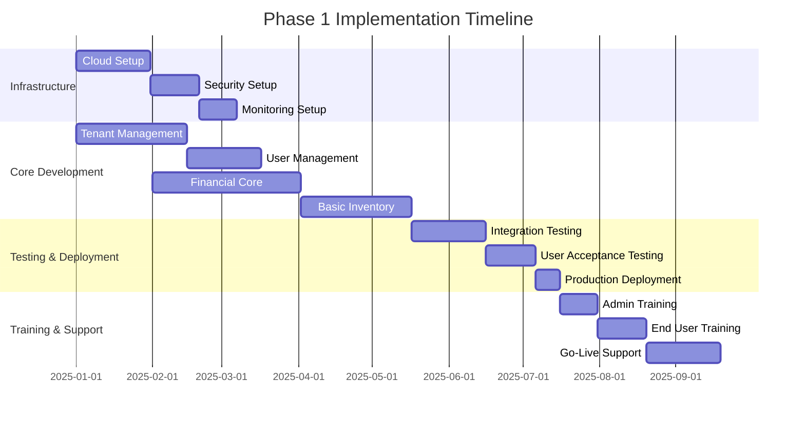
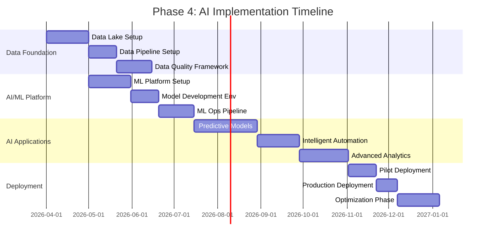

# Implementation Phases

##  Overview

The ERP system implementation follows a phased approach designed to minimize business disruption while delivering value incrementally. The implementation is structured in four major phases, each building upon the previous phase's foundation while delivering functional business capabilities.

##  Implementation Strategy

### Implementation Principles

1. **Phased Delivery**: Incremental rollout to reduce risk and enable early value realization
2. **Core First**: Essential business functions implemented before industry-specific modules
3. **Data-Driven**:  data migration and validation at each phase
4. **User-Centric**: Extensive training and change management throughout
5. **Agile Methodology**: Iterative development with regular stakeholder feedback
6. **Quality Assurance**: Rigorous testing at each phase before production deployment

### Success Criteria

```typescript
interface ImplementationSuccess {
  technical_criteria: {
    system_uptime: number; // >= 99.9%
    response_time_p95: number; // <= 500ms
    data_accuracy: number; // >= 99.95%
    user_adoption_rate: number; // >= 90%
  };
  
  business_criteria: {
    process_efficiency_improvement: number; // >= 30%
    data_visibility_improvement: number; // >= 80%
    manual_process_reduction: number; // >= 60%
    reporting_time_reduction: number; // >= 70%
  };
  
  user_criteria: {
    user_satisfaction_score: number; // >= 4.0/5.0
    training_completion_rate: number; // >= 95%
    support_ticket_resolution: number; // <= 24 hours
    feature_utilization_rate: number; // >= 70%
  };
}
```

##  Phase 1: Core Foundation (Q1-Q2 2025)

### Objectives
- Establish multi-tenant architecture and core infrastructure
- Implement essential financial and operational modules
- Migrate critical master data and establish data governance
- Deploy basic user management and security features

### Duration: 6 Months

### Key Deliverables

#### Infrastructure & Platform
```yaml
infrastructure_setup:
  cloud_environment:
    - kubernetes_cluster_setup
    - database_cluster_configuration
    - redis_cache_deployment
    - load_balancer_configuration
    - cdn_setup
    - monitoring_stack_deployment
  
  security_implementation:
    - ssl_certificate_management
    - firewall_configuration
    - backup_strategy_implementation
    - disaster_recovery_setup
    - compliance_framework_setup
  
  development_environment:
    - ci_cd_pipeline_setup
    - automated_testing_framework
    - code_quality_gates
    - deployment_automation
    - environment_management
```

#### Core Business Modules

**1. Tenant Management**
- Multi-tenant architecture implementation
- Organization hierarchy setup
- Basic tenant configuration and customization
- Tenant isolation and security

**2. User Management & Security**
- Authentication and authorization system
- Role-based access control (RBAC)
- Multi-factor authentication
- User lifecycle management
- Password policies and security controls

**3. Financial Management (Core)**
- Chart of accounts setup
- General ledger implementation
- Basic accounts payable/receivable
- Journal entry processing
- Financial reporting foundation

**4. Basic Inventory Management**
- Item master data management
- Basic stock tracking
- Simple warehouse operations
- Stock transactions and adjustments

### Implementation Timeline



### Data Migration Strategy

#### Phase 1 Data Migration Scope
```sql
-- Priority 1: Master Data
migration_priority_1:
  - chart_of_accounts
  - organizational_structure
  - user_accounts_and_roles
  - basic_customer_data
  - basic_vendor_data
  - core_inventory_items

-- Priority 2: Transactional Data (Last 12 Months)
migration_priority_2:
  - account_balances
  - outstanding_invoices
  - current_inventory_levels
  - open_purchase_orders
  - active_employee_records

-- Priority 3: Historical Data (Archive)
migration_priority_3:
  - historical_transactions (2+ years)
  - archived_documents
  - legacy_reporting_data
```

### Risk Mitigation

#### Technical Risks
```yaml
technical_risks:
  data_migration_failures:
    probability: medium
    impact: high
    mitigation:
      - _data_validation
      - rollback_procedures
      - parallel_run_strategy
      - automated_testing
  
  performance_issues:
    probability: medium
    impact: medium
    mitigation:
      - load_testing
      - performance_monitoring
      - scalability_planning
      - optimization_strategies
  
  integration_challenges:
    probability: low
    impact: medium
    mitigation:
      - api_testing
      - sandbox_environments
      - gradual_integration
      - fallback_procedures
```

#### Business Risks
```yaml
business_risks:
  user_adoption_resistance:
    probability: medium
    impact: high
    mitigation:
      - change_management_program
      - extensive_training
      - user_champions_program
      - phased_rollout
  
  business_process_disruption:
    probability: low
    impact: high
    mitigation:
      - parallel_operations
      - cutover_planning
      - backup_procedures
      - 24_7_support
```

##  Phase 2: Advanced Features (Q3 2025)

### Objectives
- Implement advanced financial features and reporting
- Deploy  inventory and asset management
- Establish workflow automation and approval processes
- Enhance user experience with advanced features

### Duration: 3 Months

### Key Deliverables

#### Advanced Financial Features
```yaml
advanced_financial:
  multi_currency_support:
    - currency_exchange_management
    - multi_currency_transactions
    - currency_revaluation
    - consolidation_features
  
  advanced_reporting:
    - financial_statement_generation
    - management_reporting
    - budget_vs_actual_analysis
    - cash_flow_reporting
  
  advanced_ap_ar:
    - automated_matching
    - payment_processing
    - aging_analysis
    - collection_management
```

####  Inventory Management
```yaml
inventory_advanced:
  multi_warehouse_operations:
    - warehouse_management
    - inter_warehouse_transfers
    - location_tracking
    - bin_management
  
  advanced_inventory_features:
    - serial_number_tracking
    - batch_lot_tracking
    - cycle_counting
    - abc_analysis
  
  procurement_automation:
    - automated_reordering
    - vendor_management
    - purchase_approval_workflows
    - three_way_matching
```

#### Asset Management
```yaml
asset_management:
  fixed_asset_tracking:
    - asset_registration
    - depreciation_calculation
    - asset_transfers
    - disposal_management
  
  maintenance_management:
    - preventive_maintenance
    - work_order_management
    - maintenance_scheduling
    - asset_performance_tracking
```

### Workflow Engine Implementation

#### Core Workflow Capabilities
```typescript
interface WorkflowEngine {
  workflow_types: {
    approval_workflows: ApprovalWorkflow[];
    business_process_workflows: BusinessProcessWorkflow[];
    notification_workflows: NotificationWorkflow[];
    escalation_workflows: EscalationWorkflow[];
  };
  
  workflow_features: {
    visual_workflow_designer: boolean;
    conditional_logic: boolean;
    parallel_processing: boolean;
    sla_monitoring: boolean;
    audit_trail: boolean;
    api_integration: boolean;
  };
}

// Example: Purchase Order Approval Workflow
const poApprovalWorkflow = {
  name: "Purchase Order Approval",
  trigger: "purchase_order_submitted",
  
  steps: [
    {
      id: "supervisor_approval",
      type: "human_task",
      assignee: "reporting_manager",
      condition: "amount <= 5000",
      sla_hours: 24
    },
    {
      id: "manager_approval", 
      type: "human_task",
      assignee: "department_manager",
      condition: "amount > 5000 AND amount <= 25000",
      sla_hours: 48
    },
    {
      id: "director_approval",
      type: "human_task", 
      assignee: "director",
      condition: "amount > 25000",
      sla_hours: 72
    },
    {
      id: "auto_approve",
      type: "system_task",
      condition: "all_approvals_received",
      action: "update_po_status_approved"
    }
  ]
};
```

##  Phase 3: Industry Modules (Q4 2025 - Q1 2026)

### Objectives
- Deploy industry-specific modules based on client requirements
- Implement specialized business processes and workflows
- Integrate with industry-specific external systems
- Provide advanced analytics and industry-specific reporting

### Duration: 6 Months

### Industry Module Selection Matrix

```yaml
industry_modules:
  airline_operations:
    complexity: high
    duration_months: 4
    prerequisites:
      - advanced_inventory_management
      - customer_relationship_management
      - financial_management
    key_features:
      - flight_scheduling
      - passenger_reservation_system
      - crew_management
      - revenue_management
      - aircraft_maintenance
  
  restaurant_management:
    complexity: medium
    duration_months: 3
    prerequisites:
      - basic_inventory_management
      - point_of_sale_integration
      - customer_management
    key_features:
      - menu_management
      - kitchen_operations
      - table_management
      - food_cost_management
      - customer_experience_tracking
  
  retail_operations:
    complexity: medium
    duration_months: 3
    prerequisites:
      - inventory_management
      - customer_management
      - multi_location_support
    key_features:
      - omnichannel_inventory
      - customer_analytics
      - merchandising_management
      - e_commerce_integration
      - loyalty_programs
  
  forecourt_management:
    complexity: high
    duration_months: 4
    prerequisites:
      - inventory_management
      - environmental_compliance
      - fleet_management
    key_features:
      - fuel_inventory_management
      - pump_operations
      - environmental_monitoring
      - fleet_card_processing
      - compliance_reporting
```

### Industry Module Implementation Process

#### Pre-Implementation Assessment
```yaml
assessment_process:
  business_requirements_analysis:
    - current_state_analysis
    - gap_identification
    - process_mapping
    - integration_requirements
  
  technical_requirements_analysis:
    - system_architecture_review
    - integration_points_identification
    - performance_requirements
    - security_requirements
  
  change_impact_analysis:
    - organizational_impact
    - process_changes
    - training_requirements
    - timeline_implications
```

#### Module-Specific Implementation

**Airline Module Implementation**
```yaml
airline_implementation:
  phase_3a_core_airline:
    duration: 6_weeks
    deliverables:
      - aircraft_fleet_management
      - route_management
      - flight_scheduling
      - basic_reservation_system
  
  phase_3b_passenger_operations:
    duration: 6_weeks
    deliverables:
      - passenger_check_in
      - boarding_management
      - baggage_tracking
      - loyalty_program_integration
  
  phase_3c_revenue_management:
    duration: 4_weeks
    deliverables:
      - dynamic_pricing
      - inventory_allocation
      - yield_management
      - reporting_analytics
```

##  Phase 4: AI & Advanced Analytics (Q2-Q3 2026)

### Objectives
- Implement artificial intelligence and machine learning capabilities
- Deploy predictive analytics and forecasting
- Provide intelligent automation and decision support
- Enable advanced business intelligence and data visualization

### Duration: 6 Months

### AI/ML Capabilities

#### Predictive Analytics
```yaml
predictive_analytics:
  demand_forecasting:
    models:
      - time_series_forecasting
      - seasonal_pattern_analysis
      - external_factor_integration
    applications:
      - inventory_planning
      - capacity_planning
      - revenue_forecasting
  
  customer_analytics:
    models:
      - churn_prediction
      - lifetime_value_modeling
      - behavior_segmentation
    applications:
      - targeted_marketing
      - retention_strategies
      - personalization
  
  financial_analytics:
    models:
      - cash_flow_forecasting
      - risk_assessment
      - fraud_detection
    applications:
      - working_capital_optimization
      - credit_risk_management
      - financial_planning
```

#### Intelligent Automation
```typescript
interface IntelligentAutomation {
  automation_capabilities: {
    document_processing: {
      ocr_extraction: boolean;
      intelligent_classification: boolean;
      automated_data_entry: boolean;
      exception_handling: boolean;
    };
    
    decision_automation: {
      rule_based_decisions: boolean;
      ml_powered_decisions: boolean;
      confidence_scoring: boolean;
      human_in_the_loop: boolean;
    };
    
    process_optimization: {
      bottleneck_identification: boolean;
      process_mining: boolean;
      optimization_recommendations: boolean;
      automated_improvements: boolean;
    };
  };
}

// Example: Intelligent Invoice Processing
const intelligentInvoiceProcessing = {
  process_steps: [
    {
      step: "document_capture",
      automation: "ocr_extraction",
      confidence_threshold: 0.95
    },
    {
      step: "vendor_identification", 
      automation: "ml_classification",
      fallback: "manual_review"
    },
    {
      step: "line_item_extraction",
      automation: "intelligent_parsing",
      validation: "business_rules"
    },
    {
      step: "approval_routing",
      automation: "smart_routing",
      criteria: ["amount", "vendor", "department"]
    }
  ]
};
```

#### Advanced Business Intelligence

```yaml
business_intelligence:
  real_time_dashboards:
    - executive_dashboards
    - operational_dashboards
    - financial_dashboards
    - industry_specific_dashboards
  
  advanced_analytics:
    - trend_analysis
    - comparative_analysis
    - what_if_scenarios
    - root_cause_analysis
  
  data_visualization:
    - interactive_charts
    - geographic_mapping
    - network_diagrams
    - process_flow_visualization
  
  self_service_analytics:
    - drag_drop_report_builder
    - natural_language_queries
    - automated_insights
    - collaborative_analytics
```

### AI Implementation Roadmap



##  Implementation Metrics & KPIs

### Technical KPIs
```yaml
technical_kpis:
  system_performance:
    - system_uptime: target_99_9_percent
    - response_time_p95: target_500ms
    - concurrent_users: target_1000_users
    - data_throughput: target_10k_transactions_per_minute
  
  data_quality:
    - data_accuracy: target_99_95_percent
    - data_completeness: target_99_percent
    - data_consistency: target_99_5_percent
    - data_timeliness: target_real_time
  
  security_metrics:
    - security_incidents: target_zero
    - vulnerability_resolution: target_24_hours
    - access_review_compliance: target_100_percent
    - backup_success_rate: target_100_percent
```

### Business KPIs
```yaml
business_kpis:
  process_efficiency:
    - manual_process_reduction: target_60_percent
    - process_cycle_time_reduction: target_50_percent
    - error_rate_reduction: target_80_percent
    - approval_time_reduction: target_70_percent
  
  user_adoption:
    - active_user_percentage: target_90_percent
    - feature_utilization_rate: target_70_percent
    - user_satisfaction_score: target_4_5_out_of_5
    - training_completion_rate: target_95_percent
  
  business_value:
    - cost_savings_percentage: target_20_percent
    - revenue_impact_percentage: target_15_percent
    - data_visibility_improvement: target_80_percent
    - decision_making_speed: target_50_percent_faster
```

##  Success Factors & Best Practices

### Critical Success Factors

#### Executive Sponsorship
- Strong C-level commitment and vision communication
- Adequate budget allocation and resource commitment
- Regular steering committee meetings and decision making
- Change management support from leadership

#### Project Management Excellence
- Experienced project management team
- Clear project governance structure
- Regular milestone reviews and course corrections
- Risk management and mitigation strategies

#### User Engagement
- Early and continuous user involvement
-  training programs
- User champion networks
- Feedback collection and incorporation

#### Technical Excellence
- Robust architecture and design decisions
-  testing strategies
- Performance optimization and monitoring
- Security best practices implementation

### Implementation Best Practices

```yaml
best_practices:
  planning_phase:
    - _requirements_gathering
    - detailed_project_planning
    - risk_assessment_and_mitigation
    - stakeholder_alignment
  
  execution_phase:
    - agile_development_methodology
    - continuous_integration_deployment
    - regular_stakeholder_communication
    - quality_assurance_processes
  
  testing_phase:
    - _test_planning
    - automated_testing_implementation
    - user_acceptance_testing
    - performance_load_testing
  
  deployment_phase:
    - phased_rollout_strategy
    - cutover_planning
    - fallback_procedures
    - post_deployment_support
  
  post_implementation:
    - continuous_monitoring
    - performance_optimization
    - user_feedback_collection
    - ongoing_training_support
```

This  implementation strategy ensures successful deployment of the ERP system while minimizing business disruption and maximizing user adoption and business value realization.
