# Settings System Data Flow & Architecture

## Overview

This document details the data flow patterns, architectural decisions, and integration points for the Settings system within the ERP platform. It serves as a technical reference for understanding how configuration data moves through the system and how services interact with the Settings module.

## Table of Contents

1. [System Architecture](#system-architecture)
2. [Data Flow Patterns](#data-flow-patterns)
3. [Service Layer Architecture](#service-layer-architecture)
4. [Repository Layer Data Access](#repository-layer-data-access)
5. [Configuration Resolution Engine](#configuration-resolution-engine)
6. [Template System Architecture](#template-system-architecture)
7. [Audit and Compliance Flow](#audit-and-compliance-flow)
8. [Cache and Performance Strategy](#cache-and-performance-strategy)
9. [Security and Tenant Isolation](#security-and-tenant-isolation)

---

## System Architecture

### High-Level Architecture

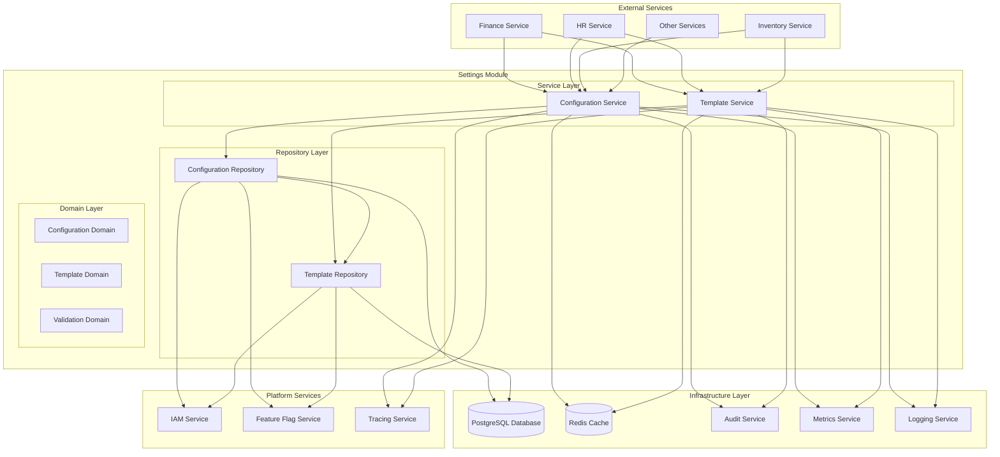

### Component Responsibilities

#### Service Layer
- **Configuration Service**: Business logic for configuration CRUD operations, validation, and resolution
- **Template Service**: Template lifecycle management, application workflows, and conflict resolution

#### Repository Layer  
- **Configuration Repository**: Data access abstraction with SQLC integration and caching
- **Template Repository**: Template storage and retrieval with audit trail management

#### Domain Layer
- **Configuration Domain**: Value objects, entities, and business rules for configurations
- **Template Domain**: Template aggregates, application logic, and validation rules
- **Validation Domain**: Rich validation framework with extensible rule engine

---

## Data Flow Patterns

### Configuration Read Flow

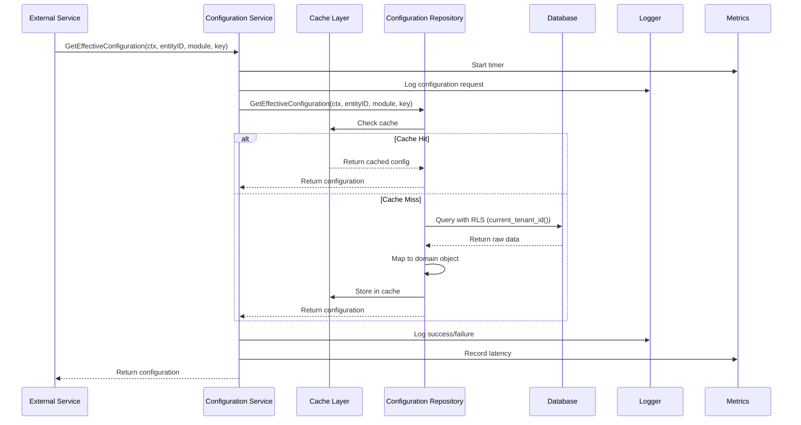

### Configuration Write Flow

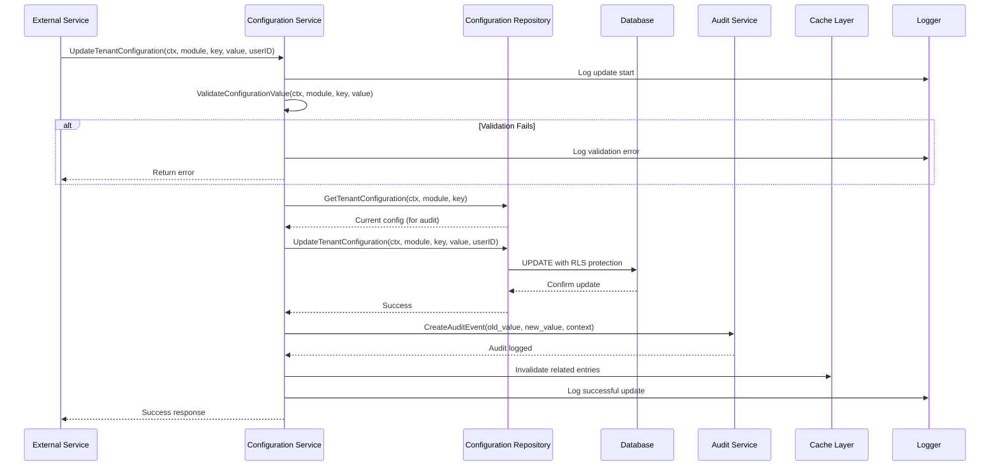

### Template Application Flow

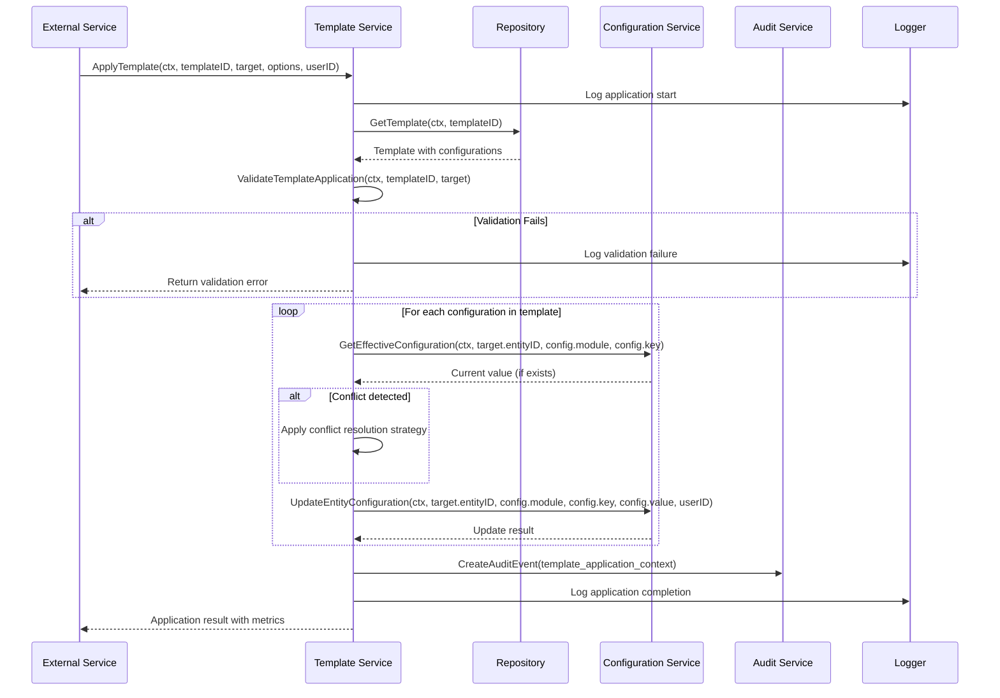

---

## Service Layer Architecture

### Configuration Service Architecture

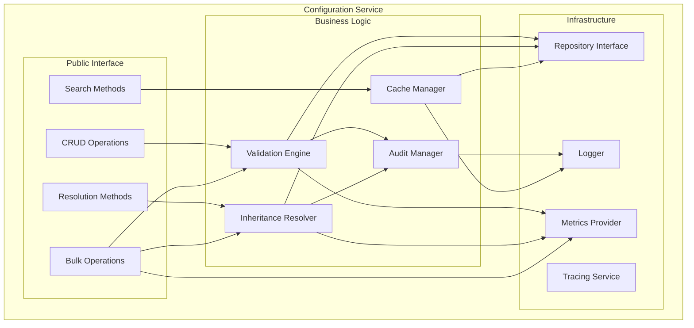

### Template Service Architecture

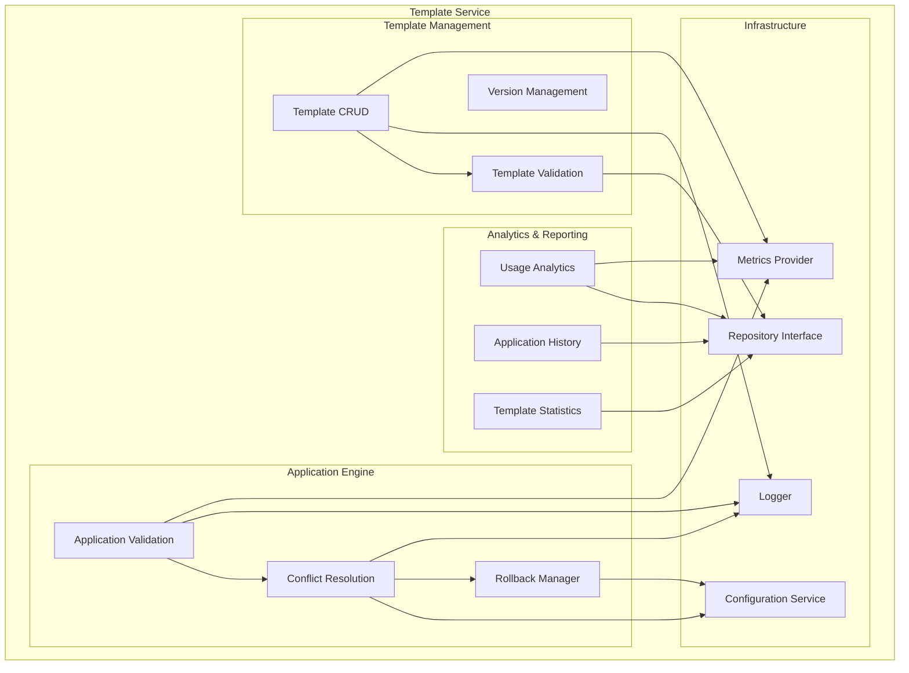

---

## Repository Layer Data Access

### SQLC Integration Architecture

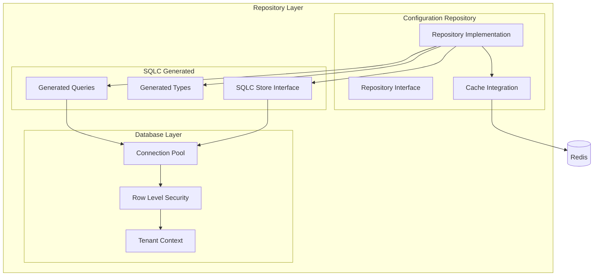

### Data Access Patterns

#### Context-Based Tenant Resolution
```go
// All repository methods use context for tenant ID resolution
func (r *configurationRepository) GetEffectiveConfiguration(
    ctx context.Context, 
    entityID *uuid.UUID, 
    module domain.ModuleName, 
    key domain.ConfigKey,
) (*domain.Configuration, error) {
    // Tenant ID automatically resolved from context
    tenantID, _ := shared.GetTenantID(ctx)
    ctx = shared.WithTenantID(ctx, tenantID)
    
    // SQLC query uses current_tenant_id() function
    result, err := r.store.GetEffectiveConfiguration(ctx, db.GetEffectiveConfigurationParams{
        ModuleName: string(module),
        ConfigKey:  string(key),
        EntityID:   *entityID,
    })
    
    // Map to domain object
    return r.mapToConfiguration(result)
}
```

#### Type-Safe Query Parameters
```sql
-- SQLC query with named parameters
-- name: GetEffectiveConfiguration :one
SELECT 
    module_name,
    config_key,
    value,
    source,
    data_type
FROM get_effective_configuration(
    sqlc.arg(module_name)::text,
    sqlc.arg(config_key)::text, 
    sqlc.arg(entity_id)::uuid
)
WHERE tenant_id = current_tenant_id();
```

#### Cache Integration Strategy
```go
func (r *configurationRepository) getWithCache(
    ctx context.Context, 
    cacheKey string, 
    queryFunc func() (*domain.Configuration, error),
) (*domain.Configuration, error) {
    // Check cache first
    var cached domain.Configuration
    if err := r.cache.Get(ctx, cacheKey, &cached); err == nil {
        r.metrics.IncrementCounter("settings.cache_hit", nil)
        return &cached, nil
    }
    
    // Cache miss - query database
    result, err := queryFunc()
    if err != nil {
        return nil, err
    }
    
    // Store in cache with TTL
    r.cache.Set(ctx, cacheKey, result, 5*time.Minute)
    r.metrics.IncrementCounter("settings.cache_miss", nil)
    
    return result, nil
}
```

---

## Configuration Resolution Engine

### Inheritance Resolution Algorithm

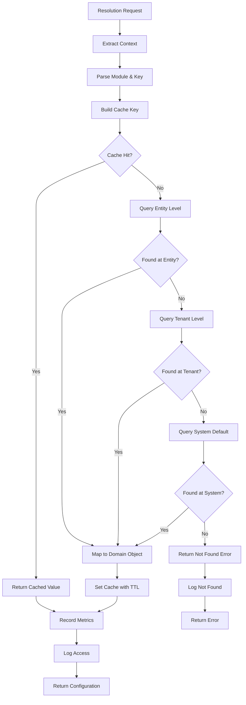

### Resolution Priority Matrix

| Level | Storage Location | Query Method | Cache TTL | Override Behavior |
|-------|-----------------|--------------|-----------|------------------|
| Entity | `entities.settings` | Direct JSONB query | 5 minutes | Overrides tenant/system |
| Tenant | `tenant_configurations.settings` | JSONB + dedicated columns | 15 minutes | Overrides system only |
| System | `config_definitions.default_value` | Static definition | 1 hour | Fallback only |

### Data Type Resolution

```go
type ConfigurationResolver struct {
    repo    repository.ConfigurationRepository
    cache   cache.Service
    logger  logger.Logger
    metrics metrics.MetricsProvider
}

func (r *ConfigurationResolver) ResolveWithType(
    ctx context.Context,
    entityID *uuid.UUID,
    module domain.ModuleName,
    key domain.ConfigKey,
) (*ResolvedConfiguration, error) {
    // Get configuration definition for type information
    definition, err := r.repo.GetConfigDefinition(ctx, module, key)
    if err != nil && err != domain.ErrConfigDefinitionNotFound {
        return nil, fmt.Errorf("failed to get configuration definition: %w", err)
    }
    
    // Resolve value through inheritance
    config, err := r.repo.GetEffectiveConfiguration(ctx, entityID, module, key)
    if err != nil {
        if err == domain.ErrConfigurationNotFound && definition != nil {
            // Use system default
            return &ResolvedConfiguration{
                Value:      definition.DefaultValue,
                Source:     domain.ConfigSourceSystem,
                DataType:   definition.DataType,
                Definition: definition,
            }, nil
        }
        return nil, err
    }
    
    // Validate data type consistency
    if definition != nil && config.Value.DataType != definition.DataType {
        r.logger.WarnContext(ctx, "Configuration data type mismatch", logger.Fields{
            "module":           string(module),
            "key":              string(key),
            "expected_type":    string(definition.DataType),
            "actual_type":      string(config.Value.DataType),
            "source":           string(config.Source),
        })
    }
    
    return &ResolvedConfiguration{
        Value:      config.Value,
        Source:     config.Source,
        DataType:   config.Value.DataType,
        Definition: definition,
        Metadata: ResolutionMetadata{
            ResolvedAt: time.Now(),
            CacheHit:   false, // Set by cache layer
            TenantID:   shared.GetTenantID(ctx),
            EntityID:   entityID,
        },
    }, nil
}
```

---

## Template System Architecture

### Template Domain Model

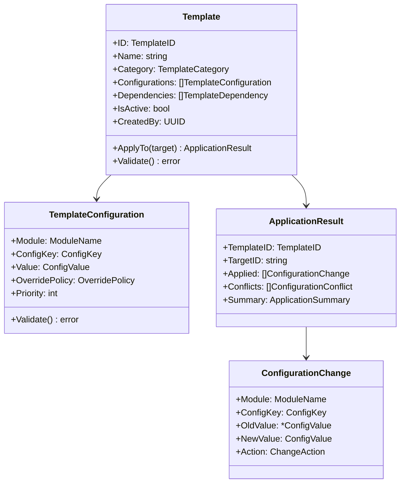

### Template Application Engine

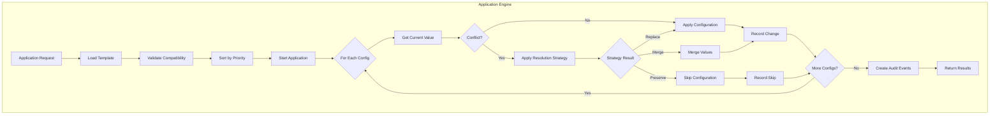

### Conflict Resolution Strategies

```go
type ConflictResolver struct {
    logger logger.Logger
}

func (cr *ConflictResolver) ResolveConflict(
    templateConfig TemplateConfiguration,
    existingConfig *domain.Configuration,
    strategy ConflictStrategy,
) (*ConfigurationChange, *ConfigurationConflict, error) {
    
    switch strategy {
    case ConflictStrategyPreserve:
        if existingConfig != nil {
            return nil, &ConfigurationConflict{
                Module:        templateConfig.Module,
                ConfigKey:     templateConfig.ConfigKey,
                TemplateValue: templateConfig.Value,
                ExistingValue: existingConfig.Value,
                Resolution:    ConflictResolutionKeptExisting,
                Reason:        "preserve existing value strategy",
            }, nil
        }
        
    case ConflictStrategyReplace:
        return &ConfigurationChange{
            Module:    templateConfig.Module,
            ConfigKey: templateConfig.ConfigKey,
            OldValue:  existingConfig?.Value,
            NewValue:  templateConfig.Value,
            Action:    ChangeActionUpdate,
        }, nil, nil
        
    case ConflictStrategyMerge:
        if existingConfig != nil && 
           templateConfig.Value.DataType == domain.DataTypeJSON &&
           existingConfig.Value.DataType == domain.DataTypeJSON {
            
            mergedValue, err := cr.mergeJSONValues(existingConfig.Value, templateConfig.Value)
            if err != nil {
                return nil, nil, fmt.Errorf("failed to merge JSON values: %w", err)
            }
            
            return &ConfigurationChange{
                Module:    templateConfig.Module,
                ConfigKey: templateConfig.ConfigKey,
                OldValue:  &existingConfig.Value,
                NewValue:  mergedValue,
                Action:    ChangeActionMerge,
            }, nil, nil
        }
    }
    
    // Default to replace if no specific handling
    return &ConfigurationChange{
        Module:    templateConfig.Module,
        ConfigKey: templateConfig.ConfigKey,
        OldValue:  existingConfig?.Value,
        NewValue:  templateConfig.Value,
        Action:    ChangeActionCreate,
    }, nil, nil
}
```

---

## Audit and Compliance Flow

### Audit Event Creation

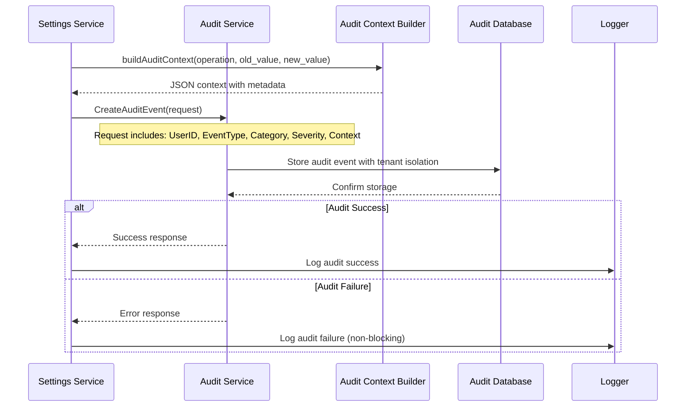

### Audit Context Structure

```go
type ConfigurationAuditContext struct {
    Level       string                 `json:"level"`        // tenant, entity
    Module      string                 `json:"module"`       // finance, hr, inventory
    ConfigKey   string                 `json:"config_key"`   // approval_limit, etc.
    OldValue    interface{}            `json:"old_value,omitempty"`
    NewValue    interface{}            `json:"new_value,omitempty"`
    OldSource   string                 `json:"old_source,omitempty"`
    NewType     string                 `json:"new_type,omitempty"`
    Timestamp   time.Time              `json:"timestamp"`
    Metadata    map[string]interface{} `json:"metadata,omitempty"`
}

type TemplateAuditContext struct {
    Operation          string    `json:"operation"`           // create, update, apply
    TemplateID         string    `json:"template_id"`
    TemplateName       string    `json:"template_name"`
    TemplateCategory   string    `json:"template_category"`
    ConfigurationCount int       `json:"configuration_count"`
    IsActive           bool      `json:"is_active"`
    TargetType         string    `json:"target_type,omitempty"`
    TargetEntityID     *string   `json:"target_entity_id,omitempty"`
    AppliedConfigs     int       `json:"applied_configs,omitempty"`
    Conflicts          int       `json:"conflicts,omitempty"`
    Errors             int       `json:"errors,omitempty"`
    DurationMS         int64     `json:"duration_ms,omitempty"`
    Timestamp          time.Time `json:"timestamp"`
}
```

### Compliance Features

#### Change Tracking
- Every configuration change creates an audit event
- Old and new values are preserved in audit context  
- User attribution and timestamp tracking
- Source information (system/tenant/entity) preservation

#### Data Retention
- Audit events stored with configurable retention policies
- Compliance flags support for regulatory requirements
- Export capabilities for audit reporting
- Integration with external compliance systems

---

## Cache and Performance Strategy

### Caching Architecture

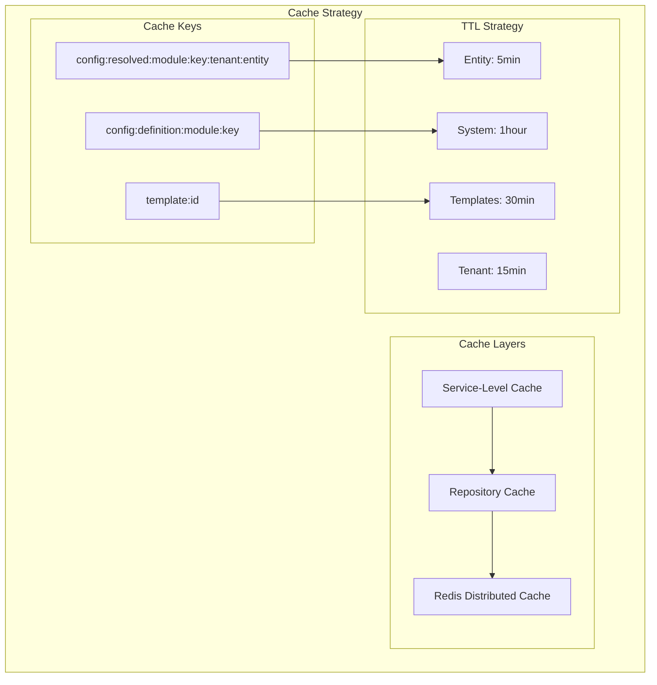

### Performance Optimization Patterns

#### Batch Operations
```go
func (s *configurationService) GetMultipleConfigurations(
    ctx context.Context,
    entityID *uuid.UUID,
    requests []ConfigurationRequest,
) (map[string]*domain.Configuration, error) {
    
    results := make(map[string]*domain.Configuration)
    cacheKeys := make([]string, len(requests))
    missedRequests := make([]ConfigurationRequest, 0)
    
    // Build cache keys and check cache
    for i, req := range requests {
        cacheKey := s.buildCacheKey(req.Module, req.Key, entityID)
        cacheKeys[i] = cacheKey
        
        var cached domain.Configuration
        if err := s.cache.Get(ctx, cacheKey, &cached); err == nil {
            results[req.String()] = &cached
        } else {
            missedRequests = append(missedRequests, req)
        }
    }
    
    // Batch query for cache misses
    if len(missedRequests) > 0 {
        dbResults, err := s.repo.GetMultipleEffectiveConfigurations(ctx, entityID, missedRequests)
        if err != nil {
            return nil, err
        }
        
        // Update cache and results
        for key, config := range dbResults {
            results[key] = config
            cacheKey := s.buildCacheKeyFromString(key, entityID)
            s.cache.Set(ctx, cacheKey, config, s.getCacheTTL(config.Source))
        }
    }
    
    return results, nil
}
```

#### Smart Cache Invalidation
```go
func (s *configurationService) invalidateRelatedCaches(
    ctx context.Context,
    tenantID uuid.UUID,
    entityID *uuid.UUID,
    module domain.ModuleName,
    key domain.ConfigKey,
) {
    patterns := []string{
        // Invalidate specific configuration
        s.buildCacheKey(module, key, tenantID, entityID),
        // Invalidate entity inheritance chain
        fmt.Sprintf("config:resolved:%s:%s:%s:*", module, key, tenantID),
        // Invalidate module-level caches
        fmt.Sprintf("config:list:%s:%s:*", module, tenantID),
    }
    
    for _, pattern := range patterns {
        if err := s.cache.DeletePattern(ctx, pattern); err != nil {
            s.logger.WarnContext(ctx, "Failed to invalidate cache pattern", logger.Fields{
                "pattern": pattern,
                "error":   err.Error(),
            })
        }
    }
}
```

### Performance Metrics

#### Key Metrics Tracked
- Configuration resolution latency (P50, P95, P99)
- Cache hit ratio by level (entity, tenant, system)
- Template application duration and success rate
- Database query performance and connection pool usage
- Bulk operation throughput and error rates

#### Monitoring Integration
```go
func (s *configurationService) recordPerformanceMetrics(
    ctx context.Context,
    operation string,
    startTime time.Time,
    err error,
    additionalFields metrics.Fields,
) {
    duration := time.Since(startTime)
    
    fields := metrics.Fields{
        "operation": operation,
        "duration_ms": duration.Milliseconds(),
    }
    
    // Merge additional fields
    for k, v := range additionalFields {
        fields[k] = v
    }
    
    if err != nil {
        fields["error"] = err.Error()
        s.metrics.IncrementCounter(fmt.Sprintf("settings.%s.error", operation), fields)
    } else {
        s.metrics.IncrementCounter(fmt.Sprintf("settings.%s.success", operation), fields)
    }
    
    s.metrics.RecordHistogram(fmt.Sprintf("settings.%s.duration", operation), float64(duration.Milliseconds()), fields)
}
```

---

## Security and Tenant Isolation

### Multi-Tenant Security Model

```mermaid
graph TD
    subgraph "Request Flow"
        A[Client Request] --> B[Authentication]
        B --> C[Authorization]
        C --> D[Tenant Context Extraction]
        D --> E[Service Call]
    end
    
    subgraph "Tenant Isolation"
        E --> F[Repository Layer]
        F --> G[Context Injection]
        G --> H[RLS Protection]
        H --> I[Database Query]
    end
    
    subgraph "Database Security"
        I --> J[current_tenant_id()]
        J --> K[Row Filter]
        K --> L[Result Set]
    end
    
    L --> M[Domain Mapping]
    M --> N[Response]
```

### Row-Level Security Implementation

#### Database-Level Protection
```sql
-- Configuration tables have RLS policies
CREATE POLICY tenant_configurations_isolation ON tenant_configurations
FOR ALL TO application_role
USING (tenant_id = current_tenant_id());

CREATE POLICY entity_configurations_isolation ON entities
FOR ALL TO application_role  
USING (tenant_id = current_tenant_id());

-- Function to get tenant ID from context
CREATE OR REPLACE FUNCTION current_tenant_id() RETURNS UUID AS $$
BEGIN
    RETURN current_setting('app.current_tenant_id')::UUID;
END;
$$ LANGUAGE plpgsql SECURITY DEFINER;
```

#### Application-Level Security
```go
func (r *configurationRepository) ensureTenantContext(ctx context.Context) (context.Context, error) {
    tenantID, err := shared.GetTenantID(ctx)
    if err != nil {
        return nil, fmt.Errorf("tenant ID not found in context: %w", err)
    }
    
    // Set database session variable for RLS
    if err := r.store.SetTenantContext(ctx, tenantID); err != nil {
        return nil, fmt.Errorf("failed to set tenant context: %w", err)
    }
    
    return shared.WithTenantID(ctx, tenantID), nil
}
```

### Permission-Based Access Control

#### Configuration-Level Permissions
```go
type ConfigurationPermissions struct {
    CanRead   bool
    CanWrite  bool
    CanDelete bool
    Scope     PermissionScope // tenant, entity, specific_entity
}

func (s *configurationService) checkPermissions(
    ctx context.Context,
    operation string,
    module domain.ModuleName,
    key domain.ConfigKey,
    entityID *uuid.UUID,
) error {
    // Get current user from context
    userID, err := shared.GetUserID(ctx)
    if err != nil {
        return fmt.Errorf("user not authenticated: %w", err)
    }
    
    // Check IAM permissions
    permission := fmt.Sprintf("settings:%s:%s", module, operation)
    
    hasPermission, err := s.iamService.CheckPermission(ctx, userID, permission, map[string]interface{}{
        "module":    string(module),
        "key":       string(key),
        "entity_id": entityID,
    })
    
    if err != nil {
        return fmt.Errorf("permission check failed: %w", err)
    }
    
    if !hasPermission {
        return fmt.Errorf("insufficient permissions for %s on %s.%s", operation, module, key)
    }
    
    return nil
}
```

#### Feature Flag Integration
```go
func (s *configurationService) checkFeatureAvailability(
    ctx context.Context,
    module domain.ModuleName,
    key domain.ConfigKey,
) error {
    tenantID, _ := shared.GetTenantID(ctx)
    
    // Check if module/feature is enabled for tenant
    featureFlag := fmt.Sprintf("%s.%s", module, key)
    
    enabled, err := s.featureFlagService.IsEnabled(ctx, tenantID, featureFlag)
    if err != nil {
        s.logger.WarnContext(ctx, "Feature flag check failed, allowing access", logger.Fields{
            "feature_flag": featureFlag,
            "error":        err.Error(),
        })
        return nil // Fail open for availability
    }
    
    if !enabled {
        return fmt.Errorf("feature %s is not enabled for this tenant", featureFlag)
    }
    
    return nil
}
```

---

This  data flow and architecture document provides the technical foundation for understanding how the Settings system integrates with the broader ERP platform, ensuring security, performance, and maintainability.