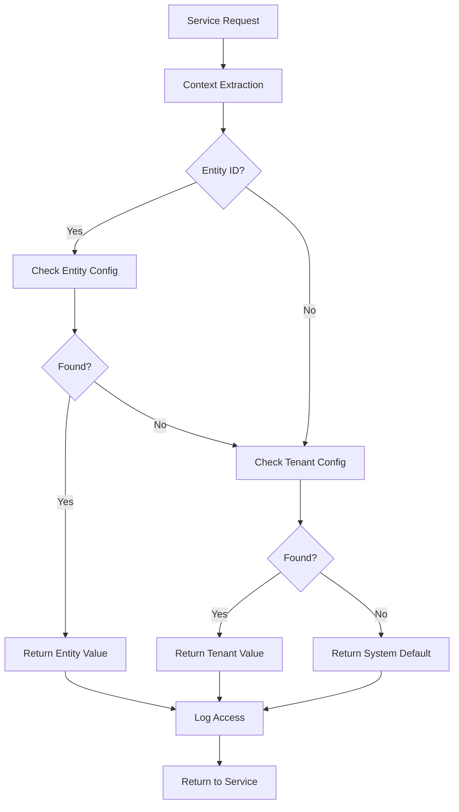
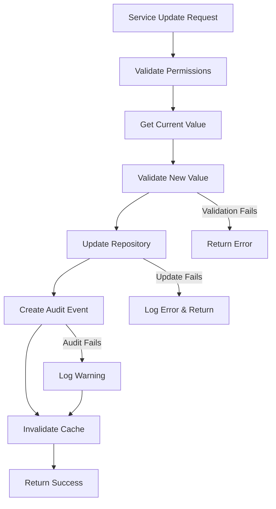
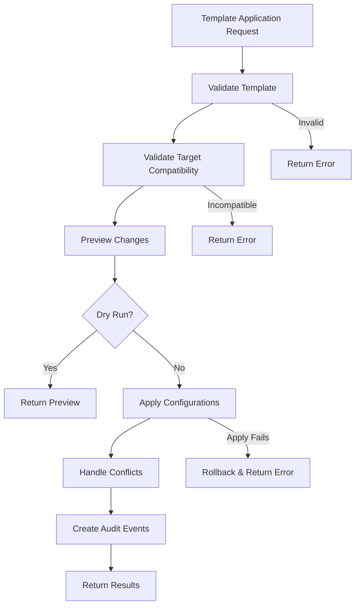

# Settings Service Integration Guide

## Overview

This guide explains how other services within the ERP system can integrate with and use the Settings module. The Settings system provides a centralized configuration management service with hierarchical inheritance (System → Tenant → Entity) and template-based configuration deployment.

## Table of Contents

1. [Service Dependencies](#service-dependencies)
2. [Integration Patterns](#integration-patterns)
3. [Data Flow](#data-flow)
4. [Configuration Resolution](#configuration-resolution)
5. [Service Integration Examples](#service-integration-examples)
6. [Best Practices](#best-practices)
7. [Error Handling](#error-handling)
8. [Performance Considerations](#performance-considerations)

---

## Service Dependencies

### Required Dependencies

The Settings services require the following dependencies to be injected:

```go
// Configuration Service Dependencies
type ConfigurationService interface {
    // ... service methods
}

func NewConfigurationService(
    repo repository.ConfigurationRepository,
    auditService audit.Service,
    logger logger.Logger,
    tracing tracing.TracingService,
    metrics metrics.MetricsProvider,
) ConfigurationService

// Template Service Dependencies  
type TemplateService interface {
    // ... service methods
}

func NewTemplateService(
    repo repository.ConfigurationRepository,
    auditService audit.Service,
    logger logger.Logger,
    tracing tracing.TracingService,
    metrics metrics.MetricsProvider,
) TemplateService
```

### Dependency Injection Setup

```go
// In your main application or service container
func setupSettingsServices(container *ServiceContainer) {
    // Create configuration repository
    configRepo := repository.NewConfigurationRepository(
        container.Store,
        container.Cache,
        container.Tracing,
        container.Metrics,
    )
    
    // Create configuration service
    configService := service.NewConfigurationService(
        configRepo,
        container.AuditService,
        container.Logger.WithFields(logger.Fields{"service": "settings"}),
        container.Tracing,
        container.Metrics,
    )
    
    // Create template service
    templateService := service.NewTemplateService(
        configRepo,
        container.AuditService,
        container.Logger.WithFields(logger.Fields{"service": "templates"}),
        container.Tracing,
        container.Metrics,
    )
    
    // Register services
    container.ConfigurationService = configService
    container.TemplateService = templateService
}
```

---

## Integration Patterns

### 1. Direct Service Integration

**Use Case**: Services that need configuration values for their business logic.

```go
type FinanceService struct {
    configService settings.ConfigurationService
    logger        logger.Logger
}

func (s *FinanceService) ProcessPayment(ctx context.Context, payment *Payment) error {
    // Get effective approval limit for the entity
    approvalConfig, err := s.configService.GetEffectiveConfiguration(
        ctx, 
        &payment.EntityID, 
        "finance", 
        "approval_limit",
    )
    if err != nil {
        return fmt.Errorf("failed to get approval limit: %w", err)
    }
    
    approvalLimit, err := approvalConfig.Value.AsDecimal()
    if err != nil {
        return fmt.Errorf("invalid approval limit format: %w", err)
    }
    
    if payment.Amount > approvalLimit {
        return s.requireApproval(ctx, payment)
    }
    
    return s.processDirectly(ctx, payment)
}
```

### 2. Configuration-Driven Behavior

**Use Case**: Services that modify behavior based on configuration settings.

```go
type InventoryService struct {
    configService settings.ConfigurationService
    logger        logger.Logger
}

func (s *InventoryService) UpdateStock(ctx context.Context, item *Item, quantity int) error {
    // Get inventory configuration
    configs, err := s.configService.ListEffectiveConfigurations(
        ctx, 
        &item.EntityID, 
        "inventory",
    )
    if err != nil {
        return fmt.Errorf("failed to get inventory configuration: %w", err)
    }
    
    // Extract relevant settings
    var allowNegative bool
    var trackLots bool
    
    for _, config := range configs {
        switch config.Key.String() {
        case "allow_negative_stock":
            allowNegative, _ = config.Value.AsBool()
        case "require_lot_tracking":
            trackLots, _ = config.Value.AsBool()
        }
    }
    
    // Apply business logic based on configuration
    if !allowNegative && item.CurrentStock+quantity < 0 {
        return ErrInsufficientStock
    }
    
    if trackLots && item.LotNumber == "" {
        return ErrLotNumberRequired
    }
    
    return s.updateStockLevel(ctx, item, quantity)
}
```

### 3. Template-Based Service Setup

**Use Case**: Services that use templates for initial configuration.

```go
type TenantOnboardingService struct {
    configService  settings.ConfigurationService
    templateService settings.TemplateService
    logger         logger.Logger
}

func (s *TenantOnboardingService) SetupNewTenant(
    ctx context.Context, 
    tenant *Tenant, 
    industryType string,
) error {
    // Find appropriate industry template
    templates, err := s.templateService.ListTemplates(ctx, repository.TemplateFilters{
        Category: domain.TemplateCategoryIndustry,
        IsActive: true,
    })
    if err != nil {
        return fmt.Errorf("failed to list templates: %w", err)
    }
    
    var selectedTemplate *domain.Template
    for _, template := range templates {
        if strings.Contains(template.Name, industryType) {
            selectedTemplate = template
            break
        }
    }
    
    if selectedTemplate != nil {
        // Apply industry template to new tenant
        target := repository.TemplateTarget{
            Type: "tenant",
            EntityID: &tenant.ID,
        }
        
        result, err := s.templateService.ApplyTemplate(
            ctx,
            selectedTemplate.ID,
            target,
            repository.ApplyOptions{DryRun: false},
            tenant.CreatedBy,
        )
        if err != nil {
            return fmt.Errorf("failed to apply template: %w", err)
        }
        
        s.logger.InfoContext(ctx, "Applied industry template to new tenant", logger.Fields{
            "tenant_id":      tenant.ID.String(),
            "template_name":  selectedTemplate.Name,
            "applied_configs": result.Summary.Applied,
        })
    }
    
    return nil
}
```

---

## Data Flow

### Configuration Resolution Flow



### Configuration Update Flow



### Template Application Flow



---

## Configuration Resolution

### Resolution Priority

The Settings system resolves configuration values using a 3-level hierarchy:

1. **Entity Level**: Stored in `entities.settings` JSONB
2. **Tenant Level**: Stored in `tenant_configurations.settings` JSONB or dedicated columns
3. **System Level**: Stored in `config_definitions.default_value`

### Resolution Example

```go
// Example: Getting document prefix for invoices
func getInvoicePrefix(ctx context.Context, configService settings.ConfigurationService, entityID uuid.UUID) (string, error) {
    config, err := configService.GetEffectiveConfiguration(
        ctx,
        &entityID,
        "finance",
        "invoice_prefix",
    )
    if err != nil {
        return "", err
    }
    
    prefix, err := config.Value.AsString()
    if err != nil {
        return "INV-", nil // fallback to default
    }
    
    return prefix, nil
}
```

### Batch Resolution

For performance, services can retrieve multiple configurations at once:

```go
// Get all finance configurations for an entity
configs, err := configService.ListEffectiveConfigurations(
    ctx,
    &entityID,
    "finance",
)

// Build configuration map for easy access
configMap := make(map[string]domain.ConfigValue)
for _, config := range configs {
    configMap[config.Key.String()] = config.Value
}

// Use configurations
if invoicePrefix, exists := configMap["invoice_prefix"]; exists {
    prefix, _ := invoicePrefix.AsString()
    // use prefix...
}
```

---

## Service Integration Examples

### Finance Module Integration

```go
type FinanceConfiguration struct {
    ApprovalLimit        decimal.Decimal
    InvoicePrefix        string
    PaymentTermsDefault  string
    RequirePOForExpense  bool
    AutoApprovalEnabled  bool
}

func (s *FinanceService) getEntityConfiguration(ctx context.Context, entityID uuid.UUID) (*FinanceConfiguration, error) {
    configs, err := s.configService.ListEffectiveConfigurations(ctx, &entityID, "finance")
    if err != nil {
        return nil, fmt.Errorf("failed to get finance configurations: %w", err)
    }
    
    config := &FinanceConfiguration{
        // Set defaults
        ApprovalLimit:        decimal.NewFromInt(1000),
        InvoicePrefix:        "INV-",
        PaymentTermsDefault:  "NET30",
        RequirePOForExpense:  false,
        AutoApprovalEnabled:  true,
    }
    
    // Override with actual configurations
    for _, cfg := range configs {
        switch cfg.Key.String() {
        case "approval_limit":
            if val, err := cfg.Value.AsDecimal(); err == nil {
                config.ApprovalLimit = val
            }
        case "invoice_prefix":
            if val, err := cfg.Value.AsString(); err == nil {
                config.InvoicePrefix = val
            }
        case "payment_terms_default":
            if val, err := cfg.Value.AsString(); err == nil {
                config.PaymentTermsDefault = val
            }
        case "require_po_for_expense":
            if val, err := cfg.Value.AsBool(); err == nil {
                config.RequirePOForExpense = val
            }
        case "auto_approval_enabled":
            if val, err := cfg.Value.AsBool(); err == nil {
                config.AutoApprovalEnabled = val
            }
        }
    }
    
    return config, nil
}
```

### HR Module Integration

```go
type HRService struct {
    configService settings.ConfigurationService
    logger        logger.Logger
}

func (s *HRService) CalculateOvertimePay(ctx context.Context, employee *Employee, hoursWorked float64) (*OvertimePay, error) {
    // Get HR configuration for the employee's entity
    configs, err := s.configService.ListEffectiveConfigurations(ctx, &employee.EntityID, "hr")
    if err != nil {
        return nil, fmt.Errorf("failed to get HR configuration: %w", err)
    }
    
    // Default values
    overtimeThreshold := 40.0
    overtimeMultiplier := 1.5
    
    // Apply configured values
    for _, config := range configs {
        switch config.Key.String() {
        case "overtime_threshold":
            if val, err := config.Value.AsDecimal(); err == nil {
                overtimeThreshold, _ = val.Float64()
            }
        case "overtime_multiplier":
            if val, err := config.Value.AsDecimal(); err == nil {
                overtimeMultiplier, _ = val.Float64()
            }
        }
    }
    
    // Calculate overtime pay
    if hoursWorked <= overtimeThreshold {
        return &OvertimePay{RegularHours: hoursWorked, OvertimeHours: 0}, nil
    }
    
    overtimeHours := hoursWorked - overtimeThreshold
    return &OvertimePay{
        RegularHours:       overtimeThreshold,
        OvertimeHours:      overtimeHours,
        OvertimeMultiplier: overtimeMultiplier,
    }, nil
}
```

### Inventory Module Integration

```go
type InventoryService struct {
    configService settings.ConfigurationService
    logger        logger.Logger
}

func (s *InventoryService) CheckReorderPoint(ctx context.Context, item *InventoryItem) (bool, error) {
    // Get inventory configuration
    reorderConfig, err := s.configService.GetEffectiveConfiguration(
        ctx,
        &item.EntityID,
        "inventory",
        "reorder_point_days",
    )
    if err != nil {
        s.logger.WarnContext(ctx, "Failed to get reorder configuration, using default", logger.Fields{
            "item_id": item.ID,
            "error":   err.Error(),
        })
        // Use default of 30 days
        return s.checkReorderWithDays(item, 30), nil
    }
    
    reorderDays, err := reorderConfig.Value.AsInt()
    if err != nil {
        s.logger.WarnContext(ctx, "Invalid reorder point configuration, using default", logger.Fields{
            "item_id":     item.ID,
            "config_value": reorderConfig.Value.Raw,
            "error":       err.Error(),
        })
        reorderDays = 30
    }
    
    return s.checkReorderWithDays(item, reorderDays), nil
}

func (s *InventoryService) checkReorderWithDays(item *InventoryItem, days int) bool {
    // Calculate if current stock will last for the specified days
    dailyUsage := item.AverageDailyUsage
    if dailyUsage <= 0 {
        return false // No usage pattern to base reorder on
    }
    
    daysOfStock := float64(item.CurrentStock) / dailyUsage
    return daysOfStock <= float64(days)
}
```

---

## Best Practices

### 1. Configuration Caching

Services should cache frequently accessed configurations to improve performance:

```go
type ServiceWithConfigCache struct {
    configService settings.ConfigurationService
    cache         map[string]*domain.Configuration
    cacheMutex    sync.RWMutex
    cacheExpiry   time.Duration
    logger        logger.Logger
}

func (s *ServiceWithConfigCache) getCachedConfig(ctx context.Context, entityID uuid.UUID, module, key string) (*domain.Configuration, error) {
    cacheKey := fmt.Sprintf("%s:%s:%s", entityID.String(), module, key)
    
    s.cacheMutex.RLock()
    if cached, exists := s.cache[cacheKey]; exists {
        s.cacheMutex.RUnlock()
        return cached, nil
    }
    s.cacheMutex.RUnlock()
    
    // Cache miss - get from service
    config, err := s.configService.GetEffectiveConfiguration(ctx, &entityID, domain.ModuleName(module), domain.ConfigKey(key))
    if err != nil {
        return nil, err
    }
    
    // Update cache
    s.cacheMutex.Lock()
    s.cache[cacheKey] = config
    s.cacheMutex.Unlock()
    
    // Set expiry timer
    go func() {
        time.Sleep(s.cacheExpiry)
        s.cacheMutex.Lock()
        delete(s.cache, cacheKey)
        s.cacheMutex.Unlock()
    }()
    
    return config, nil
}
```

### 2. Graceful Degradation

Services should continue operating with sensible defaults when configuration is unavailable:

```go
func (s *ServiceExample) getConfigWithFallback(ctx context.Context, entityID uuid.UUID, key string, defaultValue interface{}) interface{} {
    config, err := s.configService.GetEffectiveConfiguration(ctx, &entityID, s.moduleName, domain.ConfigKey(key))
    if err != nil {
        s.logger.WarnContext(ctx, "Configuration unavailable, using default", logger.Fields{
            "key":           key,
            "default_value": defaultValue,
            "error":         err.Error(),
        })
        return defaultValue
    }
    
    // Try to convert to expected type
    switch v := defaultValue.(type) {
    case string:
        if val, err := config.Value.AsString(); err == nil {
            return val
        }
    case int:
        if val, err := config.Value.AsInt(); err == nil {
            return val
        }
    case bool:
        if val, err := config.Value.AsBool(); err == nil {
            return val
        }
    case float64:
        if val, err := config.Value.AsDecimal(); err == nil {
            floatVal, _ := val.Float64()
            return floatVal
        }
    }
    
    s.logger.WarnContext(ctx, "Configuration type conversion failed, using default", logger.Fields{
        "key":            key,
        "config_value":   config.Value.Raw,
        "expected_type":  fmt.Sprintf("%T", defaultValue),
        "default_value":  defaultValue,
    })
    
    return defaultValue
}
```

### 3. Configuration Validation

Services should validate configuration values make sense for their domain:

```go
func (s *FinanceService) validateApprovalLimit(ctx context.Context, entityID uuid.UUID) error {
    config, err := s.configService.GetEffectiveConfiguration(ctx, &entityID, "finance", "approval_limit")
    if err != nil {
        return nil // Configuration not required
    }
    
    limit, err := config.Value.AsDecimal()
    if err != nil {
        return fmt.Errorf("approval limit must be a decimal number")
    }
    
    if limit.LessThan(decimal.Zero) {
        return fmt.Errorf("approval limit cannot be negative")
    }
    
    if limit.GreaterThan(decimal.NewFromInt(1000000)) {
        return fmt.Errorf("approval limit exceeds maximum allowed value")
    }
    
    return nil
}
```

---

## Error Handling

### Configuration Not Found

```go
config, err := configService.GetEffectiveConfiguration(ctx, &entityID, "finance", "approval_limit")
if err != nil {
    if errors.Is(err, domain.ErrConfigurationNotFound) {
        // Use default value
        return s.processWithDefaultLimit(ctx, payment)
    }
    // Other error - log and return
    s.logger.ErrorContext(ctx, "Failed to get configuration", logger.Fields{
        "entity_id": entityID,
        "error":     err.Error(),
    })
    return err
}
```

### Invalid Configuration Values

```go
approvalLimit, err := config.Value.AsDecimal()
if err != nil {
    s.logger.WarnContext(ctx, "Invalid approval limit configuration", logger.Fields{
        "entity_id":      entityID,
        "config_value":   config.Value.Raw,
        "config_source":  config.Source,
        "error":          err.Error(),
    })
    
    // Use safe default
    approvalLimit = decimal.NewFromInt(1000)
}
```

### Service Unavailable

```go
config, err := s.configService.GetEffectiveConfiguration(ctx, &entityID, "finance", "approval_limit")
if err != nil {
    // Check if it's a temporary service issue
    if isTemporaryError(err) {
        // Use cached value if available
        if cached := s.getCachedConfig(entityID, "approval_limit"); cached != nil {
            s.logger.InfoContext(ctx, "Using cached configuration due to service unavailability", logger.Fields{
                "entity_id": entityID,
                "key":       "approval_limit",
            })
            return cached.Value.AsDecimal()
        }
    }
    
    // Fallback to default
    return decimal.NewFromInt(1000), nil
}
```

---

## Performance Considerations

### 1. Batch Configuration Retrieval

Instead of making multiple individual calls:

```go
// ❌ Inefficient - multiple service calls
approvalLimit := s.getConfig(ctx, entityID, "approval_limit")
paymentTerms := s.getConfig(ctx, entityID, "payment_terms")
autoApprove := s.getConfig(ctx, entityID, "auto_approve")

// ✅ Efficient - single service call  
configs, err := s.configService.ListEffectiveConfigurations(ctx, &entityID, "finance")
if err != nil {
    return err
}

configMap := make(map[string]domain.ConfigValue)
for _, config := range configs {
    configMap[config.Key.String()] = config.Value
}
```

### 2. Configuration Preloading

For services that need configurations frequently, preload during initialization:

```go
type ServiceWithPreloadedConfig struct {
    configService    settings.ConfigurationService
    preloadedConfigs map[uuid.UUID]map[string]domain.ConfigValue
    mutex            sync.RWMutex
    logger           logger.Logger
}

func (s *ServiceWithPreloadedConfig) PreloadEntityConfigurations(ctx context.Context, entityIDs []uuid.UUID) error {
    s.mutex.Lock()
    defer s.mutex.Unlock()
    
    for _, entityID := range entityIDs {
        configs, err := s.configService.ListEffectiveConfigurations(ctx, &entityID, s.moduleName)
        if err != nil {
            s.logger.WarnContext(ctx, "Failed to preload configurations for entity", logger.Fields{
                "entity_id": entityID,
                "error":     err.Error(),
            })
            continue
        }
        
        configMap := make(map[string]domain.ConfigValue)
        for _, config := range configs {
            configMap[config.Key.String()] = config.Value
        }
        
        s.preloadedConfigs[entityID] = configMap
    }
    
    return nil
}
```

### 3. Configuration Change Notifications

Services can subscribe to configuration changes to invalidate caches:

```go
// This would be implemented as part of the event system
func (s *ServiceWithCache) HandleConfigurationChanged(ctx context.Context, event *ConfigurationChangedEvent) {
    s.cacheMutex.Lock()
    defer s.cacheMutex.Unlock()
    
    // Invalidate affected cache entries
    cacheKeyPattern := fmt.Sprintf("%s:%s:%s", event.EntityID, event.Module, event.Key)
    
    for key := range s.cache {
        if strings.Contains(key, cacheKeyPattern) {
            delete(s.cache, key)
        }
    }
    
    s.logger.DebugContext(ctx, "Invalidated configuration cache due to change", logger.Fields{
        "entity_id": event.EntityID,
        "module":    event.Module,
        "key":       event.Key,
    })
}
```

---

This integration guide provides  patterns and examples for services to effectively use the Settings system while maintaining performance, reliability, and operational visibility.