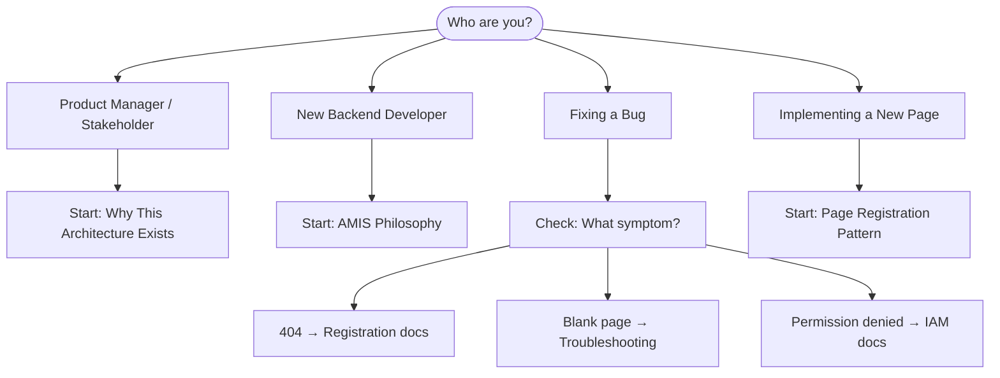

# UI Module Documentation

> Last verified: 2026-05-18 | Code pointer: `internal/web/`

## Who Are You?

Choose your path:



## Path 1: Product Manager / Stakeholder

**Goal**: Understand what the UI system can and cannot do today.
**Reading time**: ~15 minutes
**Prerequisites**: None

Start here → [Why This Architecture Exists](01-theory/01-why-ui-architecture-matters.md)
Then → [UX Principles and Personas](01-theory/03-ux-principles-and-personas.md)
Then → [What Is and Isn't Built Yet](05-roadmap/01-implemented.md)

Skip: All files in `02-architecture/`, `03-implementation/`

## Path 2: New Backend Developer

**Goal**: Implement a new page from scratch.
**Reading time**: ~45 minutes
**Prerequisites**: Basic Go, basic JSON

Required reading order:

1. [AMIS Philosophy](01-theory/02-amis-philosophy.md) — 10 min
2. [High-Level Architecture](02-architecture/01-high-level-overview.md) — 10 min
3. [Page Registration Pattern](03-implementation/02-page-registration-pattern.md) — 10 min ← START HERE for first page
4. [Go Schema Builder](03-implementation/01-go-schema-builder.md) — 20 min
5. [Pipeline Deep Dive](02-architecture/02-pipeline-deep-dive.md) — reference as needed

5. [Authorization Patterns](03-implementation/03-authorization-patterns.md) — 4 gating patterns, AllUIPermissions, debug checklist

If working on existing pages: [Migration Guide](appendices/B-migration-guide.md) — legacy `amis.Ctx` → modern `UISessionContext`

## Path 3: Fixing a Bug

**Goal**: Diagnose why a page is not rendering.
**Reading time**: ~10 minutes
**Prerequisites**: Basic Go

Decision tree:

- Page returns 404 → [Page Registration Pattern](03-implementation/02-page-registration-pattern.md#common-errors)
- Page renders blank → [Pipeline Troubleshooting](04-reference/04-troubleshooting.md#blank-page)
- Permission denied → [IAM Integration](02-architecture/03-iam-integration.md#debugging)
- Dark mode broken → [Theming Troubleshooting](04-reference/04-troubleshooting.md#dark-mode)
- Cache stale → [Caching Strategy](02-architecture/04-caching-strategy.md#invalidation)
- AMIS data not loading → [API Contracts](04-reference/02-api-contracts.md#4-common-contract-mistakes)

## Path 4: Implementing a New Page

**Goal**: Create and register a production-ready page.
**Reading time**: ~30 minutes
**Prerequisites**: Go, familiarity with the codebase

Checklist:

- [ ] [Page Registration Pattern](03-implementation/02-page-registration-pattern.md)
- [ ] [Page Patterns](03-implementation/04-page-patterns.md) — pick List / Document Form / Settings / Dashboard
- [ ] [Component Catalog](04-reference/01-component-catalog.md) — all amis.* and ast.* components
- [ ] [DSL Blocks](03-implementation/07-dsl-blocks.md) — reusable blocks for document forms and dashboards
- [ ] [IAM Integration](02-architecture/03-iam-integration.md) — wire permissions
- [ ] [Pipeline Deep Dive](02-architecture/02-pipeline-deep-dive.md) — understand caching
- [ ] [Migration Guide](appendices/B-migration-guide.md) — if touching an existing legacy page

## Current Implementation Status

| Feature | Status | Code Location |
|---------|--------|---------------|
| 9-stage schema pipeline | Implemented | `internal/web/ui/pipeline.go` |
| Page registry + validation | Implemented | `internal/web/registry/registry.go` |
| AST-typed page builders | Implemented | `internal/web/ast/` |
| IAM-based authorization | Implemented | `internal/web/stages/authz.go` |
| Redis schema cache | Implemented | `internal/web/cache/` |
| Dark mode (AMIS + portals) | Implemented | `web/index.html` |
| DSL block library (~26 blocks) | Implemented | `internal/web/dsl/blocks/` |
| Notification system (all types) | Not implemented | — |
| Saved views / filter persistence | Not implemented | — |
| Keyboard shortcuts | Not implemented | — |
| Per-user module ordering | Not implemented | — |
| 5-persona detection system | Not implemented | — |

## Documentation Structure

```
01-theory/       — Why and What (non-technical friendly)
02-architecture/ — How it works (system design)
03-implementation/ — How to build with it (developer guide)
04-reference/    — Look things up (API, components, config)
05-roadmap/      — What's coming (planned features)
appendices/      — Glossary, migration guide, audit trail
```

## Common Mistakes

| Mistake | Symptom | Fix |
|---------|---------|-----|
| Wrong permission key format | Buttons hidden for everyone | Use `resource.action` format; `Can("view", "invoice")` checks `invoice.view` |
| Returning envelope from PageFn | Nested `{status:0, data:{status:0,...}}` | Return raw schema; SchemaHandler wraps it |
| Missing `init()` registration | 404 on page route | Add `registry.RegisterPage(...)` in `init()` |
| Using `UIContext` (old type) | Compile error | Use `UISessionContext` — `UIContext` does not exist |
| Both `Fn` and `ASTFn` set | `ASTFn` silently wins | CompileStage always prefers `ASTFn`; remove `Fn` once migrated |
| Trailing slash in route | Registry lookup returns nil → 404 | Route must be `/finance/invoices`, not `/finance/invoices/` |
