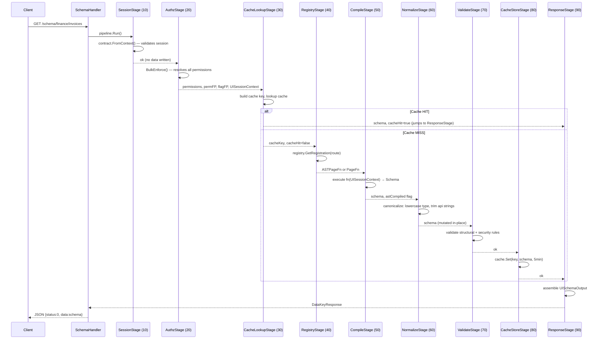

# Pipeline Deep Dive

> Last verified: 2026-05-18 | Code pointer: `internal/web/ui/pipeline.go`, `internal/web/stages/`

---

## Why Does the Pipeline Exist?

When a browser asks for the schema for a page, a surprising number of things need to happen before returning JSON: confirm the user is logged in, figure out which permissions they have, check whether the compiled schema is already in cache, find the right page builder function, execute it, verify the output is valid, store it for next time, and finally wrap it in the right response format. If all of this happened in one function, it would be a 200-line blob that is impossible to test, impossible to instrument, and impossible to extend without touching everything.

The pipeline is the answer: each concern becomes one isolated stage. Stages declare what they need (dependencies) and what they produce (data keys). The pipeline orchestrates them in priority order. Adding a new cross-cutting concern — say, per-request audit logging — means writing one new stage and registering it. Nothing else changes.

---

## Stage Sequence (Mermaid)



---

## Per-Stage Reference

| Stage Name | Priority | Required | What It Does | Data Keys Read | Data Keys Written | Error Behavior |
|------------|----------|----------|-------------|---------------|-------------------|----------------|
| `ui.session` | 10 | Yes | Validates that a `contract.SessionContext` exists in the Go context | (Go context) | None | Aborts with `ErrUnauthenticated` (HTTP 401) |
| `ui.authz` | 20 | Yes | Calls `UIAuthzService.BulkEnforce()`, computes permission + flag fingerprints, constructs `UISessionContext` | (Go context) | `DataKeyPermissions`, `DataKeyPermFingerprint`, `DataKeyFlagFingerprint`, `DataKeySessionCtx` | Aborts with `ErrPermissionResolution` (HTTP 500) |
| `ui.cache_lookup` | 30 | No | Builds cache key, looks up schema in Redis/LRU | `DataKeyPermFingerprint`, `DataKeyFlagFingerprint`, `DataKeyCacheVersions` (optional) | `DataKeyCacheKey`, `DataKeyCacheHit`, `DataKeySchema` (on hit) | Skips on error (non-fatal); cache miss is not an error |
| `ui.registry` | 40 | Yes | Looks up the `PageRegistration` for the route; sets `ASTPageFn` or `PageFn` | `opCtx.Input` (route) | `DataKeyASTPageFn` and/or `DataKeyPageFn` | Aborts with `PageNotFoundError` (HTTP 404) |
| `ui.compile` | 50 | Yes | Executes `ASTPageFn` (preferred) or `PageFn` with `UISessionContext` | `DataKeySessionCtx`, `DataKeyASTPageFn`, `DataKeyPageFn` | `DataKeySchema`, `DataKeyASTCompiled` | Aborts on panic or empty schema (HTTP 500) |
| `ui.normalize` | 60 | Yes | Canonicalizes schema: lowercases `type` values, trims whitespace from `api` strings | `DataKeySchema` | `DataKeySchema` (mutated in-place) | Never returns error; silently skips if no schema |
| `ui.validate` | 70 | Yes | Enforces structural rules (CRUD syncLocation, chart transparent bg, API method prefix) and security rules (no IAM in expressions) | `DataKeySchema`, `DataKeyASTCompiled` | None | Aborts with `ErrSchemaInvalid` (HTTP 500); structural rules skipped when `DataKeyASTCompiled=true` |
| `ui.cache_store` | 80 | No | Writes compiled schema to cache with 5-minute TTL | `DataKeySchema`, `DataKeyCacheKey`, `DataKeyCacheHit` | None | Non-fatal: write failure is logged but does not abort |
| `ui.response` | 90 | Yes | Assembles `UISchemaOutput` struct | `DataKeySchema`, `DataKeyCacheHit`, `opCtx.Input` | `DataKeyResponse` | Aborts if `DataKeySchema` missing (pipeline ordering defect) |

---

## Per-Stage Detail

### Stage 1: SessionStage (Priority 10)

**File:** `internal/web/stages/session.go`

The pipeline's first gate. Calls `contract.FromContext(opCtx.Ctx)` to extract the IAM session context injected by the `InjectSessionContext()` Fiber middleware. If no session is present — because the route was not protected by the middleware, or because the token was invalid — the stage returns `ErrUnauthenticated` and the pipeline stops immediately.

This stage writes no data keys. It acts as a guard: if it succeeds, all subsequent stages can safely assume a valid session exists in the Go context.

**Key invariant:** This stage is the only place that checks for session presence. Downstream stages call `contract.FromContext()` directly without repeating the `ok` check, trusting that this stage has already validated it.

### Stage 2: AuthzStage (Priority 20)

**File:** `internal/web/stages/authz.go`

The only stage in the pipeline that calls the IAM authorization service. Calls `UIAuthzService.BulkEnforce(ctx, sc)` to evaluate every permission in `authz.AllUIPermissions` via Casbin in a single batch, rather than one call per permission check.

After BulkEnforce returns, the stage:
1. Computes a stable `permFP` (permission fingerprint) via `authz.PermissionFingerprint()` — a deterministic sorted-key SHA256 hash of the resolved map.
2. Computes a stable `flagFP` (feature flag fingerprint) via `authz.FlagFingerprint()` — same approach over the known flag list.
3. Constructs `UISessionContext` via `ui.NewUISessionContext(sc, perms)` — the immutable, self-contained session object that page functions receive.

Both fingerprints feed into the cache key in Stage 3. Two users with identical permission sets and enabled flags will share a cache entry.

**Security note:** The permission map is never exposed outside `UISessionContext`. Page functions call `sess.Can("action", "resource")` which reads the pre-computed map. No Casbin call happens at render time.

### Stage 3: CacheLookupStage (Priority 30)

**File:** `internal/web/stages/cache.go`

Builds the cache key and performs a two-level lookup (in-process LRU, then Redis).

Cache key format:

```
ui:schema:{tenantID}:{route}:{permFP}:{flagFP}:{version}
```

When `DataKeyCacheVersions` is injected at startup (the normal case), the full generation-aware key is built by `uicache.Key()`. When absent (migration window fallback), `authz.CacheKey()` is used, which omits the version component.

On a cache **hit**: writes `DataKeySchema` and `DataKeyCacheHit=true`, then sets `NextStageID = "ui.response"` — skipping Stages 4–8 entirely.

On a cache **miss**: writes `DataKeyCacheKey` and `DataKeyCacheHit=false`, then returns normally to let the pipeline continue.

On a cache **error** (Redis unavailable, circuit open): logs the error non-fatally and continues as if it were a miss. Cache failure never aborts schema compilation.

**Security note:** The cache key is built *after* AuthzStage. Building it before would be a privilege escalation defect — two users with different permissions at the same route would share a cache entry.

### Stage 4: RegistryStage (Priority 40)

**File:** `internal/web/stages/registry.go`

Reads `input.Route` from `opCtx.Input` and calls `registry.GetRegistration(route)`. If the route is not registered, returns `&ui.PageNotFoundError{Route: route}` which SchemaHandler maps to HTTP 404.

If registration exists, sets data keys:
- `DataKeyASTPageFn` — if `reg.ASTFn != nil` (preferred path)
- `DataKeyPageFn` — if `reg.Fn != nil` (legacy path)
- Both keys may be set simultaneously; CompileStage always prefers `DataKeyASTPageFn`

This stage only handles `ui.OperationKey`, not `ui.AppOperationKey`. The app shell (nav tree) uses a different compilation path.

**Common failure:** Route with a trailing slash. The registry stores routes exactly as registered. `/finance/invoices/` and `/finance/invoices` are different keys. Normalize routes to have no trailing slash.

### Stage 5: CompileStage (Priority 50)

**File:** `internal/web/stages/compile.go`

Executes the page builder function. Dispatches in this order:

1. **AST path** (preferred): If `DataKeyASTPageFn` is set, calls `fn(sess)` and asserts the return value to `ast.Node`. Then calls `ast.CompileTree(node)` to produce a `Schema`. Sets `DataKeyASTCompiled = true` to tell NormalizeStage and ValidateStage to skip redundant checks.

2. **Legacy path**: If only `DataKeyPageFn` is set, calls `fn(sess)` directly. The function returns a `Schema` (raw `map[string]any`). `DataKeyASTCompiled` is not set.

Both paths wrap execution in a `recover()` call. A panicking page function does not crash the server — it returns an error that aborts the pipeline with HTTP 500 and logs the stack trace.

### Stage 6: NormalizeStage (Priority 60)

**File:** `internal/web/stages/normalize.go`

Pure canonicalization — mutates the schema to a standard form. This stage **never returns an error**. If something cannot be silently corrected, it belongs in ValidateStage, not here.

Current canonicalization rules:
- Lowercases all `type` field values (`"CRUD"` → `"crud"`). AMIS type identifiers are always lowercase.
- Trims leading/trailing whitespace from `api` string values.

The walker visits every `M` (map) node in the tree recursively. Canonicalization is idempotent — running it on an already-canonical schema is a no-op.

### Stage 7: ValidateStage (Priority 70)

**File:** `internal/web/stages/normalize.go`

Enforcement only. Reads the canonicalized schema and rejects violations. All errors are `*sharedErrors.BusinessError` wrapping `ui.ErrSchemaInvalid`.

Two rule sets:

**Structural rules** (skipped when `DataKeyASTCompiled=true`, because the typed AST guarantees these at build time):

| Rule | Code | What it checks |
|------|------|----------------|
| `VALIDATE_CRUD_SYNC_LOCATION` | `ruleValidateCRUDSyncLocation` | Every `crud` node must have `syncLocation: true` |
| `VALIDATE_CHART_TRANSPARENT_BG` | `ruleValidateChartTransparentBg` | Every `chart` node must have `style.background: "transparent"` |
| `VALIDATE_API_METHOD_PREFIX` | `ruleValidateAPIMethodPrefix` | Every `api` string must start with `get:`, `post:`, `put:`, `delete:`, or `patch:` |

**Security rules** (always run regardless of compilation path):

| Rule | Code | What it checks |
|------|------|----------------|
| `VALIDATE_IAM_IN_EXPRESSION` | `ruleNoIAMExpressions` | No IAM keyword in `visibleOn`, `disabledOn`, `hiddenOn`, or `requiredOn` expressions |

IAM keywords banned in expressions: `role:`, `role ==`, `role===`, `.roles`, `.role `, `permission:`, `.permissions`, `Can(`, `CanDo(`, `user.type`, `UserType`, `ADMIN`, `SYSADMIN`.

### Stage 8: CacheStoreStage (Priority 80)

**File:** `internal/web/stages/cache.go`

Writes the validated schema to cache. Skips if `DataKeyCacheHit=true` (schema came from cache — no point re-storing it). Skips if `DataKeyCacheKey` is empty (CacheLookupStage skipped).

TTL: 5 minutes (`schemaCacheTTL`). Early invalidation happens outside the pipeline via `DeletePattern` on role change events.

Non-required: write failure logs a message in `StageResult.Message` but returns `nil` error. A Redis outage does not degrade schema serving — it only means more compilations.

### Stage 9: ResponseStage (Priority 90)

**File:** `internal/web/stages/response.go`

The terminal stage. Always runs — whether the schema came from cache (via the jump from Stage 3) or was freshly compiled. Assembles `UISchemaOutput` from the data map and writes it to `DataKeyResponse`. SchemaHandler reads this key after `pipeline.Run()` returns and calls `c.JSON()`.

Aborts with an error if `DataKeySchema` is missing — this indicates a pipeline ordering defect, not a user error.

---

## DataKey Constants Reference

All data keys are defined in `internal/web/ui/pipeline.go`. Convention: `"ui.<stage>.<key>"`.

| Constant | Value | Set By | Read By |
|----------|-------|--------|---------|
| `DataKeyRoute` | `"ui.request.route"` | SchemaHandler (pre-pipeline) | CacheLookupStage |
| `DataKeyPermissions` | `"ui.authz.permissions"` | AuthzStage | (internal, not read by other stages) |
| `DataKeyPermFingerprint` | `"ui.authz.perm_fingerprint"` | AuthzStage | CacheLookupStage |
| `DataKeyFlagFingerprint` | `"ui.authz.flag_fingerprint"` | AuthzStage | CacheLookupStage |
| `DataKeySessionCtx` | `"ui.authz.session_ctx"` | AuthzStage | CompileStage |
| `DataKeyCacheKey` | `"ui.cache.key"` | CacheLookupStage | CacheStoreStage |
| `DataKeyCacheHit` | `"ui.cache.hit"` | CacheLookupStage | CacheStoreStage, ResponseStage |
| `DataKeyCacheVersions` | `"ui.cache.versions"` | Wire (startup injection) | CacheLookupStage |
| `DataKeyPageFn` | `"ui.registry.page_fn"` | RegistryStage | CompileStage |
| `DataKeyASTPageFn` | `"ui.registry.ast_page_fn"` | RegistryStage | CompileStage |
| `DataKeyASTCompiled` | `"ui.compile.ast_compiled"` | CompileStage | NormalizeStage, ValidateStage |
| `DataKeySchema` | `"ui.compile.schema"` | CompileStage, CacheLookupStage (hit) | NormalizeStage, ValidateStage, CacheStoreStage, ResponseStage |
| `DataKeyResponse` | `"ui.response"` | ResponseStage | SchemaHandler (post-pipeline) |

---

## How to Add a New Stage

Every stage is a struct implementing `pipeline.Stage`. Use this template:

```go
package stages

import (
    "fmt"

    "awo.so/internal/pipeline"
    "awo.so/internal/web/ui"
)

// MyStage does X. It runs at priority P between StageA and StageB.
//
// Reads:  DataKeySessionCtx (set by AuthzStage)
// Writes: DataKeyMyOutput
type MyStage struct {
    pipeline.BaseStage
    // Add injected dependencies here (services, config)
}

// NewMyStage constructs a MyStage.
func NewMyStage() *MyStage {
    return &MyStage{
        BaseStage: pipeline.BaseStage{
            StageName:       "ui.my_stage",
            StageOperations: []string{ui.OperationKey},   // or AppOperationKey
            StagePriority:   55,                           // between 50 (compile) and 60 (normalize)
            StageRequired:   true,                         // false = non-fatal on error
            StageDependsOn:  []string{"ui.compile"},       // must run after this stage
        },
    }
}

// Execute implements pipeline.Stage.
func (s *MyStage) Execute(opCtx *pipeline.OperationContext) (pipeline.StageResult, error) {
    sess, ok := opCtx.Data[ui.DataKeySessionCtx].(ui.UISessionContext)
    if !ok {
        return pipeline.StageResult{}, fmt.Errorf("ui.my_stage: DataKeySessionCtx missing")
    }

    // Do work here.
    _ = sess

    return pipeline.StageResult{
        Status:  "completed",
        Message: "my stage completed",
        Outputs: map[string]any{
            "ui.my_stage.output": "value",
        },
    }, nil
}

// Compile-time interface check.
var _ pipeline.Stage = (*MyStage)(nil)
```

Then register it in the pipeline builder (wire.go or equivalent):

```go
pipeline.AddStage(stages.NewMyStage())
```

**Priority guidance:** Pick a priority in the unused gap nearest to where it logically belongs. Current used priorities: 10, 20, 30, 40, 50, 60, 70, 80, 90. Priorities 11–19, 21–29, etc. are available for insertion without renumbering.

---

## Cache Fingerprinting Explanation

The cache key has this structure:

```
ui:schema:{tenantID}:{route}:{permFP}:{flagFP}:{version}
```

`permFP` and `flagFP` are computed by `AuthzStage`:

- **`permFP`**: `authz.PermissionFingerprint(perms)` — takes the resolved `map[string]bool`, sorts the keys deterministically, concatenates `key=true` or `key=false` for each, and SHA256-hashes the result. The first 16 characters of the hex digest are used.
- **`flagFP`**: `authz.FlagFingerprint(sc, authz.UIFlagList)` — same approach over the known UI feature flag list.

The result: two users with exactly the same resolved permissions and enabled feature flags produce the same fingerprint and share a cache entry. Two users with any difference produce different fingerprints and get separate entries.

The `version` component comes from `uicache.CacheVersions`, a struct injected at startup that tracks the generation number for DSL blocks, schema version, and other invalidation axes. Incrementing a version key invalidates all cache entries across all tenants without a `FLUSHDB`.

---

## Common Failure Modes

| Symptom | Most Likely Cause | How to Diagnose |
|---------|------------------|-----------------|
| HTTP 401 on all schema requests | `InjectSessionContext()` middleware missing from route chain | Check Fiber route registration; ensure middleware is applied before SchemaHandler |
| HTTP 404 for a known page | Route not registered, or trailing slash mismatch | Call `registry.Paths()` in a debug handler; compare exact string |
| HTTP 500 `VALIDATE_CRUD_SYNC_LOCATION` | PageFn emits `crud` without `syncLocation:true` | Add `"syncLocation": true` to the crud node, or migrate to `CRUDNode` from the AST |
| HTTP 500 `VALIDATE_IAM_IN_EXPRESSION` | PageFn embeds role/permission strings in AMIS expressions | Replace with boolean variables: `sess.Can(...)` sets `can_X=true`, use `${can_X}` in expression |
| HTTP 500 `VALIDATE_API_METHOD_PREFIX` | PageFn uses unprefixed `api` string like `"/api/v1/invoices"` | Prefix with method: `"get:/api/v1/invoices"` |
| Cache never hits (high compile rate) | `CacheVersions` not injected, or `permFP`/`flagFP` always differ | Check wire.go for `DataKeyCacheVersions` injection; check that permission set is stable between requests |
| Page renders wrong data for user | Cache key collision — permissions not included in key | Ensure AuthzStage runs before CacheLookupStage; check `StageDependsOn` ordering |
| CompileStage HTTP 500 with stack trace | PageFn panicked | Check `StageResult.Message` in pipeline trace; fix the panic in the PageFn |

---

## End-to-End Request Trace Example

Request: `GET /schema/finance/invoices` by user `alice` (tenant `acme`), permissions: `{invoice.view: true, invoice.create: true}`, flags: `{bulk_import: false}`.

```
Stage 10 (session):
  - contract.FromContext() → sc{userID:alice, tenantID:acme}
  - Returns: completed — "session validated for user alice tenant acme"

Stage 20 (authz):
  - BulkEnforce(ctx, sc) → {invoice.view:true, invoice.create:true, ...30 other keys...}
  - permFP = sha256(sorted perms)[:16] = "a3f9b2c1d4e5f601"
  - flagFP = sha256(sorted flags)[:16] = "0011223344556677"
  - UISessionContext{UserID:alice, TenantID:acme, IsPlatform:false, IsPortal:false, ...}
  - Returns: completed — "resolved 32 permissions for user alice"

Stage 30 (cache_lookup):
  - cacheKey = "ui:schema:acme:/finance/invoices:a3f9b2c1d4e5f601:0011223344556677:v3"
  - cache.Get(ctx, cacheKey) → ErrCacheMiss
  - Returns: completed — sets DataKeyCacheKey, DataKeyCacheHit=false

Stage 40 (registry):
  - registry.GetRegistration("/finance/invoices") → PageRegistration{Module:finance, ASTFn:...}
  - Returns: completed — "resolved registration for route /finance/invoices (module=finance)"

Stage 50 (compile):
  - ASTPageFn present → calls fn(sess) → ast.Node
  - ast.CompileTree(node) → Schema{type:page, title:Invoices, ...}
  - DataKeyASTCompiled = true
  - Returns: completed — "AST-compiled schema with 4 top-level keys"

Stage 60 (normalize):
  - Walks schema tree; all type values already lowercase; no api whitespace
  - Returns: completed — "schema canonicalized"

Stage 70 (validate):
  - DataKeyASTCompiled=true → structural rules SKIPPED
  - Security rules: no IAM keywords in any expression
  - Returns: completed — "schema passed security validation (AST path: structural rules skipped)"

Stage 80 (cache_store):
  - cache.Set(ctx, "ui:schema:acme:/finance/invoices:...:v3", schema, 5m)
  - Returns: completed — "schema cached at key ui:schema:... ttl=5m0s"

Stage 90 (response):
  - UISchemaOutput{Schema:..., CacheHit:false, Route:/finance/invoices}
  - DataKeyResponse = output
  - Returns: completed — "response assembled for route /finance/invoices (cacheHit=false)"

SchemaHandler reads DataKeyResponse, calls c.JSON(200, {status:0, data:schema})
```

Second request from `alice` (same session):

```
Stages 10–20 run (session + authz always run).
Stage 30: cache.Get() → hit. DataKeySchema set. NextStageID = "ui.response".
Stages 40–80: SKIPPED.
Stage 90: runs, assembles output with CacheHit=true.
Total time saved: ~40ms (Casbin + PageFn + compile chain)
```
