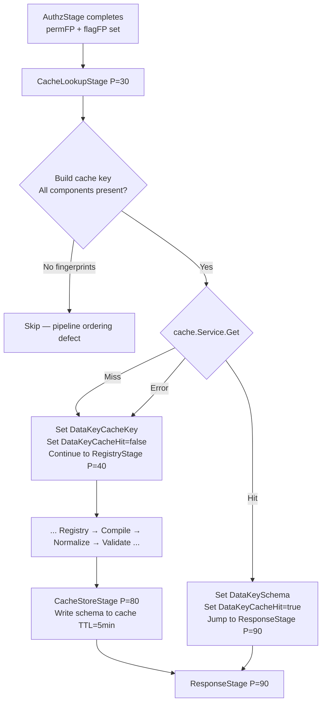

# Caching Strategy

> Last verified: 2026-05-18 | Code pointer: `internal/web/stages/cache.go`, `internal/web/authz/service.go`

---

## 📖 Why Caching Matters

Schema compilation is expensive: Casbin resolves ~35 permissions per request, the page function executes, normalization and validation run. For a 100-user team, the same invoice list schema might be requested hundreds of times per hour by users with identical roles. The cache turns those repetitions into a single Redis lookup. Understanding when the cache hits, when it misses, and when it must be invalidated is essential for predictable performance and correct authorization behavior.

---

## Cache Key Structure

```
ui:schema:{tenantID}:{route}:{permFP}:{flagFP}:{version}
```

Example:
```
ui:schema:550e8400-e29b-41d4-a716-446655440000:/finance/invoices:a1b2c3d4:e5f6a7b8:v1
```

| Component | Source | Purpose |
|-----------|--------|---------|
| `tenantID` | `opCtx.TenantID.String()` | Tenant isolation — prevents cross-tenant cache sharing |
| `route` | `ui.UISchemaInput.Route` | Page identity |
| `permFP` | `authz.PermissionFingerprint(perms)` | User permission set identity |
| `flagFP` | `authz.FlagFingerprint(sc, UIFlagList)` | Feature flag set identity |
| `version` | `uicache.CacheVersions` (optional) | Generation-based invalidation |

**Two users with the same role set and the same enabled feature flags share one cache entry.** Role assignment change → new `permFP` → automatic cache miss → new schema compiled.

**Security invariant:** Cache key is built **after** `AuthzStage` resolves permissions. Building it before would allow a cached schema for one user to be served to another regardless of their permissions — a privilege escalation defect.

---

## Fingerprint Algorithm

Source: `internal/web/authz/service.go`

### Permission Fingerprint

```go
func PermissionFingerprint(perms map[string]bool) string {
    // Collect only TRUE-valued permissions
    keys := make([]string, 0, len(perms))
    for k, v := range perms {
        if v {
            keys = append(keys, k)
        }
    }
    sort.Strings(keys) // deterministic, map iteration order independent
    h := sha256.Sum256([]byte(strings.Join(keys, ",")))
    return fmt.Sprintf("%x", h[:8]) // 16 hex chars
}
```

Two sessions with identical granted permissions produce identical `permFP`. Session with `invoice.read` + `account.read` = same fingerprint regardless of user UUID.

### Flag Fingerprint

```go
func FlagFingerprint(sc contract.SessionContext, flags []UIPermission) string {
    enabled := make([]string, 0)
    for _, f := range flags {
        if sc.FeatureEnabled(string(f)) {
            enabled = append(enabled, string(f))
        }
    }
    sort.Strings(enabled)
    h := sha256.Sum256([]byte(strings.Join(enabled, ",")))
    return fmt.Sprintf("%x", h[:8])
}
```

Two sessions with the same enabled feature flags produce identical `flagFP`.

---

## Cache Lookup — Hit vs Miss Flow



**Cache errors are non-fatal.** Redis unavailable → pipeline continues as if cache miss. The stage is declared `StageRequired: false`. Compilation proceeds normally.

---

## ⚙️ Cache TTL and Storage

```go
// internal/web/stages/cache.go
const schemaCacheTTL = 5 * time.Minute
```

- **L1 (in-process LRU):** `cache.Service.GetMemory` — checked first, sub-millisecond
- **L2 (Redis):** checked on L1 miss
- Write: L1 + L2 simultaneously on `CacheStoreStage`

The `cache.Service` is tenant-aware. It reads `cache.TenantIDKey` from the Go context to namespace Redis operations.

---

## Cache Invalidation

### Automatic: Permission Change

When a user's role changes, their permission set changes → `permFP` changes → existing cache entry is not referenced → **automatic miss on next request**.

No explicit invalidation needed for permission changes. The fingerprint scheme handles it.

### Automatic: Feature Flag Change

Flag changes at login (flags are session-scoped snapshots) → `flagFP` changes → automatic miss.

Note: existing sessions see old flags until they re-authenticate. See [IAM Integration → Feature Flag Semantics](03-iam-integration.md#feature-flag-semantics).

### Manual: `DeletePattern` Invalidation

For cases where the schema itself changes (code deployment, page function update), the cache must be explicitly cleared:

```go
// Invalidate all schemas for a tenant (code deployment)
cacheSvc.DeletePattern(ctx, "ui:schema:{tenantID}:*")

// Invalidate a specific route for all users in a tenant
cacheSvc.DeletePattern(ctx, "ui:schema:{tenantID}:/finance/invoices:*")
```

Source comment in `cache.go`:
> Schemas are invalidated earlier via DeletePattern on role change.

---

## Generation-Based Invalidation (`CacheVersions`)

For production deployments, inject `uicache.CacheVersions` at startup to enable generation-aware keys:

```go
type CacheVersions struct {
    CompilerVersion  string // bump when compiler logic changes
    ASTVersion       string // bump when AST structure changes
    PolicyGeneration int    // bump when Casbin policy file changes
    SchemaGeneration int    // bump when page schema logic changes
}
```

When `DataKeyCacheVersions` is set in `opCtx.Data` before `pipeline.Run()`, `buildCacheKey` uses the 8-component key:

```
ui:schema:{tenantID}:{route}:{permFP}:{flagFP}:{compilerVer}:{schemaGen}
```

Bumping `SchemaGeneration` at deploy time invalidates all compiled schemas globally without needing `DeletePattern` calls.

**Fallback:** When `CacheVersions` is not injected (legacy mode), `buildCacheKey` uses the 5-component key (no version components). Both formats coexist during migration.

---

## Cache Miss Conditions (Summary)

| Condition | Why |
|-----------|-----|
| First request for a route | Cold start — nothing in cache |
| User's role changed | `permFP` changed |
| Feature flag toggled (after re-auth) | `flagFP` changed |
| `SchemaGeneration` bumped at deploy | Version component changed |
| `DeletePattern` called explicitly | Entry removed |
| Redis unavailable | Error treated as miss — non-fatal |
| `CacheLookupStage` skipped | Missing fingerprints (ordering defect) |

---

## Cache Store Behavior

`CacheStoreStage` (Priority 80) skips the write if:
- `DataKeyCacheHit == true` — schema came from cache, no point re-storing
- `DataKeyCacheKey` is empty — `CacheLookupStage` was skipped
- `DataKeySchema` is empty or not present — `CompileStage` failed

Write failures are non-fatal. The stage logs the error in `StageResult.Message` but returns `nil` error — the request completes successfully without caching.

---

## Performance Expectations

| Scenario | Expected Latency |
|---------|-----------------|
| L1 cache hit (LRU) | < 1ms |
| L2 cache hit (Redis) | 2–10ms |
| Cache miss (full compile) | 15–50ms (AuthzStage ~10ms + PageFn ~5ms) |
| Redis unavailable, full compile | Same as cache miss — no degradation |

Two users with the same role set hitting the same page within 5 minutes: the second request is a cache hit regardless of user UUID.

---

## Caveats

**1. No per-user cache differentiation for non-permission state.**
If a page function reads `sess.UserID` or `sess.DisplayName` to produce user-specific content (e.g. "Welcome, Alice"), the compiled schema is cached — "Welcome, Alice" will be served to everyone with the same role set. Do not embed user-specific non-permission data in compiled schemas.

**2. Preference-based rendering is partially cached.**
`sess.Pref("ui.theme")` is included in `UISessionContext` but is NOT part of the cache key. If two users have the same roles and flags but different theme preferences, they share one cache entry. Design preference-based rendering to use AMIS template expressions (`${pref_theme}`) set as page data, not branched Go code.

**3. TTL is 5 minutes, not indefinite.**
After 5 minutes, the schema is recompiled. For latency-sensitive deployments, consider bumping `schemaCacheTTL`. For correctness-sensitive deployments (frequent role changes), leave it short.
